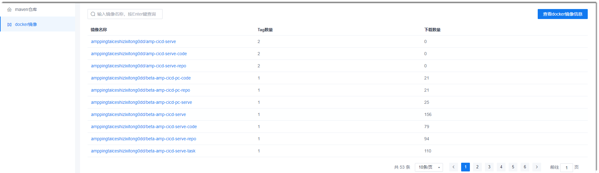
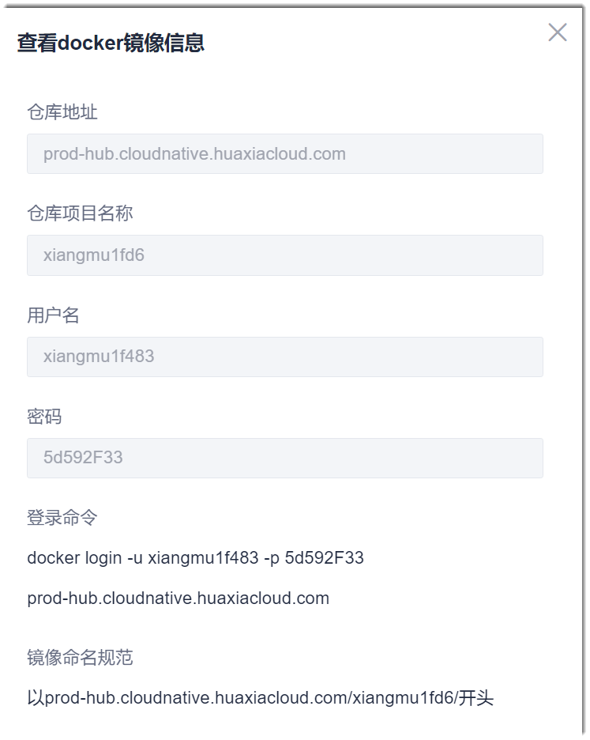
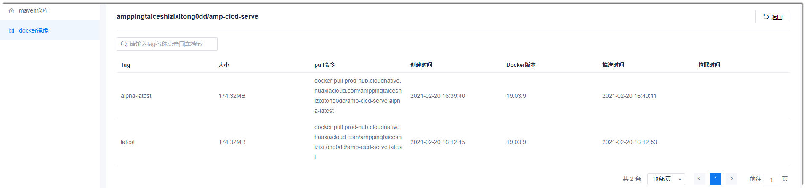

# 管理Docker镜像仓库

Docker镜像仓库用于管理Docker容器打包的文件。        
在配置流水线的Docker镜像构建步骤中，需要使用Docker镜像仓库的信息。

### 查看Docker镜像仓库的信息              
1. 在项目顶部菜单栏中，单击“制品库”。
2. 在左侧导航栏中，单击“docker镜像”。                           
    右侧界面显示Docker镜像仓库的Docker打包记录。                       
               
3. 单击右上角的“查看docker镜像信息”，显示docker镜像仓库的相关信息。                         
    

### 查看Docker镜像信息
在Docker镜像界面中，单击镜像名称，可查看该镜像的详情。                 

 
