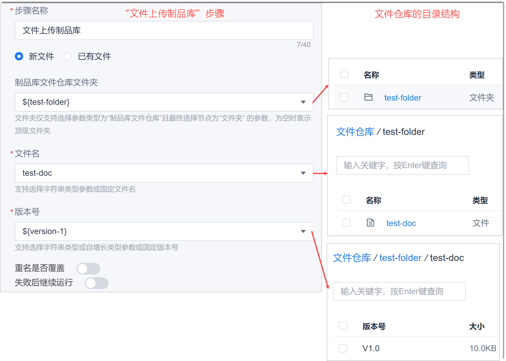
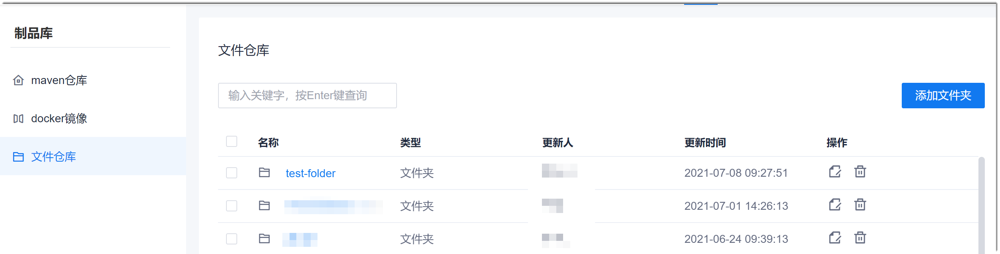
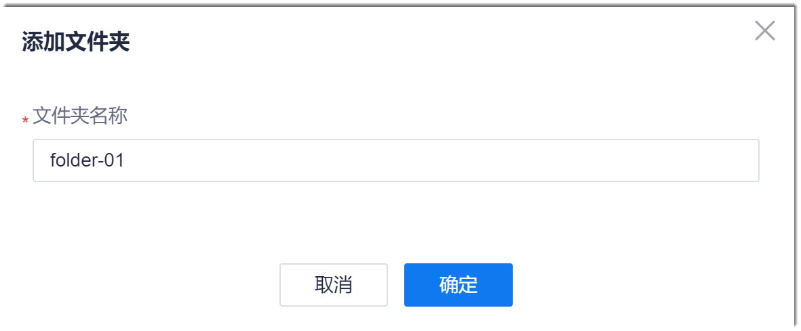
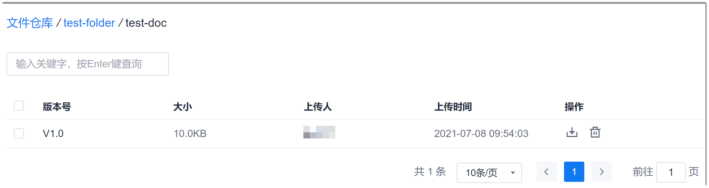

# 管理文件仓库

文件仓库用于存放和管理通过流水线中“上传 > 文件上传制品库”步骤上传的文件。      
您可以将版本构建包上传至文件仓库，后续可通过文件仓库中的构建包将产品回退到指定的版本。     

### 前提条件
* 已使用具有项目“制品库-文件仓库”相应权限的账号登录系统。

### 背景信息         
通过流水线的“文件上传制品库”步骤上传文件后，文件存放在文件仓库的目录与“文件上传制品库”步骤中的配置之间的关系如下图所示。             

### 创建文件夹       
1. 在项目顶部菜单栏中，单击“制品库”。
2. 在制品库左侧导航栏中，单击“文件仓库”。          
  右侧界面显示文件仓库中的一级目录和文件。         
                     
3. 单击右上角的“添加文件夹”。
4. 在弹出的“添加文件夹”对话框中，输入文件夹的名称，单击“确定”。          
            
  
界面返回目录列表界面，显示刚添加的文件夹。您可以根据以上步骤创建其它文件夹，或者单击文件夹名称，进入文件夹中，添加子文件夹。

### 修改文件夹/文件名称       
在仓库目录中，单击文件夹/文件后面的。然后修改文件夹/文件的名称。

### 删除文件夹/文件      
当文件夹下面有子文件夹或者文件时，或者文件下面有版本文件时，该文件夹/文件不能被删除。需删除其下面的子文件夹或文件后，才能被删除。           
在仓库目录中，单击文件夹/文件后面的。然后确认删除。

### 下载版本文件                
在版本文件列表中，单击版本文件后面的。系统自动下载版本文件到本地。       
     

