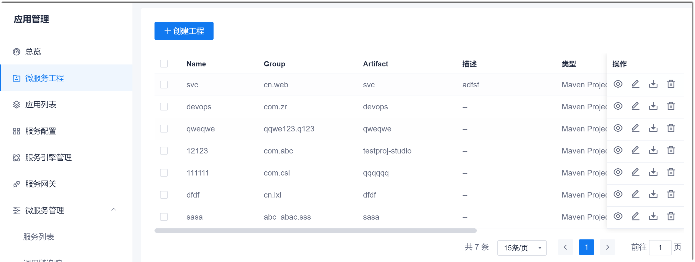
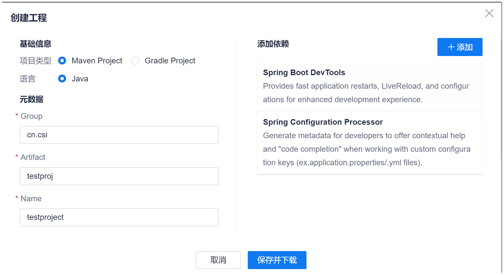
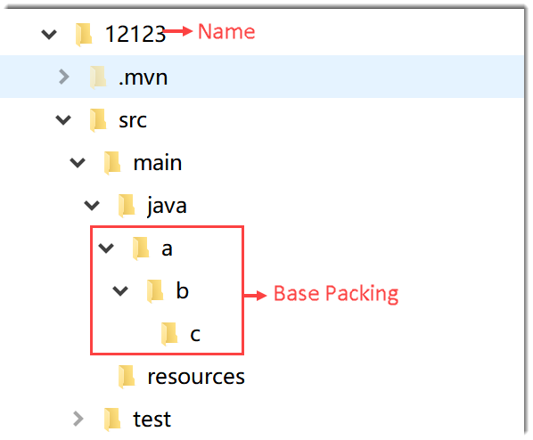

# 创建微服务工程

您可以创建基于Spring Cloud框架的微服务工程，并且添加依赖包。

### 前提条件
* 已使用具有项目微服务工程“创建工程”权限的账号登录系统。

### 背景信息
工程信息中的“Group”和“Artifact”是指Groupid和Artifactid。      
编码项目中的Groupid和Artifactid被统称为“坐标”。坐标是项目的唯一标识。      
* **Groupid **     
  GroupId可以分为多个段。一般来说，第一段为域（例如org、com、cn），第二段为公司名称。例如：某项目的GroupId是org.abc，则它的域是org，公司名称是abc。       
* **Artifactid **     
  Artifactid一般为“项目名-模块名”的命名方式。

### 操作步骤
1. 在项目顶部菜单栏中，单击“应用管理”。
2. 在应用管理左侧导航栏中，单击“微服务工程”。     
  右侧界面显示已创建的工程列表。            
            
3. 在右侧界面中，单击“创建工程”。
4. 在弹出的“创建工程”对话框中，执行如下表所示的操作。      
       
  1. 填写基础参数：根据下表的描述，填写参数。       
    <table>
<tr>
    <th>参数名称</th>
    <th>说明</th>
</tr>
<tr>
    <td>项目类型</td>
    <td>选择工程编译构建的类型。</td>
</tr>
<tr>
    <td>语言</td>
    <td>编码语言，当前只支持Java。</td>
</tr>
<tr>
    <td>Group</td>
    <td>编码项目的Groupid，与Artifactid共同组成唯一标识项目的“坐标”。
至少包含2段内容，段之间以“.”分隔。每段由字母、数字、下划线和句点组成，每段必须以字母开头。
</td>
</tr><tr>
    <td>Artifact</td>
    <td>编码项目的Artifactid。
只能包含小写字母和“-”，以字母开头长度不大于100个字符。
</td>
</tr>
<tr>
    <td>Name</td>
    <td>表示工程的名称。打好的工程包以此命名。
只能包含英文字母、数字、符号(-_)，长度不大于100个字符。
</td>
</tr>
<tr>
    <td>Base Packing</td>
    <td>表示工程包里面的目录结构。默认为“Group.Artifact”，也可自定义。例如，定义为“a.b.c”，则工程包的目录结构为如下图所示。
至少包含2段内容，段之间以“.”分隔。每段由字母、数字、下划线和句点组成，每段必须以字母开头。
</td>
</tr>
<tr>
    <td>描述</td>
    <td>对工程的描述信息。</td>
</tr>
<tr>
    <td>打包格式</td>
    <td>当前支持Jar和War格式。</td>
</tr>
<tr>
    <td>Java版本</td>
    <td>选择Java版本。</td>
</tr>
</table>

  2. 添加依赖包：在右侧“添加依赖”区域中，单击“添加“，然后选择依赖包。您可以添加多个依赖包。       
  3. 单击“保存并下载”。 

系统自动下载工程包到本地目录中。您可以将包拷贝到需要的目录，并解压后使用。