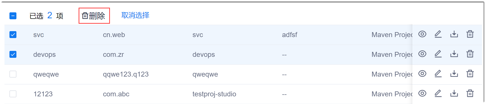

# 修改/删除/查看工程

工程创建成功后，您可以修改除“Group”、“Artifact”和“Name”外的信息。您也可以删除工程，查看工程的详细信息。

### 前提条件
* 已创建微服务工程。
* 已使用具有项目微服务工程相应权限的账号登录系统。

### 修改工程
1. 在工程列表中，单击工程后面的。
2. 在弹出的“编辑工程”对话框中，修改参数，添加或删除依赖，单击“保存并下载”。

### 删除工程
**删除单个工程**
1. 在工程列表中，单击工程后面的。
2. 在弹出的确认对话框中，单击“确定”。

**批量删除工程**
1. 在工程列表中，勾选需要删除的工程。
2. 在上方单击“删除”。       
            
3. 在弹出的确认框中，单击“确定”。

### 查看工程信息
1. 在工程列表中，单击需要修改的工程的。               
弹出“查看”对话框，显示工程的相关信息。