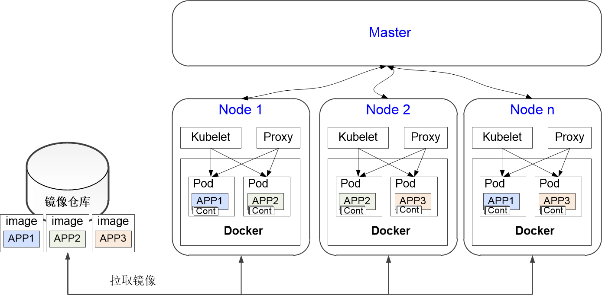

# 管理应用和服务部署

在K8s中，一个应用代表了一组功能的集合。完整的支撑应用的运行一般需要多个服务。一个服务可能由多个容器实现。        
在部署应用时，K8s从镜像库中获取需要的应用镜像，然后读取对应的配置文件部署应用。     
应用部署示意图如下图所示。     

在Cloud Native中，应用和服务的管理通过“应用管理 > 应用列表”实现，配置文件可以通过“应用管理 > 服务配置”管理，也可以不在系统中管理。

