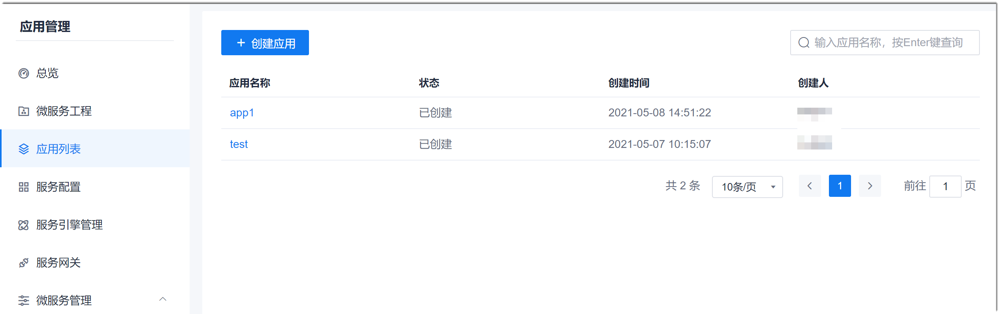
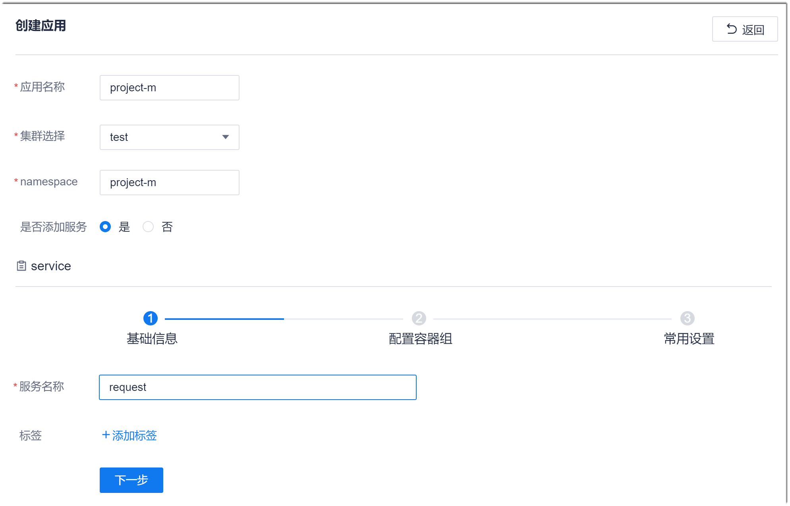
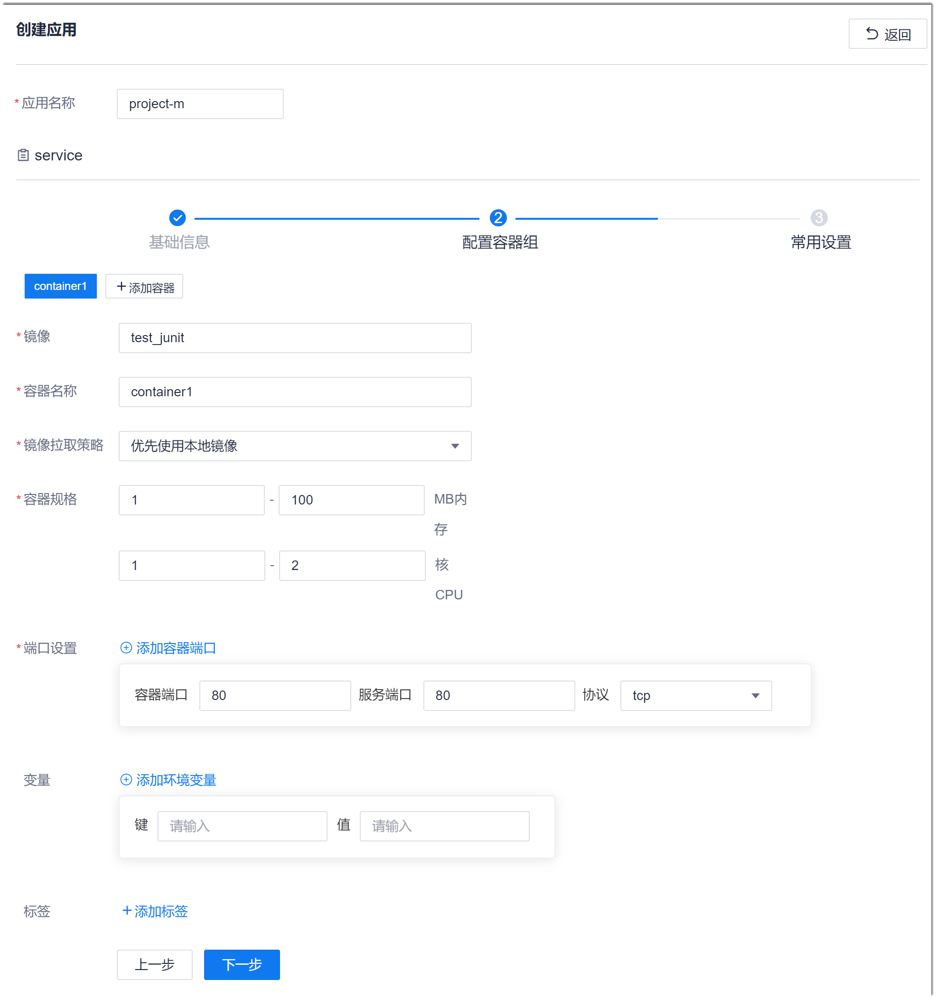
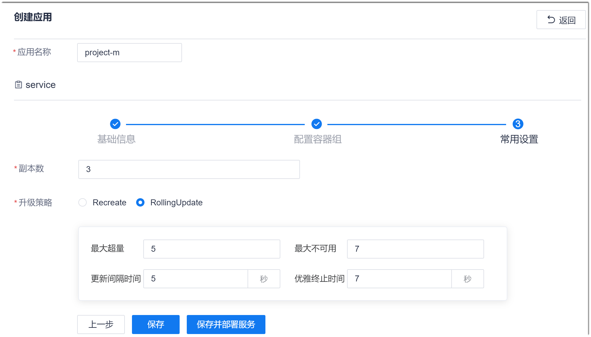

# 创建应用

### 前提条件
* 已在项目设置中添加K8s接入点。
* 已使用具有项目应用列表“创建应用”权限的账号登录系统。

### 背景信息
**环境变量**         
服务使用方如何找到我们定义的服务？在k8s中，有两个方案：
* **环境变量**    
  服务创建完成后，各Node的Kubelet会将服务名称添加到环境变量中。
  
环境变量的命名规则是“{SERVICE_NAME}_SERVICE_HOST, ${SERVICE_NAME}_SERVICE_PORT”。其中“SERVICE_NAME”是新serviceName的大写形式，serviceName中的横杠“-”会被替换成下划线“_”。

* **DNS**    
  不推荐使用。          
  
系统的应用管理使用环境变量的方式发现服务。

**标签**            
服务使用标签来匹配一组Pod，从而允许对Kubernetes中的对象进行逻辑运算。标签以key/value（键/值）对的形式附加到对象上，以多种方式使用：      
*   指定用于开发，测试和生产的对象
*   嵌入版本Label
*   使用Label分类对象

### 操作步骤
1. 在项目顶部菜单栏中，单击“应用管理”。
2. 在左侧导航栏中，单击“应用列表”。      
  右侧界面显示已配置的应用列表。      
      
3. 在右侧界面中，单击左上方的“创建应用”。
4. 配置应用和服务的基础信息。      
    在界面中，根据下表的描述，填写参数，单击“下一步”。    
        
    <table>
<tr>
    <th>参数名称</th>
    <th>说明</th>
</tr>
<tr>
    <td>应用名称</td>
    <td>自定义应用的名称。须由2-40位小写字母、数字、或“-”组成，并且必须以字母开头，数字或字母结尾。</td>
</tr>
<tr>
    <td>集群选择</td>
    <td>部署该应用的K8s集群。选择已添加的K8s接入点。K8s接入点的添加，详见<a href="6.7.1.2 添加K8s接入点.html">添加K8s接入点</a>。</td>
</tr>
<tr>
    <td>namespace</td>
    <td>部署该服务的命名空间。须由2-50位小写字母、数字、或“-”组成，并且必须以字母或数字开头和结尾。</td>
</tr><tr>
    <td>是否添加服务</td>
    <td>是：现在需要配置服务的基本信息、容器信息和副本数、升级策略。 否：现在不配置服务的相关信息，后续再补充。 </td>
</tr>
<tr>
    <td>服务名称</td>
    <td>自定义服务的名称。须由2-50位小写字母、数字、或“-”组成，并且必须以字母或数字开头和结尾。</td>
</tr>
<tr>
    <td>标签</td>
    <td>标签是一对键/值组合。单击“添加标签”，然后配置标签键和标签值，单击“确定”。</td>
</tr>
</table>
5. 配置服务的容器组信息。      
  一个服务可以由一个或多个容器实现。因此，您可以为一个服务配置多个容器。如果您需要配置多个容器，在配置完前一个容器后，单击“添加容器”继续配置下一个容器。         
  在service的配置容器组界面中，根据下表的描述配置容器信息，所有的容器配置完成后，单击“下一步”。     
       
  <table>
<tr>
    <th>参数名称</th>
    <th>说明</th>
</tr>
<tr>
    <td>镜像</td>
    <td>部署该服务的镜像的地址或名称。仅支持数字、字母、/、:、.、-、_，不超过256个字符。
如果“镜像拉取策略”包含“下载”，则“镜像”参数填写名称时，默认从docker hub(https://registry.hub.docker.com/search?q=&type=image)中下载对应镜像。
</td>
</tr>
<tr>
    <td>容器名称</td>
    <td>自定义容器的名称。须由2-50位小写字母、数字、或“-”组成，并且必须以字母或数字开头和结尾。</td>
</tr>
<tr>
    <td>镜像拉取策略</td>
    <td>从下拉菜单中选择镜像拉取策略：<ul><li>使用下载镜像：表示从远程下载镜像。</li><li>优先使用本地镜像：表示先从本地中查找“镜像”。如果能找到，则使用本地找到的镜像；如果不能找到，则再从远程下载镜像。</li><li>只使用本地镜像：表示只从本地中查找“镜像”。</li></td>
</tr><tr>
    <td>容器规格</td>
    <td>设置容器的内存空间范围和CPU内核数范围。</td>
</tr>
<tr>
    <td>端口设置</td>
    <td>设置容器端口、服务端口和请求服务使用的协议。 单击“添加容器端口”可配置多个容器端口。单击容器端口后面的，可删除端口。 </td>
</tr>
<tr>
    <td>变量</td>
    <td>即环境变量。环境变量是一对键/值组合。 单击“添加环境变量”，可配置多个环境变量。单击变量后面的，可删除变量。 </td>
</tr>
<tr>
    <td>描述</td>
    <td>对工程的描述信息。</td>
</tr>
</table>
6. 配置服务的副本数和升级策略。        
    在service的常用配置界面中，配置“副本数”和“升级策略”。      
     
    
  其中，升级策略的参数取值：    
  * Recreate：立刻升级，立刻删除所有Pod，然后创建新Pod。升级期间服务不可用，但保证应用版本一致。
  * RollingUpgrade：滚动升级，逐渐删除旧Pod，同时逐渐创建新Pod。可以设置升级策略，升级期间服务可用，但会导致调用时出现应用版本不一致的情况。      
    升级策略如下：
    * 最大超量：升级过程中，可以比原Pod数多出的Pod数量。
    * 最大不可用：滚动更新期间最大多少个Pod不可用。“最大不可用”须大于“最大超量”。
    * 更新间隔时间：滚动升级期间，每批次更新Pod的间隔时间。
    * 优雅终止时间：更新完成到删除旧版本的间隔时间。
7. 单击“保存”，保存应用和服务的配置；或者单击“保存并部署服务”，保存应用和服务的配置，并部署服务。

返回应用列表界面。

