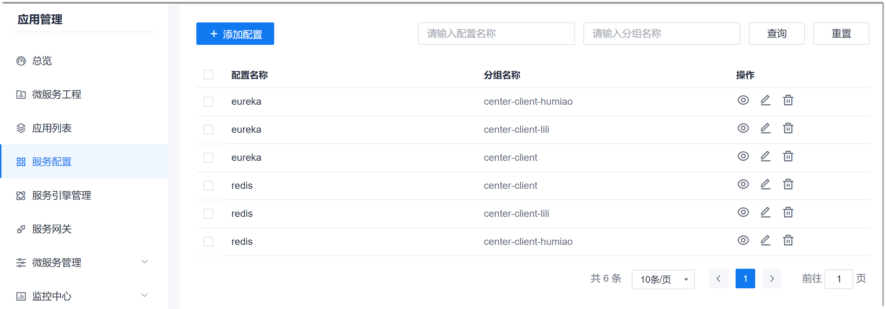
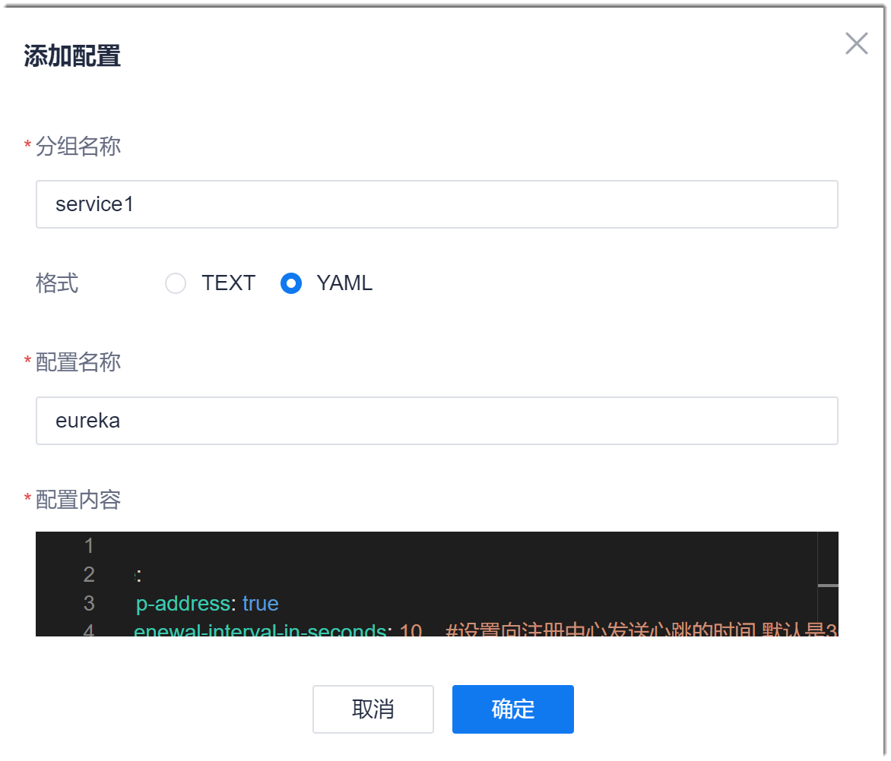

# 添加服务配置文件

您可以将服务的通用配置写成配置文件，由服务调用，减少重复配置，提升配置效率。

### 前提条件
* XXXX

### 操作步骤
1. 在项目顶部菜单栏中，单击“应用管理”。
2. 在左侧导航栏中，单击“服务配置”。    
  右侧显示配置列表。      
           
3. 在右侧配置列表界面的左上方，单击“添加配置”。
4. 在弹出的“添加配置”对话框中，根据下表的描述，填写参数，单击“确定”。                      
                  
  <table>
<tr>
    <th>参数名称</th>
    <th>说明</th>
</tr>
<tr>
    <td>分组名称</td>
    <td>填写“应用列表”中已配置的服务名称。只支持字母、数字、“_”或“-”。</td>
</tr>
<tr>
    <td>格式</td>
    <td>选择配置文件的格式。</td>
</tr>
<tr>
    <td>配置名称</td>
    <td>自定义配置名称。只支持字母、数字、“_”或“-”。</td>
</tr><tr>
    <td>配置内容</td>
    <td>根据实际情况编写配置脚本。</td>
</tr>
</table>

返回配置列表界面。