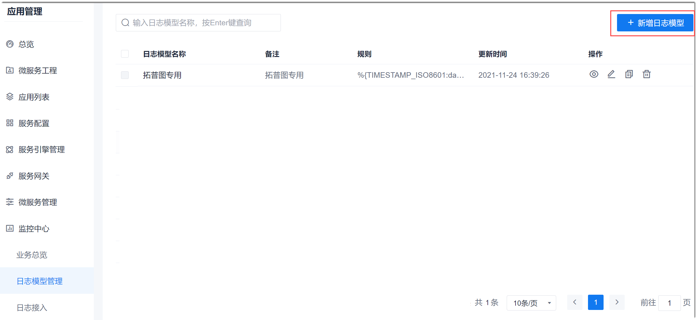
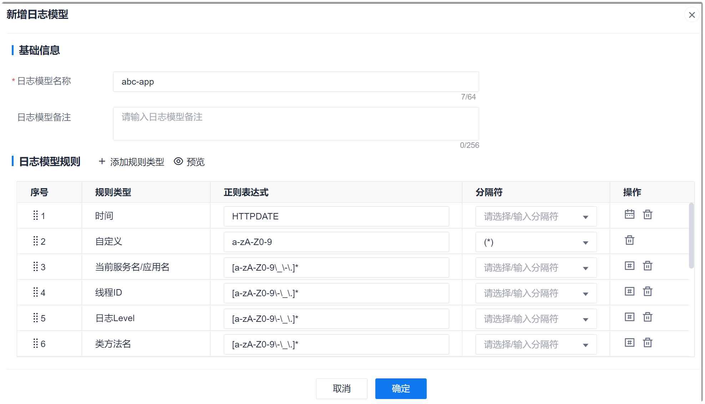

# 新增日志模型

您监控的服务存在多少种日志格式，则需要添加多少种日志模型。日志模型中包含多条规则。

### 常用正则表达式语法              
正则表达式描述了一种字符串匹配的模式，可以用来检查一个串是否含有某些字符，将匹配的字符替换；或者从某个字符串中取出符合某个条件的字符等。                 
常用的正则表达式如下表所示。

<table>
  <tr>
    <th>类型</th>
    <th>表达式</th>
    <th>含义</th>
</tr>
<tr>
    <td rowspan="7">普通字符</td>
    <td>[<i>ABC</i>]</td>
    <td>匹配[]中的任意一个字符。</td>
</tr>
<tr>
    <td>[ ^<i>ABC</i>]</td>
    <td>匹配除[]中字符外的任意一个字符。</td>
</tr>
<tr>
    <td>[A-Z]</td>
    <td>区间表达法。表示匹配所有大写字母。</td>
</tr>
<tr>
    <td>[a-z]</td>
    <td>匹配所有小写字母。</td>
</tr>
<tr>
    <td>[0-9]</td>
    <td>匹配所有数字。</td>
</tr>
<tr>
    <td>[\s\S]</td>
    <td>匹配所有字符。\s 是匹配所有空白符，包括换行，\S 非空白符，不包括换行。</td>
</tr>
<tr>
    <td>\w</td>
    <td>匹配字母、数字、下划线。等价于 [A-Za-z0-9_]。</td>
</tr>
<tr>
    <td rowspan="6">特殊字符</td>
    <td>()</td>
    <td>匹配输入字符串的结尾位置。要匹配“$”字符本身，请使用 “\$”。</td>
</tr>
<tr>
    <td>.</td>
    <td>匹配除换行符“\n”之外的任何单字符。</td>
</tr>
<tr>
    <td>\</td>
    <td>将后一个字符标记为特殊字符、原义字符、向后引用、或八进制转义符。例如，“n”匹配字符“n”。“\n”匹配换行符。序列“\\”匹配"\"，而“\(”则匹配“(”。</td>
</tr>
<tr>
    <td>^</td>
    <td>匹配输入字符串的开始位置，在方括号表达式中使用除外。当该符号在方括号表达式中使用时，表示不接受该方括号表达式中的字符集合。 </td>
</tr>
<tr>
    <td>{}</td>
    <td>标记限定符表达式的开始和结束。</td>
</tr>
<tr>
    <td>|</td>
    <td>前后两项之间的一个选择。</td>
</tr>
<tr>
    <td rowspan="6">限定字符</td>
    <td>*</td>
    <td>匹配前面的子表达式零次或多次。</td>
</tr>
<tr>
    <td>+</td>
    <td>匹配前面的子表达式一次或多次。</td>
</tr>
<tr>
    <td>?</td>
    <td>匹配前面的子表达式零次或一次。</td>
</tr>
<tr>
    <td>{n}</td>
    <td>n是一个非负整数。匹配确定的n次。</td>
</tr>
<tr>
    <td>{n,}</td>
    <td>n是一个非负整数。至少匹配n 次。</td>
</tr>
<tr>
    <td>{n,m}</td>
    <td>m和n均为非负整数，其中n<=m。最少匹配n次且最多匹配m次。</td>
</tr>
</table>

> [!NOTE]
> * 需要需要使用特殊字符本身，请使用“|_字符_”。
> * 限定符用来指定正则表达式的一个给定组件必须要出现多少次才能满足匹配。有 * 或 + 或 ? 或 {n} 或 {n,} 或 {n,m} 共6种。

常用正则表达式如下表所示。
<table>
  <tr>
    <th>含义</th>
    <th>表达式</th>
</tr>
<tr>
    <td>大小写字母、数字、-、_、.</td>
    <td>[A-Za-z0-9\-\_\.]</td>
</tr>
<tr>
    <td>所有字符</td>
    <td>[\s\S]</td>
</tr>
<tr>
    <td>URL地址</td>
    <td>(http|https):\\/\\/([\w.]+\\/?)\S，或者[a-zA-z]+://[^\s]，或者^http://( [\w-]+\.)+[\w-]+(/[\w-./?%&=]\*)?$，或者^https://( [\w-]+\.)+[\w-]+(/[\w-./?%&=]*)?$</td>
</tr>
<tr>
    <td>E-mail地址</td>
    <td>\w+([-+.]\w+)\*@\w+([-.]\w+)*\.\w+([-.]\w+)*</td>
</tr>
<tr>
    <td>YYYY-(M)M-(D)D日期格式</td>
    <td>\d{4}-\d{1,2}-\d{1,2}</td>
</tr>
</table>

### 注意事项     
系统按照日志模型解析日志时，会根据日志模型中规则的顺序一一匹配解析，因此一个日志模型的规则应包含一条日志中的所有内容，并且规则间的顺序需与日志结构一致。否则，将解析失败。

### 操作步骤
1. 在项目顶部菜单栏中，单击“应用管理 > 监控中心 > 日志模型管理”。
2. 在右侧页面中，单击“新增日志模型”。          
                    
3. 在“新增日志模型”页面中，输入日志模型的名称和备注信息，然后添加并配置规则。配置完成后，单击“确定”。             
                          
  其中，规则配置如下：
  * **添加规则**：单击“添加规则类型”，添加一条规则。您可以选择常用的规则类型。每个类型提供默认的正则表达式。如果不确定字段的类型，可以使用“自定义”类型。**“自定义”类型的规则不会被系统解析**，仅仅作为使日志完整的填充信息。 
  * **设置规则的正则表达式**：您可以使用规则类型默认的表达式；也可以单击规则后面的或，选择对应的格式或字符；也可以直接在正则表达式文本框中输入规则的正则表达式。
  * **设置分隔符**：表示此字段前后以什么字符与其它字段分隔。其中，“[\*]”表示本字段的内容放在“[]”中。如果正则表达式为“a-zA-Z0-9”，则日志中的字段内容为“[a-zA-Z0-9]”。“<\*>”和“(*)”表示同样的含义。
  * **删除规则**：单击规则后面的，可删除规则。
  * **调整规则的顺序**：鼠标焦点放到“序号”列，拖动规则到需要的位置。                                        
  * **预览日志模型**：单击规则列表上方的“预览”，可以查看配置的日志模型。红色底色的内容表示该段内容映射到系统中的字段名称。自定义规则的内容不会映射到系统字段。黄色底色的内容表示该段内容的正则表达式。        
                
 
系统返回日志模型列表页面，显示刚刚添加的日志模型。
