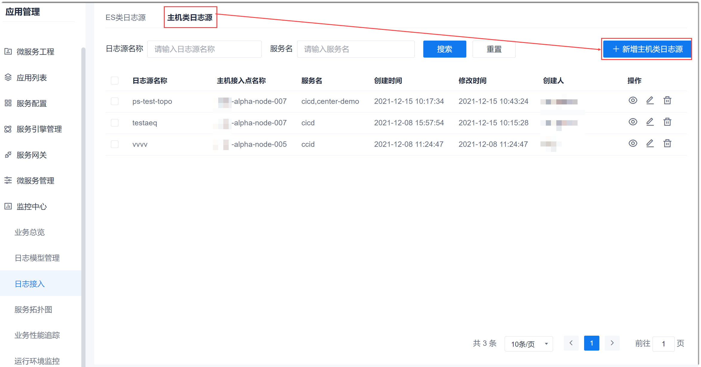

# 管理主机类日志源

主机类日志源适用于没有接入ES引擎的服务。主机类日志源需要设置主机接入点、日志存放路径和日志模型。

### 前提条件
* 已配置主机，详细请参见[管理主机](6.7.2 管理主机.html)。
* 已配置日志模型，详细请参见[管理日志模型](15.3.3.0-config-log-model.md)。

### 背景信息                          
为了统一管理项目相关的资源，因此您需要在“项目设置 > 接入点设置 > 主机管理”中对项目中用到主机进行统一管理。        

### 新建主机类日志源
1. 在项目顶部菜单栏中，单击“应用管理 > 监控中心 > 日志接入”。
2. 在右侧页面中，单击“主机类日志源”页签，然后单击“新增主机类日志源”。      
      
3. 在“新建主机日志源”的基础信息页面中，根据下表的描述，填写参数，单击“下一步”。          
               
  <table>
<tr>
    <th>参数名称</th>
    <th>说明</th>
</tr>
<tr>
    <td>日志源名称</td>
    <td>自定义日志源的名称。最多支持64个由中文、英文、“-”、“_”组成的字符串。</td>
</tr>
<tr>
    <td>主机接入点</td>
    <td>从下拉列表中选择主机。主机来源于“项目设置 > 接入点设置 > 主机管理”中配置的主机。</td>
</tr>
<tr>
    <td>服务名称</td>
    <td>自定义服务的名称。最多支持64个字符。</td>
</tr>  
<tr>
    <td>日志地址</td>
    <td>输入日志存放在主机中的绝对地址。如果填写到文件名，则只解析该日志文件；如果填写到文件夹，则解析文件夹中所有“.log”后缀名的日志文件。</td>
</tr>  
<tr>
    <td>日志模型</td>
    <td>从下拉菜单中选择日志模型，取值来源于配置的“日志模型”。</td>
</tr>  
</table>

系统返回主机类日志源列表页面，显示刚刚添加的主机类日志源。

### 修改主机类日志源
1. 在主机类日志源列表中，单击日志源后面的。
2. 在“编辑主机日志源”页面中，修改相应的信息，单击“确定”。

### 删除主机类日志源
1. 在主机类日志源列表中，单击日志源后面的。
2. 在弹出的确认对话框中，单击“确定”。
