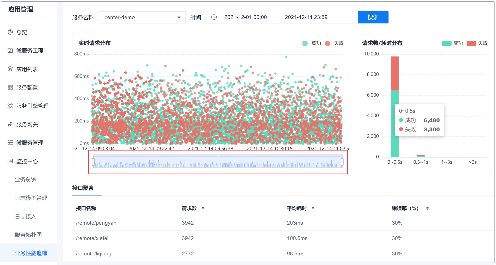

# 追踪业务性能

业务性能包含服务请求的耗时实时分布情况，请求数和请求耗时的统计，接口请求情况。您可以通过业务性能情况，发现潜在问题，优化或调整服务治理策略。

### 前提条件
* 已添加日志源，且日志源中有相应的数据。

### 操作步骤
1. 在项目顶部菜单栏中，单击“应用管理 > 监控中心 > 业务性能追踪”。          
  右侧页面默认显示第一个日志源下的第一个服务、当天的业务请求情况。        
2. 查看指定服务和时间段的业务请求情况。                  
  在右侧页面上方，选择需要查看的服务，以及需要查看的时间段，单击“确定”，然后单击“搜索”。           
           
  
  其中：
  * **实时请求分布**展示该服务被请求时，响应成功、失败的响应时长。如果响应时间过长，建议进行优化。            
    您也可以拖动图形下方的滑动尺两端，对查看的时间段进行调节。      
  * **请求数/耗时分布**展示该服务被请求时，在各响应耗时时长阶段内的请求数量。图中示例：响应耗时在5秒内的成功请求数有6480个。
  * **接口聚合**展示该服务下各接口被请求的次数、各接口的请求平均耗时、请求错误率。