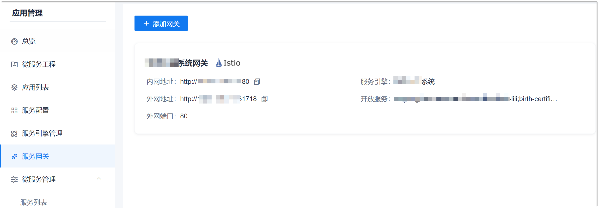
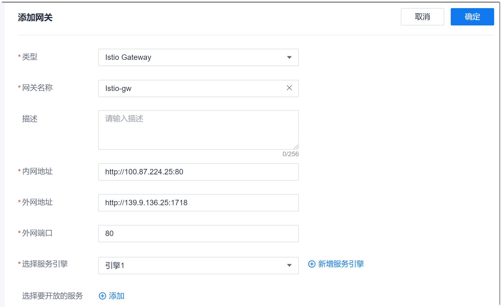

# 添加服务网关

添加服务引擎后，同一个注册中心或者命名空间内的服务可以相互访问，但本注册中心和命名空间之外的服务还不能访问，因此，需要配置服务网关，以便于外部服务访问。

### 前提条件
* 已配置服务引擎。

### 操作步骤
1. 在应用管理左侧导航栏中，单击“服务网关”。      
  右侧界面显示已配置的服务网关。    
     
2. 在右侧界面的左上方，单击“添加网关”。
3. 在“添加网关”界面中，根据下表的描述，设置参数，单击右上角的“确定”。       
   
  <table>
<tr>
   <th>参数名称</th>
    <th>说明</th>
</tr>
<tr>
    <td>类型</td>
    <td>根据实际微服务使用的引擎类型选择。当前只支持Istio。</td>
</tr>
<tr>
    <td>网关名称</td>
    <td>自定义网关名称，支持中文、数字、字母、_、-，且不能以数字开头，不超过50个字符。</td>
</tr>
<tr>
    <td>描述</td>
    <td>自定义对网关的描述信息，不超过256个字符。</td>
</tr>
<tr>
    <td>内网地址</td>
    <td>根据实际情况填写网关对产品内的访问地址，可以为域名或IP地址，如果包含端口号，请一并填上端口号。</td>
</tr>
<tr>
    <td>外网地址</td>
    <td>根据实际情况填写网关对产品外的访问地址，可以为域名或IP地址，如果包含端口号，请一并填上端口号。</td>
</tr>
<tr>
    <td>外网端口</td>
    <td>根据实际情况填写网关对产品外的访问端口。</td>
</tr>
<tr>
    <td>选择服务引擎</td>
    <td>根据实际情况选择网关对应的服务引擎。如果对应的服务引擎还未配置，可以单击后面的“新增服务引擎”，配置引擎。</td>
</tr>
<tr>
    <td>选择要开放的服务</td>
    <td>选择服务引擎后，本参数有效。单击“添加，然后根据实际情况，选择引擎中要对外开放的服务。如果不选择服务，表示对外开放所有服务。</td>
</tr>
</table>

界面返回服务网关列表界面。您可以看到新添加的服务网关。