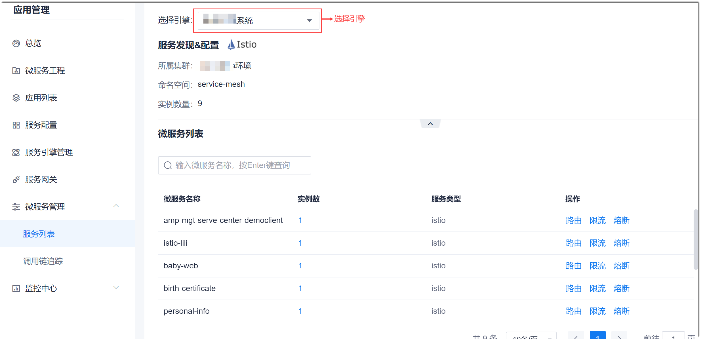
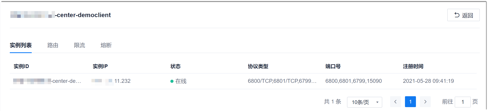

# 查看服务实例

在服务列表中，您可以查看服务的实例详情，包含实例的IP地址、状态、协议类型、端口号和注册时间。  

### 前提条件
* 已配置服务引擎，且服务已启动。
* 服务已关联网关。

### 操作步骤
1. 在项目顶部菜单栏中，单击“应用管理”。
2. 在应用管理的左侧导航栏中，单击“微服务管理 > 服务列表”。         
  右侧显示对应引擎下的服务列表。      
          
3. 在右侧界面左上方，选择服务引擎。
4. 在下方服务列表中，单击“实例数”列的数字。        
    显示服务中的实例详情。    
    
