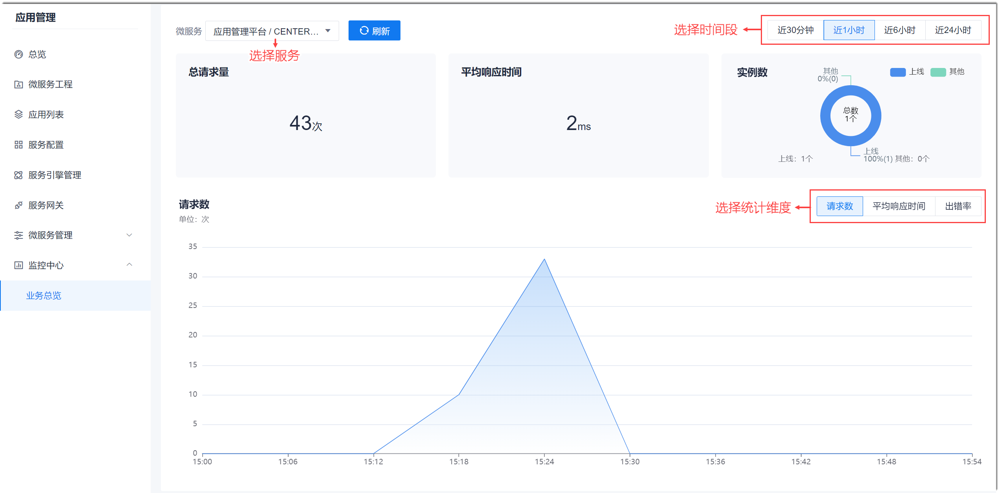

# 查看服务请求报告

服务请求报告展示在某段时间内，被请求的总数量、平均响应时间、实例数、吞吐量、包大小、出错率等。 

### 前提条件
* 已配置服务引擎，且服务已启动。
* 在查看时间段内，至少有一次服务请求，才能看到请求数据。

### 操作步骤
1. 在项目顶部菜单栏中，单击“应用管理”。
2. 在应用管理的左侧导航栏中，单击“监控中心 > 业务总览”。       
    右侧界面默认显示第一个服务的请求报告。您可以单击左上角的下拉框，选择服务；也可以设置报告的时间段，查看的统计维度。        
    报告展示界面与引擎类型有关。Spring Cloud引擎的报告界面如下图所示。      
     
    
     Istio引擎的报告界面如下图所示。       
     

