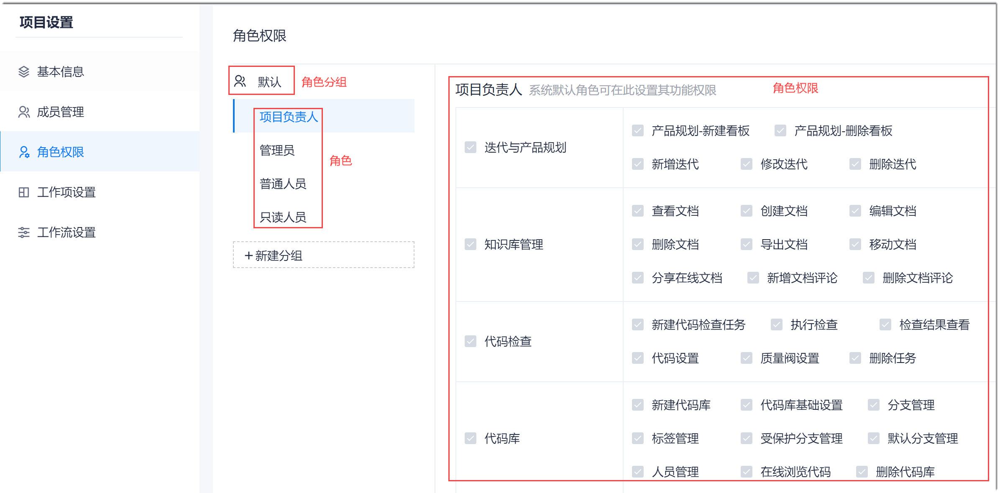
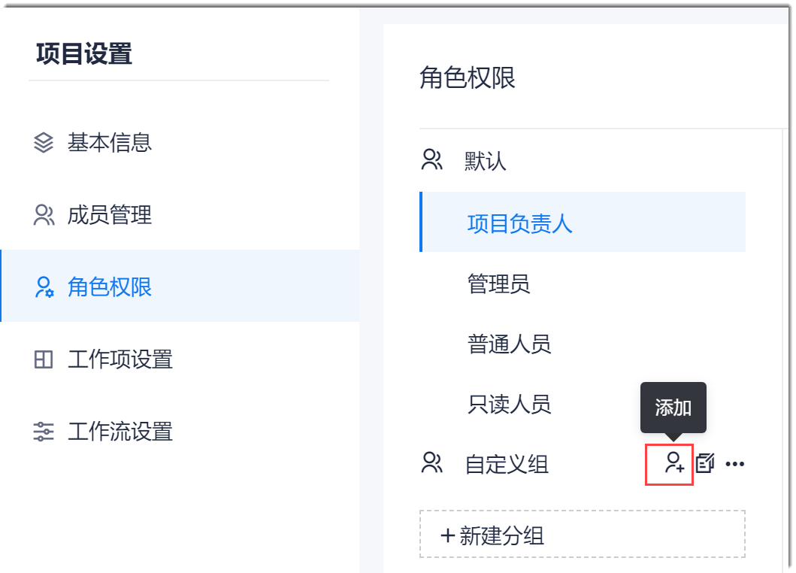
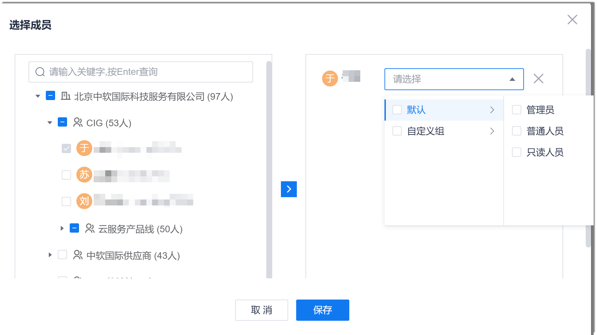

# 迁移项目成员、角色及权限

CAP的项目为私有项目，即必须是项目成员才能访问和操作项目内的内容。         
CAP的项目角色、权限支持自定义。如果系统预置的角色和权限不能满足要求，您可以自定义角色和权限。         
如果CAP的权限项与原系统的权限项不一致，请根据实际情况确定角色拥有的权限。

### 背景信息
因为项目是企业中的某一个项目，所以项目成员必须首先是企业成员。
成员的权限通过角色赋予。将项目成员设置为某个角色后，成员自动继承角色的权限。CAP支持将一个成员设置为多个角色。                 
CAP预置的角色及其默认权限如下表所示。您可以根据实际情况，重新设置默认角色“管理员”、“普通人员”、“只读人员”的权限。您也可以根据实际情况创建新的角色，为角色重新配置权限。默认角色不能被重命名或者删除。

|功能|权限|项目负责人默认权限|管理员默认权限|普通人员默认权限|只读人员默认权限|
|:--------- |:-----|:-------- |:-----|:-----|:-----|
|测试|新建用例|&#9745;|&#9745;|&#9745; | &#9744;|
|测试|删除用例|&#9745;|&#9745;|&#9744; | &#9744;|
|测试|导入用例|&#9745;|&#9745;|&#9745;|&#9744;|
|测试|关联缺陷|&#9745;|&#9745;| &#9745;|&#9744; |
|测试|运行用例|&#9745;|&#9745;|&#9745; |&#9744;|
|测试|新建任务|&#9745;|&#9745;| &#9745;|&#9744;|
|测试|运行任务|&#9745;|&#9745;| &#9745; |&#9744;|
|测试|删除任务|&#9745;|&#9745;| &#9744;|&#9744;|
|测试|新建元素|&#9745;|&#9745;| &#9745; |&#9744;|
|测试|删除元素|&#9745;|&#9745;|&#9744;|&#9744;|
|项目|删除项目|&#9745;| &#9744;|&#9744;|&#9744;|
|项目|负责人移交|&#9745;|&#9744;|&#9744;|&#9744;|
|项目设置|接入点设置|&#9745;|&#9745;|&#9745;|&#9744;|
|项目设置|工作流设置|&#9745;|&#9745;|&#9744;|&#9744;|
|项目设置|工作项设置|&#9745;| &#9745; |&#9745;|&#9744;|
|项目设置|角色权限查看|&#9745;| &#9745; |&#9744;|&#9744;|
|项目设置|项目信息编辑|&#9745;| &#9745; |&#9745;|&#9745;|
|项目设置|项目成员管理|&#9745;|&#9745; |&#9744;|&#9744;|
|项目设置|项目成员查看|&#9745;|&#9745;| &#9745;|&#9745;|
|项目设置|角色权限编辑|&#9745;|&#9745;|&#9744; |&#9744;|
|工作项|工作项导出|&#9745;|&#9745;|&#9744;  |&#9744;|
|工作项|工作项导入|&#9745;| &#9745;  |&#9744;|&#9744;|
|工作项|新增工作项|&#9745;|&#9745;  |&#9745;|&#9744;|
|工作项|删除工作项|&#9745;| &#9745; | &#9744;|&#9744; |
|工作项|修改工作项|&#9745;| &#9745; |&#9744;|&#9744;|
|工作项|新增评论|&#9745;| &#9745; |&#9745;|&#9744;|
|工作项|删除评论|&#9745;| &#9745;|&#9744;      | &#9744;|
|迭代与产品规划|产品规划-新建看板|&#9745;|   &#9745;|&#9744;| &#9744;|
|迭代与产品规划|产品规划-删除看板|&#9745;|&#9745; | &#9744;|&#9744;|
|迭代与产品规划|新增迭代|&#9745;| &#9745;| &#9744;|&#9744;|
|迭代与产品规划|修改迭代|&#9745;| &#9745; |&#9744; |&#9744; |
|迭代与产品规划|删除迭代|&#9745;|&#9745;|&#9744;|&#9744; |
|报表|查看报表|&#9745; |&#9745;|&#9745;   |&#9745;|
|报表|导出报表|&#9745;| &#9745;|&#9745;    |&#9744;|
|报表|移动报表|&#9745;| &#9745; |&#9745;    |&#9744;|
|报表|删除报表|&#9745;|&#9745;| &#9744;| &#9744;|
|报表|编辑报表|&#9745;|&#9745; |&#9745;| &#9744;|
|报表|创建报表|&#9745;|&#9745; |&#9744;|&#9744;|
|知识库管理|查看文档|&#9745;|&#9745;|&#9745;|&#9745;|
|知识库管理|创建文档|&#9745;|&#9745;|&#9745;|&#9744;|
|知识库管理|编辑文档|&#9745;|&#9745; |&#9744;|&#9744;|
|知识库管理|删除文档|&#9745;|&#9745;|&#9744;|&#9744;|
|知识库管理|导出文档|&#9745;|&#9745;| &#9744;| &#9744; |
|知识库管理|移动文档|&#9745;|&#9745;|&#9744;| &#9744; |
|知识库管理|分享在线文档|&#9745;| &#9745;|&#9745; | &#9744;|
|知识库管理|新增文档评论|&#9745;|&#9745; |&#9745;| &#9744; |
|知识库管理|删除文档评论|&#9745;|&#9745;|&#9744;| &#9744; |
|代码库|新建代码库|&#9745;|&#9745;|&#9744;|&#9744;|
|代码库|代码库基础设置|&#9745;|&#9745; |&#9744;|&#9744;|
|代码库|分支管理|&#9745;|&#9745;|&#9744;| &#9744;|
|代码库|标签管理|&#9745;|&#9745; |&#9744;|&#9744;|
|代码库|受保护分支管理|&#9745;| &#9745; | &#9744;  |&#9744;|
|代码库|默认分支管理|&#9745;| &#9745; | &#9744; | &#9744; |
|代码库|人员管理|&#9745;|      &#9745;|&#9744; | &#9744;  |
|代码库|在线浏览代码|&#9745;|&#9745; | &#9745; | &#9744; |
|代码库|删除代码库|&#9745;|&#9745;| &#9744;| &#9744; |
|代码检查|新建代码检查任务|&#9745; |&#9745;|&#9744;|&#9744;|
|代码检查|执行检查|&#9745;|&#9745;|&#9745;|&#9744;|
|代码检查|检查结果查看|&#9745;|&#9745;| &#9745;|&#9745;|
|代码检查|代码设置|&#9745;|&#9745;|&#9744;|&#9744; |
|代码检查|质量门禁|&#9745;|&#9745; |&#9744;|&#9744; |
|代码检查|删除任务|&#9745;|&#9745;| &#9744;|&#9744;  |
|制品库docker|仓库浏览|&#9745;|&#9745;|&#9745;|&#9745;|
|制品库docker|查看仓库登录信息|&#9745;|&#9745;|&#9745;|&#9744;|
|制品库maven|仓库浏览|&#9745;|&#9745;|&#9745;|&#9745;|
|制品库maven|上传文件|&#9745;|&#9745;|&#9745;|&#9744;|
|制品库maven|设置远程仓库|&#9745;|&#9745;| &#9744;|&#9744;|
|制品库maven|重置密码|&#9745;|&#9745;|&#9744;| &#9744; |
|流水线|新建流水线|&#9745;|&#9745;|&#9745;|&#9744;|
|流水线|流水线编排|&#9745;|&#9745;|&#9745;|&#9744;|
|流水线|人员管理|&#9745;|&#9745;|&#9745;|&#9744;|
|流水线|通知管理|&#9745;|&#9745;|&#9745;|&#9744;|
|流水线|触发设置|&#9745;|&#9745;| &#9745;|&#9744; |
|流水线|webhook|&#9745;|&#9745;| &#9745;| &#9744;|
|流水线|执行|&#9745;|&#9745;|&#9745;|  &#9744;|
|流水线|执行记录|&#9745;|&#9745;|&#9745;| &#9745; |
|流水线|流水线删除|&#9745;|&#9745;|&#9744; | &#9744; |
|流水线|另存为模板|&#9745;|&#9745;| &#9744;| &#9744; |

CAP的项目角色有角色级别，级别从高到低依次为：负责人、管理员、普通人员。负责人固定拥有项目全部权限，高级别的角色可以为低级别角色配置权限。       
您也可以根据实际情况创建新的角色。高级别的角色只能创建低级别的角色，为低级别的角色重新配置权限。默认角色不能被重命名或者删除。       

**如何判断自定义的角色为哪个级别的角色**：拥有“项目信息编辑”、“成员管理编辑”、“角色权限编辑”中的任意一个权限则为“管理员”级别的角色。否则为“普通人员”级别。

### 操作入口
在项目的顶部菜单栏中，单击“项目设置”。

### 迁移角色及权限
1. 在左侧导航栏中，单击“角色权限”。                   
               
2. （可选）创建分组。
     如果不创建分组，新建的角色归类在“默认”组中。
  1. 在角色权限页面左上方，单击“新建分组”。
  2. 在新建分组对话框中，输入组名，单击“确定”。                                           
    创建成功后，如果需要修改组名或者删除分组，鼠标放在分组上，单击分组后面的 或“ > 删除”。          
    当分组下有角色时，不能直接删除分组。请先将角色移出分组后，再删除分组。               
3. （可选）创建角色。               
     如果当前默认角色能满足需求，您可以在自定义的分组下面创建角色，不能在默认分组下创建角色。                    
  1. 鼠标放在自定义分组上，单击 。                     
                          
  2. 在添加角色对话框中，设置角色名称，单击“确定”。                         
  创建成功后，如果需要修改角色或者删除角色，鼠标放在角色上，单击角色后面的 或“ > 删除”。默认角色不能被重命名或删除。                        
4. 配置角色的权限。                         
     不能配置项目负责人的权限。                     
  1. 在角色权限页面左侧，单击需要配置权限的角色。
  2. 在右侧界面中，勾选需具备的权限，去勾选不需要具备的权限。
  3. （可选）如果需要恢复默认权限，单击右上角的“恢复默认”。
  
  退出该角色的权限编辑页面后，系统自动保存。
    
### 添加项目成员            
对于页面预置的项目角色，从角色级别上，项目负责人 > 管理员 > 普通人员 > 只读人员。设置成员的角色时，只能将成员设置为比当前用户低级别的角色和自定义的角色。                   
1. 在项目设置页面的左侧导航栏中，单击“成员管理”。
2. 在成员管理页面右上方，单击“添加成员”。
3. 在“选择成员”对话框中，勾选需要加入项目的成员，单击，然后在右侧成员名称后面的下拉框中，选择成员所属的角色。                 
                        
4. 所有成员选择完成后，单击“保存”。

返回成员管理页面，显示项目当前的成员列表。

