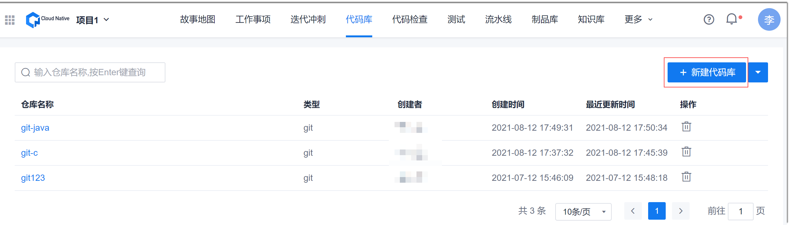

# 创建代码库

创建代码仓库后，您可以将本地的Git或SVN仓库同步到云端Cloud Native代码库中。

### 操作步骤
1. 在项目顶部菜单栏中，单击“代码库”。
      
      界面显示代码仓库列表。
      
2. 在右上方，单击“新建代码库”。
3. 在弹出的“新建代码库”对话框中，根据下表的描述，填写参数，单击“创建”。
  
          
|参数名称|说明|
|:--------- |:-------- |
|代码库名称|对于Git仓库：由1~32个字母、数字、中文、“-”、“.”、“_”组成，且只能由字母、数字、“_”开头。 对于SVN仓库：由1~32个字母、数字、“-”、“.”、“_”组成，且只能由字母、数字开头。|
|仓库类型|可以选择git和SVN。|
|选择gitignore|当“仓库类型”选择“git”时，本参数有效。 Cloud Native会根据您选择的语言生产gitignore文件。|
|代码库描述 |最多输入128个字符。|
|创建README.md文件|自动创建README.md文件。|

创建成功后，显示新建代码库详情界面。

