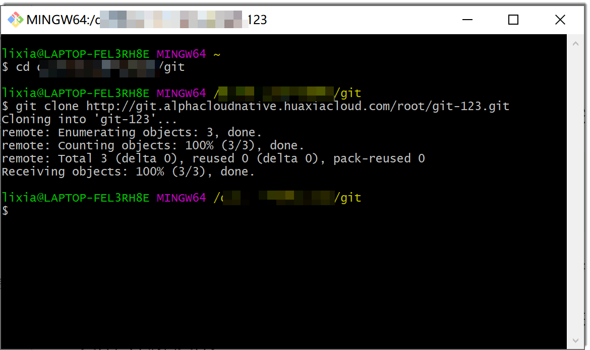
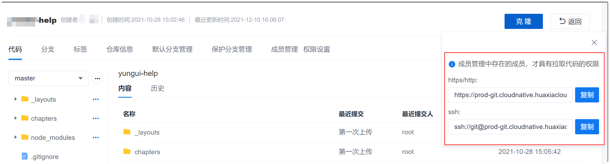
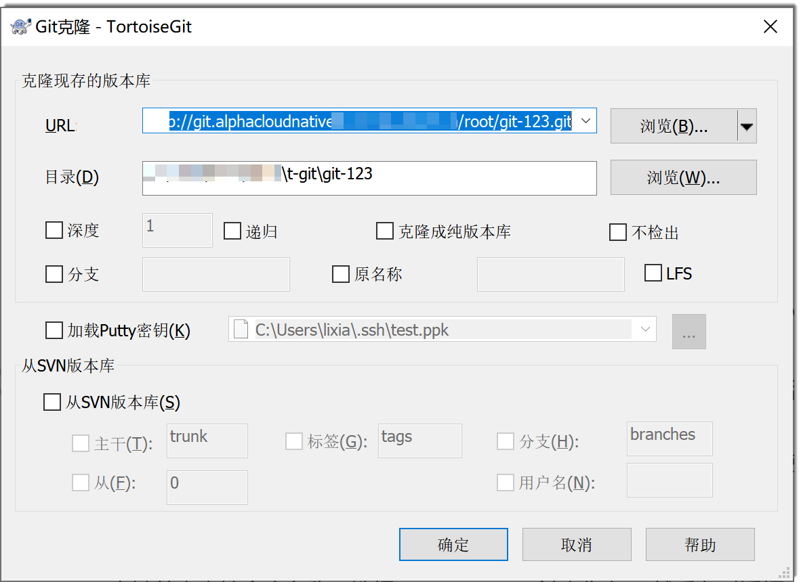
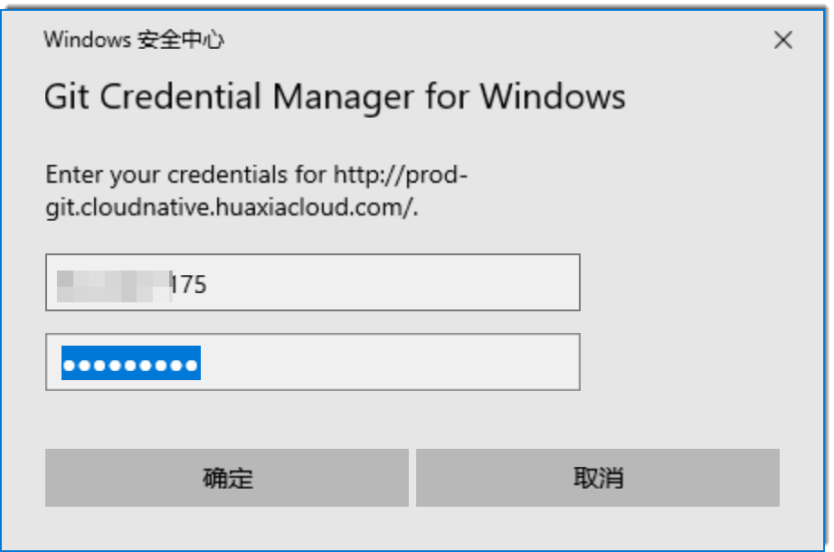
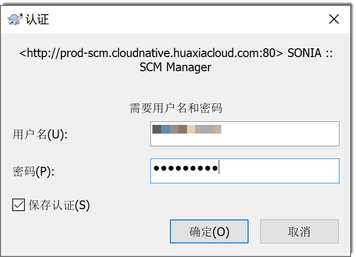

# 迁移已有代码

### 通过Git Bash/Linux Git/mac Git客户端迁移代码
Windows Git Bash客户端、Linux Git客户端和mac Git客户端在开发并比较代码过程中的命令基本一致。以下以Windows Git Bash客户端为例进行介绍。

1. 克隆代码库。
  1. 在代码库详情页面，单击右上方的“克隆”。
  2. 在地址对话框中，单击“复制”，复制访问方式中的HTTPS链接。
     
     Cloud Native当前只支持HTTPS协议。
     
  3. 打开Git Bash客户端，进入本地的相应目录下，执行以下命令，将代码库克隆下来。
```
    $ git clone <HTTPS克隆链接>
```
    
    

  4. （可选）如果您是第一次使用git克隆仓库，则需要验证认证信息。
    
    在弹出的用户名、密码对话框中，输入已加入代码库“维护人员”或“开发人员”的账号、密码，单击“确定”。
> [!NOTE]
> 客户端在使用**git clone**命令克隆代码仓库时失败，请检查账号密码是否有误。
     
     
 
2. 将原代码库中的内容全部拷贝到本地代码库目录中。
3. 提交文件到本地仓库。
  1. 进入本地代码库目录，并将代码提交到本地仓库暂存区。
```
    # 提交本目录下的所有修改到暂存区
    $ git add .
```
> [!NOTE]
> **git status**命令可以查询当前本地仓库的状态。您可以在需要的时候执行命令查看，后续不再赘述。

  2. 将暂存区的内容commit到本地仓库。
```
    $ git commit -m "<本次commit的备注信息>"
```

4. 推送文件到远端仓库的当前分支。
```
    $ git push origin <当前分支名称>
```
    
本地代码库的内容已推送到远端仓库。您可以打开Cloud Native的代码库查看。


### 通过TortoiseGit客户端迁移代码

1. 克隆仓库。
  1. 在代码库详情页面，单击右上方的“克隆”。
  2. 在地址对话框中，单击“复制”，复制访问方式中的HTTPS链接。
     
     Cloud Native当前只支持HTTPS协议。
     
     
     
  3. 打开TortoiseGit客户端，进入相应目录下，单击鼠标右键，选择“Git克隆”。
  4. 在弹出的窗口中，将复制的HTTPS地址粘贴到URL输入框中，然后单击“确定”。
      
      
      
      如果您是第一次克隆，TortoiseGit客户端会弹出对话框，要求输入用户名和密码。
      
      
      
  5. 在用户名密码对话框中，输入代码库“维护人员”或“开发人员”角色的账号和密码，单击“确定”。
    
    如果界面提示“成功”，表示仓库克隆成功。
    
2. 将原代码库中的内容全部拷贝到本地代码库目录中。
     
3. 提交文件到本地仓库。
  1. 在本地仓库目录下，右键单击空白处，选择“Git（提交） > _分支名称_”。
      
  2. 在对话框中，填写本次提交的日志信息、勾选“设置作者”、在变更的文件列表中选择要进行提交的文件，单击“提交”。
       
4. 推送文件到远端仓库。
     
 1. 在仓库目录下，右键单击空白处，选择“TortoiseGit > 推送”。
     
 2. 在弹出的窗口中去掉“自动加载Putty密钥”的勾选，然后单击“确定”。
      
本地代码库的内容已推送到远端仓库。您可以打开Cloud Native的代码库查看。


### 通过TortoiseSVN客户端迁移代码
1. 克隆仓库。
  1. 在代码库列表中，单击SVN类型的代码仓库，进入代码仓库详情界面。
  2. 单击“代码”页签，然后在右上角单击“克隆”。
  3. 在按钮下方显示的对话框中，单击“复制”，复制仓库地址。
      
      

  4. 进入本地存放代码仓库的目录，右键单击空白处，选择“SVN检出”。
        
        
        
  5. 在“检出”对话框中，将刚刚复制的代码仓库地址粘贴到“版本库URL”中，其它参数保持默认值，单击“确定”。
       
       
       
  6. 在弹出的“认证”对话框中，输入具有该仓库操作权限的Cloud Native账号和密码，单击“确定”。
     
       
       
      仓库成功克隆到本地后，目录中显示名称为仓库名称的文件夹。
      
2. 将原代码库中的内容全部拷贝到本地代码库目录中。
     
3. 将本地内容提交到远端仓库。
  1. 在修改所在的文件夹中，单击右键，选择“SVN提交”。
    
  2. 在提交对话框中，输入提交说明，勾选需要提交的文件，单击“确定”
      
  3. 在提交完成的提示框中，单击“确定”。

本地代码库的内容已推送到远端仓库。您可以打开Cloud Native的代码库查看。

