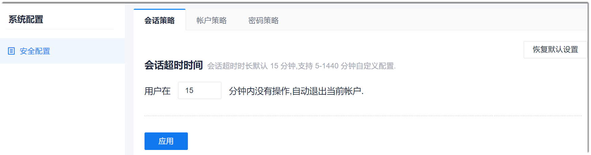

# 配置会话超时策略

配置会话超时策略是指配置用户在多长时间内没有操作，则自动退出当前账户。

### 前提条件
* 已使用具有“安全配置”权限的账号登录系统。

### 操作步骤
1. 在系统任意界面的左上角，单击“ > 系统配置”。      
    
  
2. 在右侧界面中，单击“会话策略”页签。
3. 设置**会话超时时长**，单击“应用”。         
  默认超时时长为15分钟。如果设置后想要恢复默认设置，可以单击右上角的“恢复默认设置”。      
   
  
