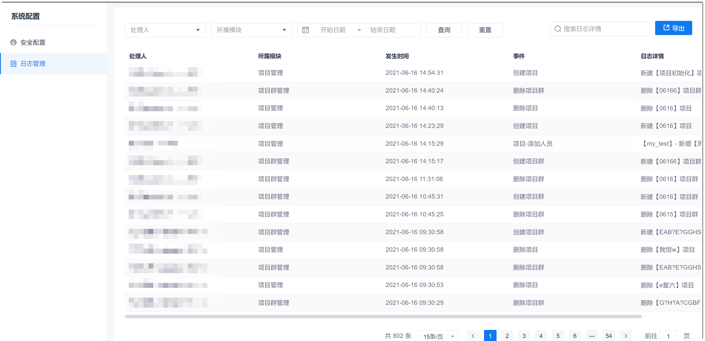
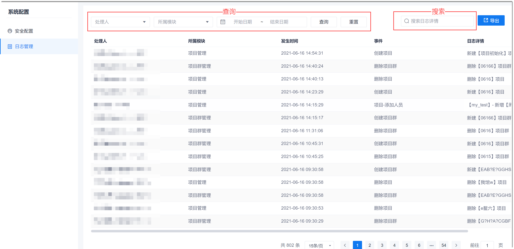

# 查看系统操作日志

系统记录最多6个月的操作日志。您可以在线查看日志，将日志导出到本地查看，您也可以查询、搜索想要的日志。

### 前提条件
* 已使用具有“日志查看”或“日志导出”权限的账号登录系统。

### 操作入口
1. 在系统任意页面的左上角，单击“ > 系统配置”。           
                  
2. 在左侧导航栏中，单击“日志管理”。

### 在线查看日志                    
单击“日志管理”后，右侧页面显示全部日志。               
  

### 查询、搜索日志            
在日志列表上方，输入查询条件，单击“查询”。或者在搜索框中输入日志详情的关键字，即可获取满足条件的日志。       
  

### 导出日志
您可以导出指定时间范围内的日志到本地查看。导出的日志与查询和搜索条件无关。
1. 在日志列表右上角，单击“导出”。
2. 在弹出的“导出”对话框中，设置导出日志的时间范围，单击“确定”。      
    如果不设置时间范围，表示导出所有日志。        
日志以zip包的形式下载到本地。zip包中的日志文件为“.xlsx”格式。

