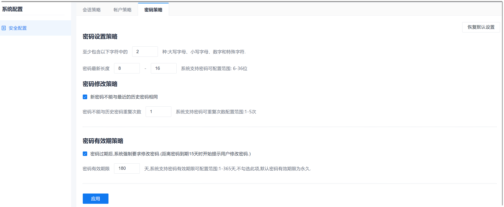

# 配置密码策略

密码策略包括密码复杂度、新旧密码是否可以相同、密码有效期。

### 前提条件
* 已使用具有“安全配置”权限的账号登录系统。

### 操作步骤
1. 在系统任意界面的左上角，单击“ > 系统配置”。      
    
  
2. 在右侧界面中，单击“密码策略”页签。
3. 根据实际要求配置密码策略，然后单击“应用”。        
  * 配置密码复杂度         
    在“密码设置策略”区域中，设置密码必须**包含多少种字符**，**密码长度**。        
  * 配置新旧密码差异         
    在“密码修改策略”区域中，勾选“新密码不能与最近的历史密码相同”，然后设置不能与**前几次**的密码相同。     
  * 配置密码有效期       
    在“密码有效期策略”区域中，勾选有效期要求，设置**密码有效期**。      
    
    
  如果设置后，需要恢复到默认状态，则单击右上方的“恢复默认设置”。