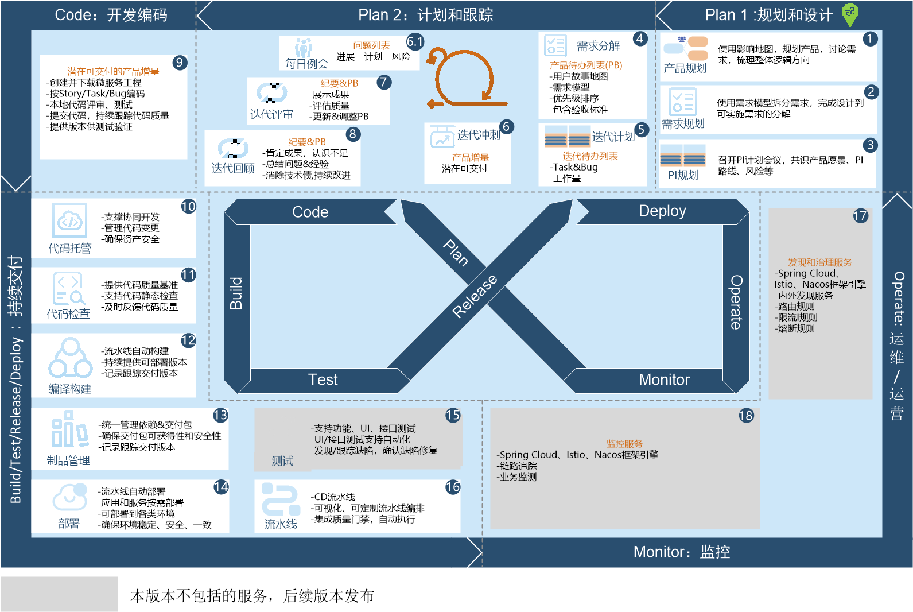

# DevOps端到端实践指引

DevOps端到端实践是一套融合了SAFe规模化敏捷框架、Scrum敏捷框架、多年软件研发经验、DevOps咨询和实施经验的，可落地的，理论与实践结合的方法论。

DevOps端到端实践过程如下图所示。            
          
> [!NOTE]
> 本版本不包括测试和应用管理服务。测试和应用管理服务后续发布。

### 规划和设计    
规划和设计是业务（或者是客户）与技术之间进行产品规划，梳理产品整体方向，进行产品实施设计和计划的过程：
* 使用影响地图，采用**WHY-WHO-HOW-WHAT**的基本模型，鉴别用户的需求是什么，什么场景下需要，谁来用，怎么用，从而确保产品能解决真正的问题，提供真正的价值。
* 使用SAFe需求模型，拆分需求，完成产品设计到可实施需求的分解。
* 召开PI计划会议，将产品愿景、目标、PI路线快速达成共识，识别团队间协作的相互影响和风险，提前制定合理的应对方案；将计划的责任转移到了真正负责工作的团队，营造一种共享使命、责任、相互协作的团队文化。

用户故事就是目标和需求的载体，以用户的场景来讲故事，便于在客户、业务与开发之间进行信息的传递。在这个过程中，独立的需求条目的堆积，很容易导致只能看到各个需求条目，不能从整个解决方案思考需求。用户故事以用户使用的场景为主线，将大的阶段点，及其细分的活动，以树状的结构进行梳理和展现，既可以看到独立的需求条目，又能够看到整体需求场景。

> [!NOTE]
> 对于小规模的敏捷：您可以将此阶段的需求规划与“计划和跟踪”阶段的需求规划合成一个步骤，直接将需求分解到Story。也无需召开PI计划会议，直接召开“计划与跟踪”阶段的迭代计划会议。

### 计划和跟踪

计划和跟踪是开发团队的Scrum敏捷开发过程，主要为管理实践。计划和跟踪将需求进一步拆分为Story/Task，并将缺陷纳入工作项管理，安排迭代计划，进行迭代冲刺，迭代开发完成后进行迭代评审和回顾，确保价值的持续流动和持续反馈，并在过程中持续学习，持续改进。

在将需求拆分为Story时，您可以采用用户故事地图，确保需求拆分过程中保持产品和用户体验的全景图；也可以采用树状结构的需求模型，既可以看到独立的需求条目，又能够看到整体需求场景。

Scrum是一个较完整的敏捷过程管理框架。在Scrum过程中，涉及三个核心角色：PO、SM和开发团队；输出三个工件：产品待办列表、迭代待办列表和产品增量；执行五个事件：迭代计划会议、迭代冲刺、每日站会、迭代评审会议、迭代回顾会议。在整个过程中，所有参与人应遵循“勇气、开放、专注、承诺、尊重”的五大价值观。

### 迭代开发   
迭代开发为迭代冲刺过程中的一部分。开发人员在迭代计划会议中领取任务后，进行编码开发，并在本地执行代码检查和单元测试，然后提交代码到代码库，并持续跟踪代码质量。  

### 持续交付    
持续交付即通常所说的CI/CD过程，主要为工程实践。
*   持续交付以代码配置管理（代码托管）为基础。代码托管支持多人协同开发，管理代码的变更、版本和基线，确保代码资产的安全。
*   通过持续交付的流水线，代码检查（即静态扫描）、编译构建、部署、测试、以及其它交付过程中可能的操作，都被有机地串联在一起，可以定时自动执行。
*   持续交付除了流水线中涉及的动态活动，还包括制品管理，以及各类环境管理，包括开发环境、测试环境、准生产环境，以及生产环境。
*   持续交付流水线就是将整个持续交付中，都有哪些阶段，分别运行在什么环境，每个阶段执行什么活动，准入与准出的质量门禁，以及每个阶段的输入与输出的制品进行管理。

