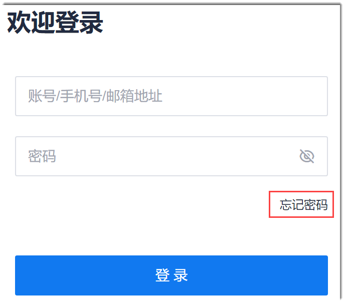
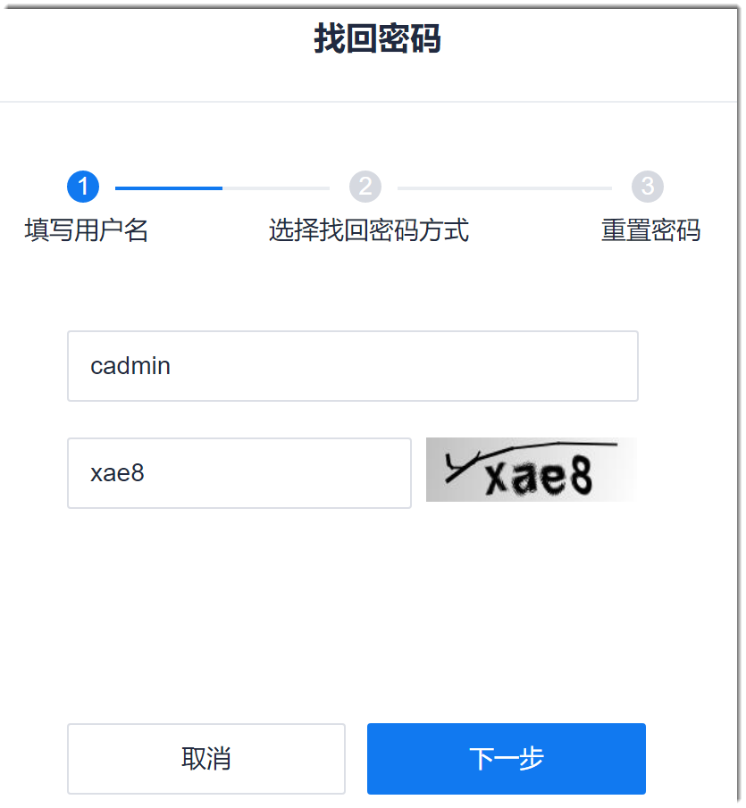
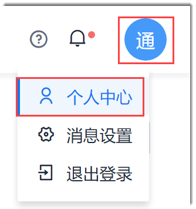
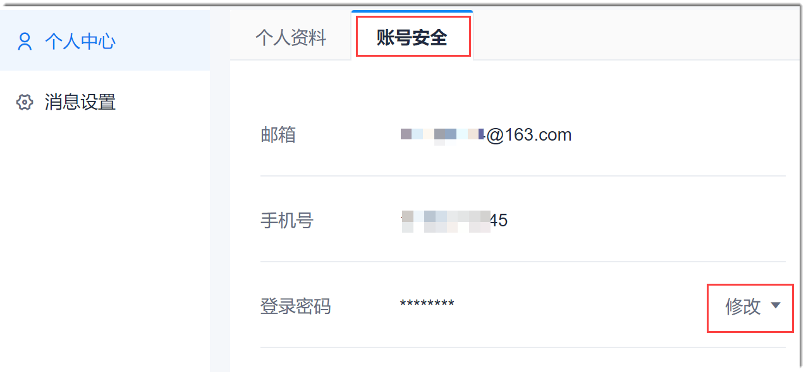

# 重置密码

当您忘记密码时，您可以通过邮箱找回密码。当您没有忘记密码，但是希望修改密码时，可以修改密码。

### 找回密码
1. 在系统登录页面中，单击“忘记密码”。                
                         
2. 在“找回密码 > 填写用户名”界面中，输入用户名、手机号或者邮箱地址，并输入验证码，单击“下一步”。           
  其中，验证码区分大小写。       
                  
3. 在“找回密码 > 选择找回密码方式”界面中，单击“发送验证码”，然后到邮箱中获取验证码，填入验证码输入框中，单击“下一步”。
4. 在“找回密码 > 重置密码”界面中，输入两次新密码，单击“确定”。

重置成功后，可以使用新密码登录CAP。

### 修改密码
1. 在系统任意页面中，在右上角单击登录用户头像，选择“个人中心”。
                  
2. 单击“账号安全”页签，然后单击“登录密码”后面的“修改”。
                              
3. 输入原密码和新密码，单击“确定”。                       
     新旧密码不能相同。
