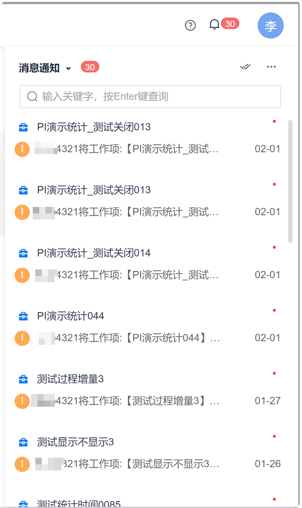
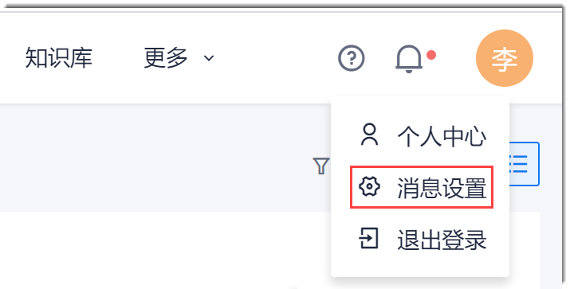
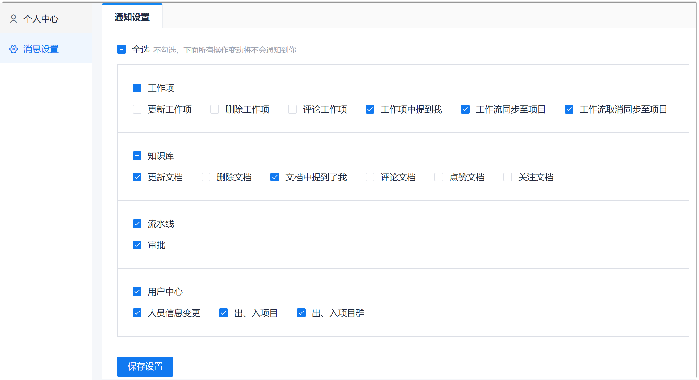
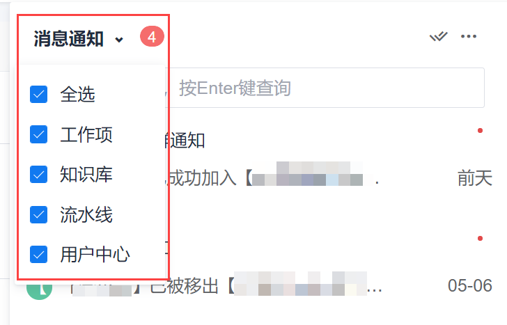
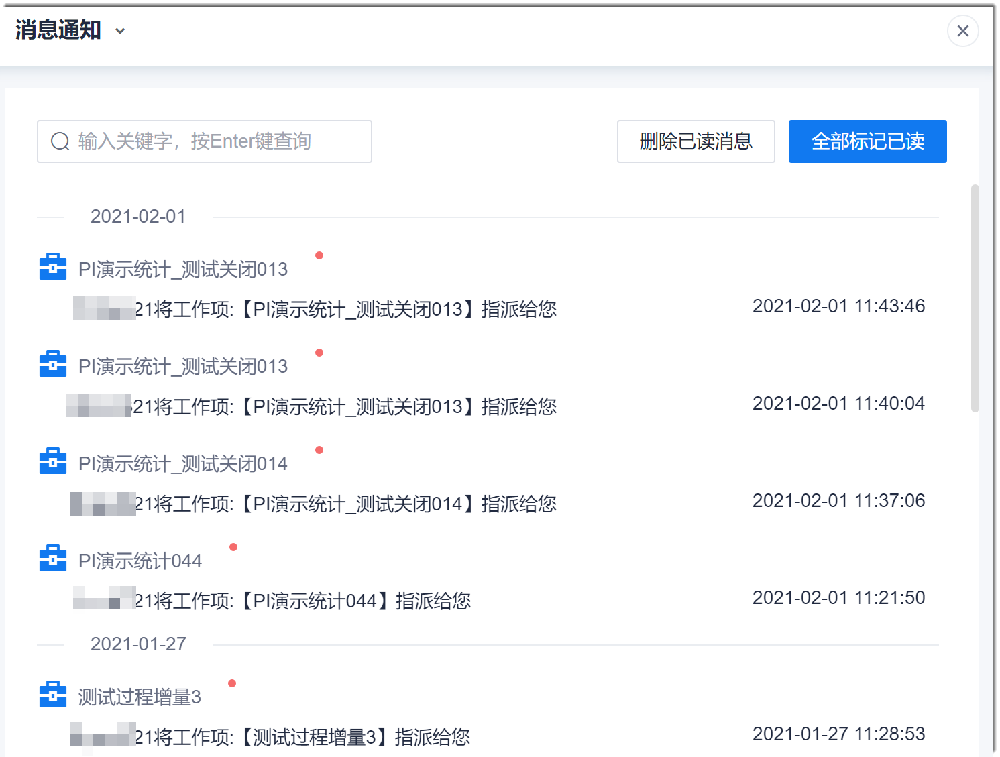
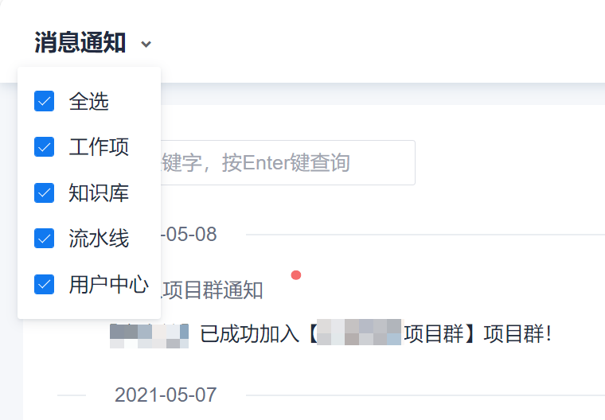
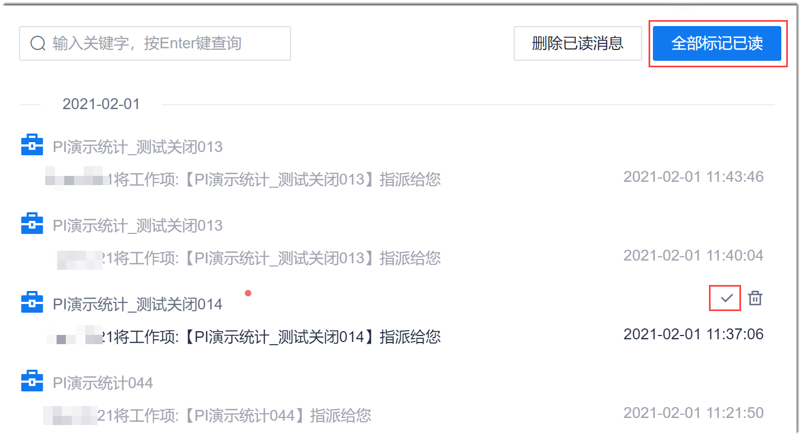
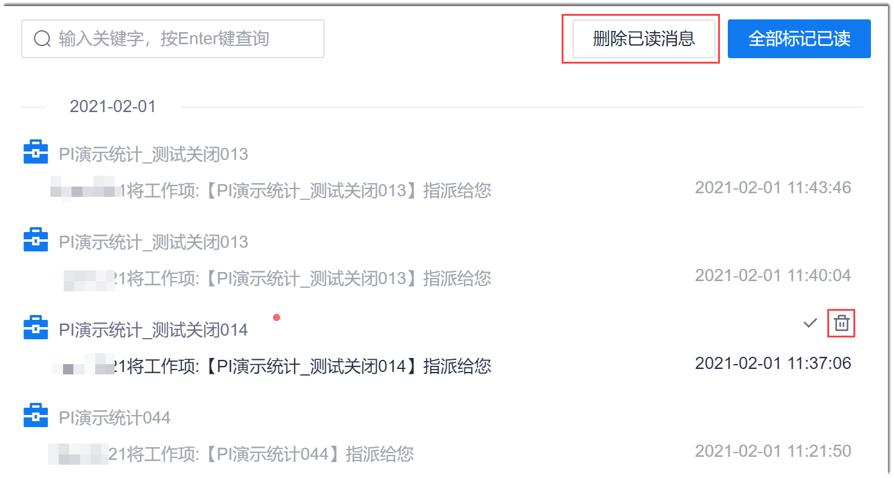

# 个人消息管理

当某些事件发生时，系统可以发送系统消息和邮件通知相关人员，便于及时了解事件。

当系统中有未读消息时，右上角的通知图标上显示红点。当鼠标放上去后，图标显示未读消息数量。

### 设置消息通知策略
1. 通过以下任一方式进入通知设置页面：
  * 通过系统消息进入：
    1. 在系统任意界面的右上角，单击。            
           显示未读消息列表。        
                
    2. 在未读消息列表中，单击右上方的“ > 设置”。       
  * 通过个人信息进入：       
    在系统任意界面的右上角，单击登录用户头像，选择“消息设置”。        
     
2. 在“通知设置”界面中，根据下表的描述，勾选需要通知你的操作，单击“保存设置”。         
                
  

|类型|事件|发送给……|消息类型|
|:--------- |:-------- |:-----|:--------|
|工作项|更新工作项|工作项的创建人、当前处理人、抄送人|系统消息、邮件|
|工作项|删除工作项|工作项的创建人、当前处理人、抄送人|系统消息、邮件|
|工作项|评论工作项 |工作项的创建人、当前处理人、抄送人|系统消息、邮件|
|工作项|工作项中提到我|被@的人|系统消息、邮件|
|工作项|工作流同步至项目|同步项目中工作流有变更的项目的所有成员|系统消息|
|工作项|工作流取消同步至项目|同步项目中的所有成员|系统消息|
|知识库|更新文档|文档的创建人、收藏人|系统消息、邮件|
|知识库|删除文档|文档的创建人、收藏人|系统消息、邮件|
|知识库|文档中提到我|被@的人|系统消息、邮件|
|知识库|评论文档|文档的创建人、收藏人|系统消息、邮件|
|知识库|点赞文档|文档的创建人、收藏人|系统消息、邮件|
|知识库|关注文档|文档的创建人、收藏人|系统消息、邮件|
|流水线|审批|流水线“人工审核”步骤的审核人员。|系统消息、邮件|
|用户中心|人员信息变更|企业成员的信息变更后，通知该成员。|系统消息、邮件|
|用户中心|出、入项目|新添加项目成员，或删除项目成员后，通知该成员。|系统消息、邮件|
|用户中心|出、入项目群|新添加项目群成员，或删除项目群成员后，通知该成员。|系统消息、邮件|

### 筛选消息类型
* 在未读消息列表中筛选消息类型
  1. 在系统任意界面的右上角，单击。          
    当没有未读消息时，图标显示为，单击后的未读消息列表显示为空白；当有未读消息时，图标显示为，单击后未读消息列表显示未读消息。        
  2. 在未读消息列表左上方，单击“消息通知”，选择消息类型。          
      
        
* 在全部消息列表中，筛选消息类型
  1. 在系统任意界面的右上角，单击。
  2. 查看所有消息。           
    在未读消息列表中，单击右上方的“ > 查看全部”。                       
    弹出“消息”界面，显示当前登录用户的所有消息。           
                                
  3. 在左上方“消息通知”下拉框中，选择消息类型。            
    
         
### 查看消息       
1. 在系统任意界面的右上角，单击。             
     当没有未读消息时，图标显示为，单击后的未读消息列表显示为空白；当有未读消息时，图标显示为，单击后未读消息列表显示未读消息。
2. 查看所有消息。             
     在未读消息列表中，单击右上方的“ > 查看全部”。
弹出“消息”界面，显示当前登录用户的所有消息。  
3. 进入通知内容的服务界面。             
     在消息列表（包括未读消息列表和全部消息列表）中，单击消息标题，可以进入通知内容的服务界面。例如，您收到人员信息变更的通知，单击消息标题，则进入“个人中心”界面。
     
### 将未读消息标记为已读
在未读消息列表和全部消息列表中，都可以通过如下几种方式，将未读消息标记为已读：
* 在未读消息列表中，单击上方的。
* 在未读消息列表和全部消息列表中，单击消息标题。
* 在全部消息列表中，鼠标移动到消息上，单击右侧的，或者单击右上方的“全部标记已读”。            
    

### 删除消息
在全部消息列表中，鼠标移动到消息上，单击右侧的，或者单击右上方的“删除已读消息”。        

