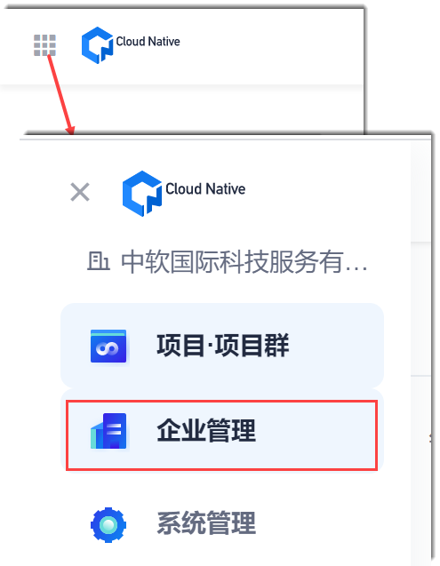
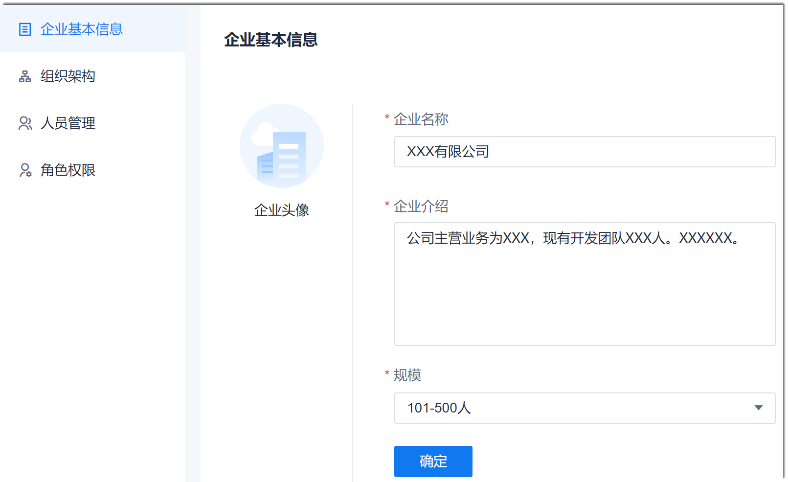

# 管理企业的基本信息

企业管理员可以管理企业的头像、名称、简介、人员规模。

### 前提条件
* 已使用企业超级管理员或管理员角色登录系统。

### 操作步骤
1. 在系统任意页面中，单击左上角的“ > 企业管理”。        
                  
2. 在“企业基本信息”界面中，管理企业的基本信息，单击“确定”。          
  * 修改企业名称                
    企业名称会默认显示首次登录系统创建管理员账号时填写的企业名称。您可以单击文本框修改。需输入3-30个字符。       
  * 在“企业介绍”中输入200个字符以内的介绍。
  * 选择“企业规模”。
     
