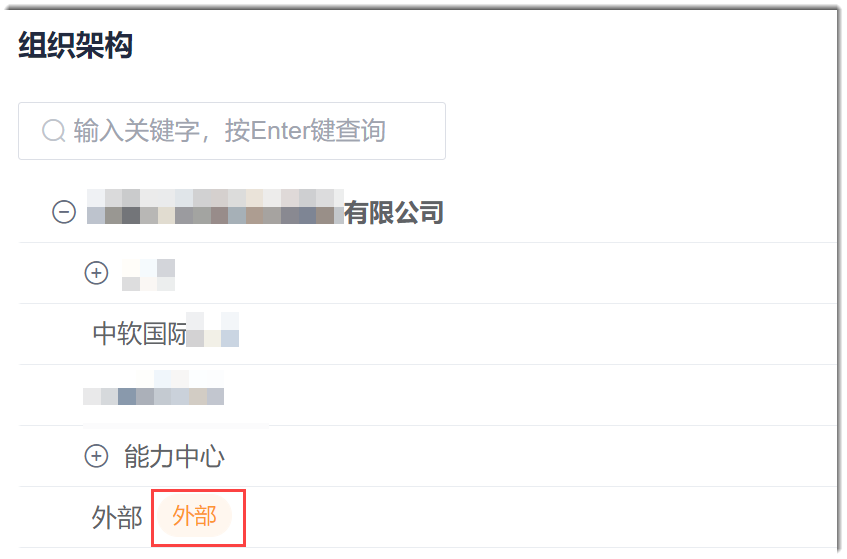

# 配置企业组织架构

您可以根据企业的实际组织架构，在系统上配置企业的组织架构。
### 前提条件
* 已使用企业超级管理员或管理员角色的账号登录系统。

### 背景信息             
同级部门之间按照部门最后修改时间正序排序（即创建时间最早的排最前面）。      
当部门下面有子部门时，部门前面的图标显示为。单击图标，可展开部门，查看子部门。当部门下面没有子部门时，部门前面无图标。

### 添加部门
1. 在系统任意页面，单击左上角的“ > 企业管理”。
2. 在左侧导航栏中，单击“组织架构”。                   
  右侧页面显示一级部门列表。                
  

3. 创建部门。
  1. 在组织结构列表右上方，单击“创建部门”，或者鼠标移动到部门上，单击右侧的。
  2. 在弹出的“新建部门”或“新建子部门”对话框中，输入部门名称，选择上级部门，然后根据实际情况确定是否勾选“外部合作方”，单击“确定”。              
     
> [!NOTE]
> “外部合作方”选项在上级部门选择企业时，才有效。          
> 勾选“外部合作方”后，部门名称后面会显示“外部”标记。         
> 

### 修改部门名称
修改部门名称后，企业成员所属部门信息会一并修改。
1. 鼠标移动到部门上，单击右侧的。
2. 输入部门新名称，单击“确定”。
  

### 删除部门
当部门下有子部门时，删除部门会将子部门一并删除。如果部门下面有成员，则不能直接删除部门，需将成员移出后，才能删除部门。
1. 鼠标移动到部门上，单击右侧的。
2. 在弹出的确认框中，单击“确定”。
