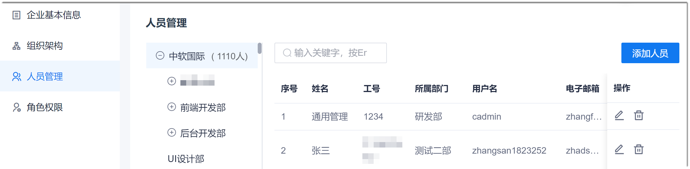
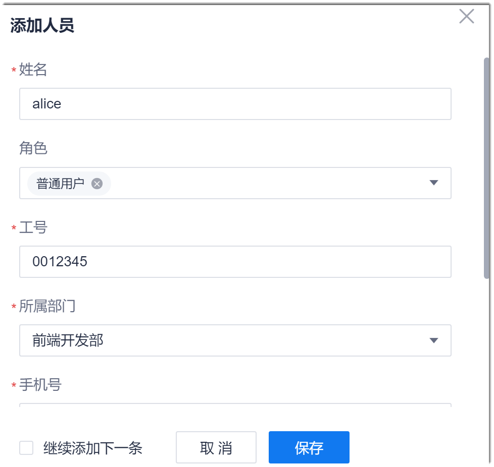
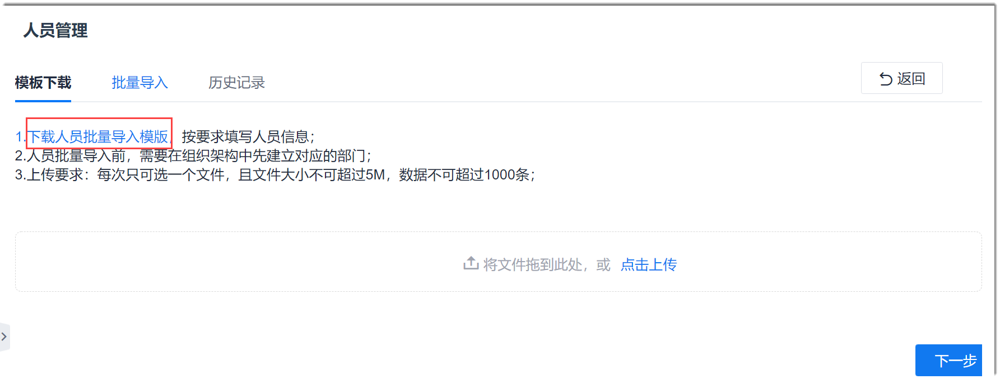
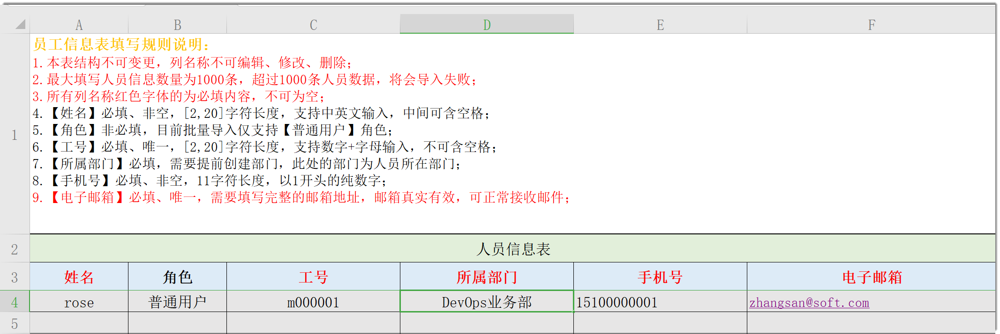
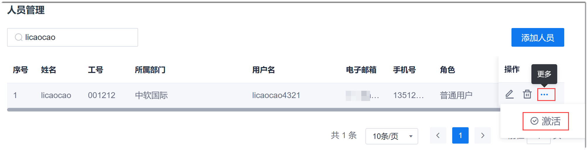
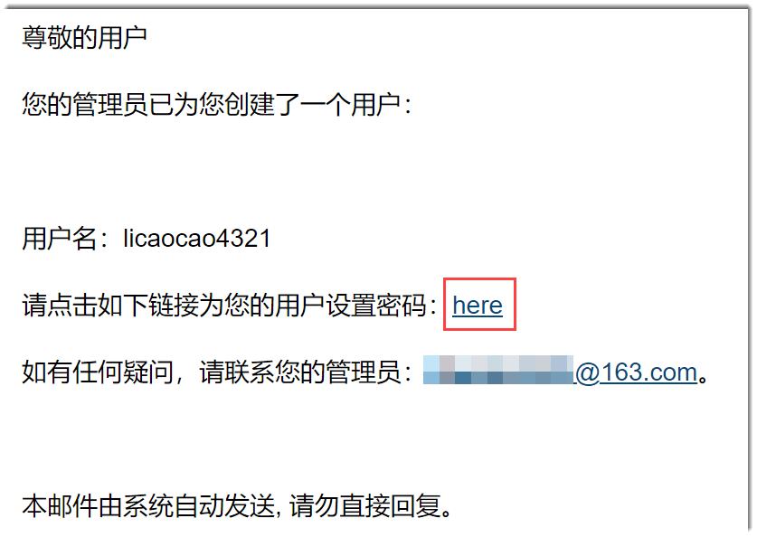
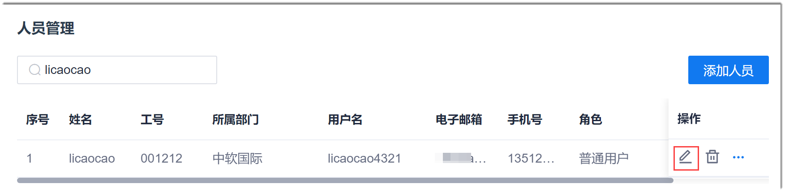
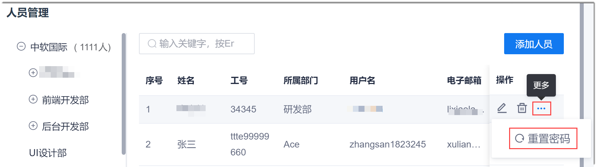

# 管理企业人员

为方便企业管理人员，Cloud Native提供了企业的人员管理。您可以管理人员的姓名、工号、所属部门、联系方式。同时，项目群和项目成员均来源于企业人员。因此，需要加入项目群和项目的人员需先加入企业人员中。

### 前提条件
* 已使用具有企业人员管理相应权限的账号登录系统。

### 背景信息
对于添加、修改、删除人员和重置密码，高级别角色可以管理低级别角色，“普通用户”角色如果具备相应的权限，只能管理“普通用户”角色的对应功能。角色的级别由高到低依次为：超级管理员 > 管理员 > 普通用户。

例如，使用超级管理员账号可以修改人员的角色为管理员和普通用户角色。

### 添加人员
1. 在系统任意界面，单击左上角的“ > 企业管理”。
2. 在左侧导航栏中，单击“人员管理”。
     
     右侧主界面显示组织架构和企业人员。企业人员按人员最后被编辑的时间由近到远的顺序显示。
      
      
     
3. 在界面右上方，单击“添加人员”。
4. 在弹出的“添加人员”对话框中，按实际情况填写人员信息，单击“保存”。
  
  
> [!NOTE]
> 如果需要添加多个人员，可以勾选对话框左下角的“继续添加下一条”。勾选并单击“保存”后，继续弹出“添加人员”对话框。
     

|参数名称      |填写规则|
| :---------    | :-------- |
|姓名    |2~6个中文字符，企业内唯一。 |
|角色|在下拉框中选择。如果不选择，默认为“普通用户”角色。|
|工号    |2~20个字母和数字组合，企业内唯一。 |
|所属部门    |选择已配置的组织部门。|
|手机号      |11位数字组合，必须以“1”开头，第二位必须为3~9。|
|电子邮箱    |符合邮箱地址规则。|
|用户名      |系统自动生成。生成规则：“姓名”的拼音+“手机号”后四位。例如，“姓名”为“李三”，“手机号”后4位为“1234”，则“用户名”为“lisan1234”。|

企业人员管理主界面显示刚刚添加的人员。 

人员添加成功后 ，默认状态为“未激活”状态。此时，人员不能使用账号登录。您需要[激活人员](#激活人员)后，人员才能使用账号登录系统。

### 导入人员
1. 在企业人员管理界面中，单击右上方的“批量导入”。      
  
2. 在“模板下载”页签中，单击“下载人员批量导入模板”，下载模板。     
  
3. 在本地打开模板，按照格式要求填写数据（不能修改数据单元格之外的内容）。填写完成后，保存并关闭文件。    
  
4. 返回企业人员管理的“模板下载”页签中，上传文件，单击“下一步”。
5. 在“批量导入”页签中，单击“导入前检查”。在检查通过后，单击“导入”。       
  导入前检查主要检查文件的格式问题。导入时再验证数据。如果某些数据验证不成功，不影响验证成功数据的导入。      
         

导入成功的数据显示在界面中。导入失败的数据和失败原因请单击“历史记录”页签，然后单击下载文件查看。      

### 激活人员
人员添加成功后 ，默认状态为“未激活”状态。此时，人员不能使用账号登录。您需要激活人员后，人员才能使用账号登录系统。         
**激活单个人员**
1. 在企业人员列表中，单击“未激活”状态人员操作列的或“ > 激活”。      
  
  
2. 在弹出的确认对话框中，单击“确定”。

**批量激活人员**
1. 在企业人员列表中，勾选需要激活的人员，然后单击列表上方的“激活”。       
  
2. 在弹出的确认对话框中，单击“确定”。

激活人员后，系统会发送密码设置邮件到人员的预留邮箱中。邮件内容如下图所示。         

企业人员单击邮件中的“here”，设置登录密码。设置密码邮件的有效期为24小时。超过24小时，或在设置密码后，密码设置邮件失效。

### 修改人员信息
当人员信息变动时，管理员可以修改人员信息，包括联系方式、所属部门、所属角色等。
1. 在企业人员管理主界面的人员“操作”列，单击按钮。
  
  

2. 在弹出的“修改人员信息”对话框中，修改相关信息，单击“确定”。

### 重置密码

当企业人员忘记密码，或者有账号安全隐患时，您可以重置账号的密码。
1. 在企业人员管理主界面的人员“操作”列，单击或 “ > 重置密码”。
  
  
  
2. 在弹出的确认对话框中，单击“确定”。           

重置密码后，系统会发送密码重置邮件到人员的预留邮箱中。邮件内容如下图所示。           

企业人员单击邮件中的“here”，重新设置登录密码。重置密码邮件的有效期为24小时。超过24小时，或者在设置密码后，密码设置邮件失效。

### 删除成员
当人员不再属于企业时，可以删除成员。         
当操作删除的人员为非超级管理员角色时，只能删除不在任何项目或项目群中的成员。             
当操作删除的人员为超级管理员角色时，无论成员是否在项目或项目群中，均可强制删除单个成员（单击成员后面的按钮），不能批量强制删除成员。成员从企业中被删除后，也将自动从项目或项目群中被删除。如果被强制删除的成员为项目群或项目的负责人，则该项目或项目群的负责人改为超级管理员，再由超级管理员重新指派负责人。                            
1. 在企业人员管理主界面的人员“操作”列，单击按钮；或者勾选需要删除的成员，单击列表上方的“批量删除”。
2. 在弹出的确认框中，单击“确定”。

### 解除账号锁定
当账号在15分钟内连续5次登录失败时，账号将被锁定。账号被锁定后，您可以联系具备人员管理“解除锁定”权限的本级或上级角色手动解除锁定。        
在企业人员管理主界面的人员“操作”列，单击或 “ > 解锁”。       
解锁成功后，账号可以登录Cloud Native。

### 禁止用户登录
如果您发现异常账号，您可以禁止该账号登录系统。          
在企业人员管理主界面的人员“操作”列，单击或“ > 禁止登录”。        
被禁止登录用户状态显示为“禁止登录”。

### 解除用户禁止登录
如果被禁止登录的账号恢复正常，您可以解除该账号的禁止登录。          
在企业人员管理主界面的人员“操作”列，单击或“ > 解除禁止登录”。        

### 解除账号停用
当账号因长时间未使用被停用后，如果需要继续使用该账号，您可以解除账号停用。          
在企业人员管理主界面的人员“操作”列，单击或“ > 禁止登录”。        
被禁止登录用户状态显示为“禁止登录”。
