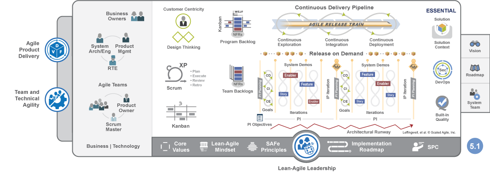

# 项目群概述

一般情况下，敏捷讲的是一个敏捷团队（一般3~9人）或两三个敏捷团队的敏捷。然而，很多研发团队的人数比较多。在大规模成员的情况下， 应该如何实施敏捷，如何协同和管理各个敏捷团队呢？SAFe—— 规模化敏捷框架提供了一种方案。

SAFe是可扩展和可配置的框架，SAFe4.5中基本型框架如下图所示。关于其它类型的SAFe框架和SAFe的详细描述请参见[SAFe官网](https://www.scaledagileframework.com/#)。

在SAFe中，一个投资策略由一列敏捷版本火车（Agile Release Train，ART）承载。一个企业级投资策略可以由多个敏捷版本火车组成。SAFe采用PI（Program Increments）对一列ART的提交和发布时间进行总体规划。每个PI为一个发布版本。每个PI的增量由多个敏捷团队经过多个迭代开发完成。
PI级团队由System and Solution Architest/Engineering、Product and Solution Management、Release Train Engineer组成。迭代级团队由敏捷团队组成，包括全功能开发团队、Product Owner和Scrum Master。

在系统中，项目群用于统一管理产品所有工作项，通过PI路线和子项目协调管理多个团队，同时提供项目群级的统计报表、知识库管理。项目也可以统一管理产品所有工作项（同时可以从项目群中同步工作项）、根据需求进行迭代开发、持续交付、运营&运维。一个项目群可以包含多个子项目。
