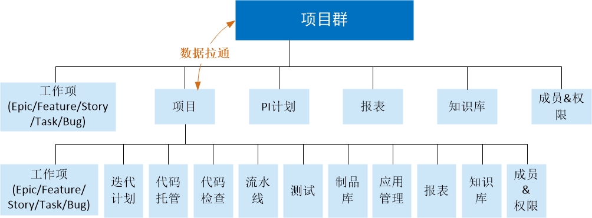
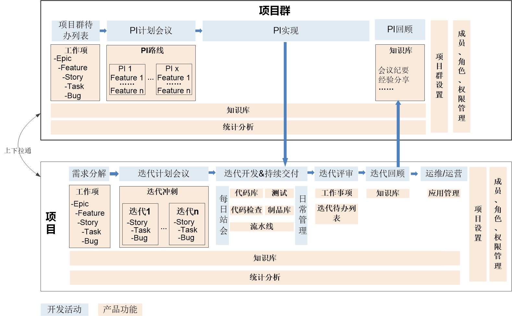

# 项目群与项目的关系

在规模化敏捷开发场景下，项目群除了统一管理所有工作项外，主要用于管理协调多个敏捷团队，制定统一的规则、统一的版本计划节奏，展示产品级统计报表。           
子项目的工作项可以从项目群同步。子项目与项目群的数据上下拉通，使所有成员对需求都有全局了解。除此之外，子项目主要管理产品的具体实现，包括管理迭代，根据需求编写代码并保障质量，将代码托管到代码库中，执行代码检查保障代码质量，对交付的增量执行编译构建、部署、测试、发布（可以使用流水线实现持续交付），并进行运维/运营阶段的应用管理。在项目管理过程中，您还可以随时管理过程中产生的知识、文档，进行多维度的统计分析。        

项目群与项目的关系如下图所示。        

多团队协作开发时，使用项目群和项目协同开发的过程如下图所示。    

