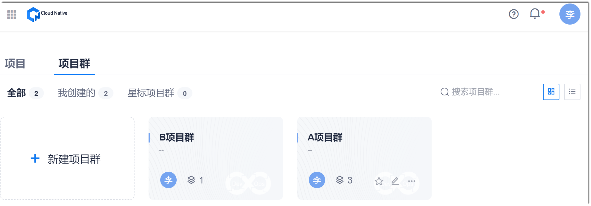
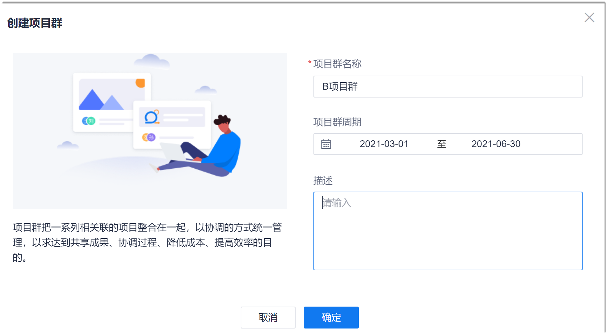
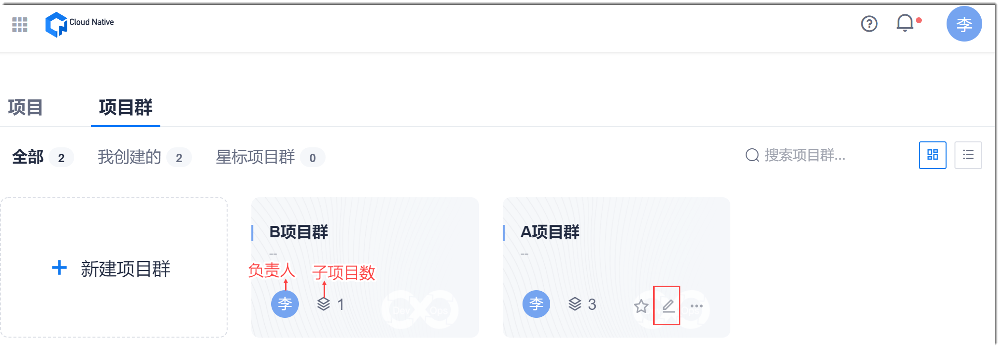
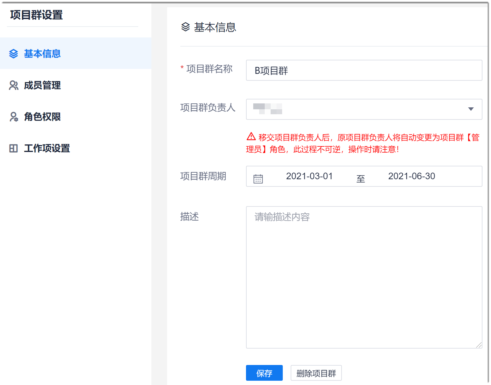
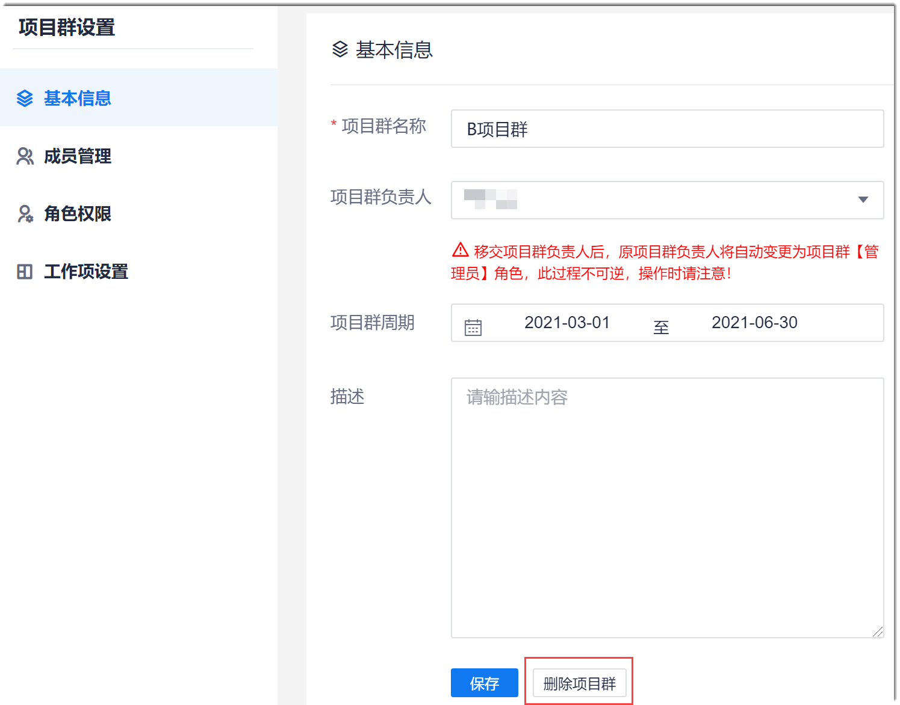

# 创建项目群

在进行所有的项目群工作前，您需要创建项目群。

### 前提条件
* 已使用具备项目群“新建项目群”权限的账号登录系统。

### 操作步骤
1. 在系统任意页面中，单击左上角的“ > 项目·项目群”。
2. 单击“项目群”页签。             
    显示项目群总览页面。页面默认以卡片方式显示。您也可以单击右上角的，将显示方式切换为列表方式。                     
     
3. 在项目群总览页面中，单击“新建项目群”。
4. 在“创建项目群”对话框中，输入项目群名称，设置项目群周期，输入项目群描述，单击“确定”。            
    
    
创建成功后，返回项目群总览页面，显示最新创建的项目群。

### 相关操作
#### 修改项目群信息
项目群信息包括项目群名称、项目群负责人、项目群周期和项目群的描述信息。其中，项目群负责人变更后，项目群负责人相关的权限也将一并移交，原项目群负责人的角色自动修改为“管理员”。
1. 在项目群总览页面中，鼠标移动到项目群上，单击，进入项目群基本信息页面。                           
                             
2. 在项目群基本信息页面中，您可以修改项目群的名称、项目群周期和项目群描述，并变更项目群负责人。修改完成后，单击“保存”。                   
    
        

#### 删除项目群                 
当项目群废弃后，您可以删除项目群。项目群被删除后，无法恢复，请谨慎操作。
1. 在项目群总览页面中，鼠标移动到项目群上，单击。
2. 在项目群基本信息页面中，单击“删除项目群”。                      
                          
3. 在弹出的确认对话框中，单击“确定”。
