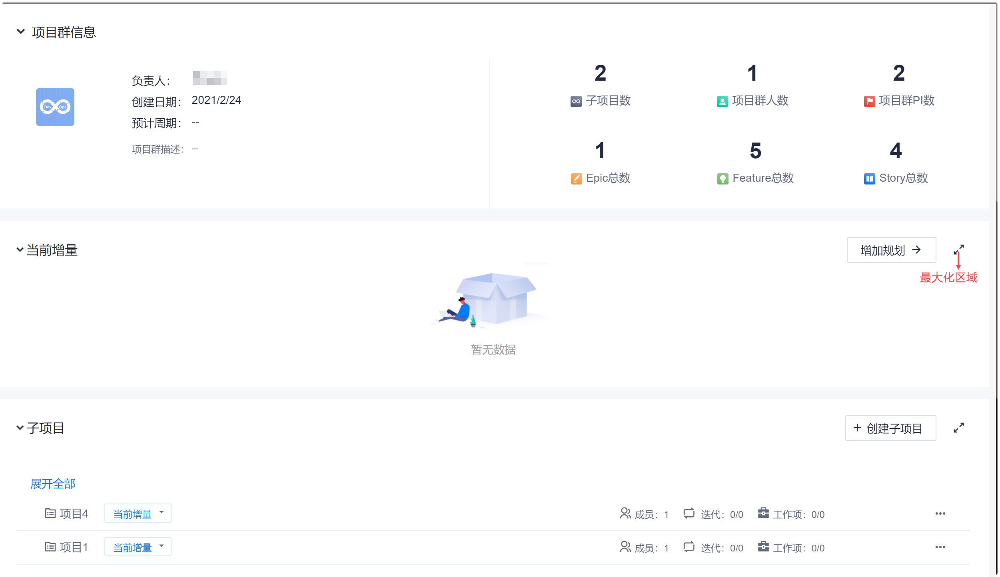
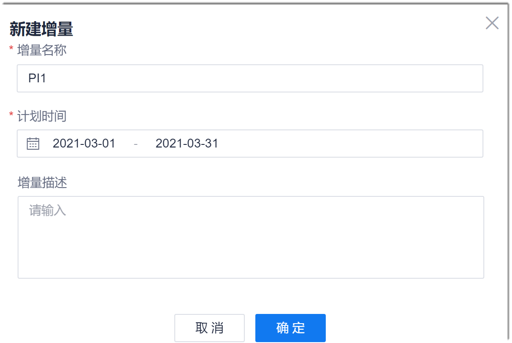
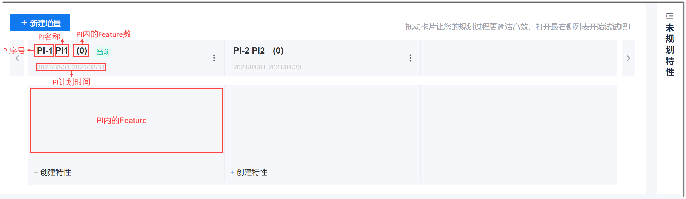
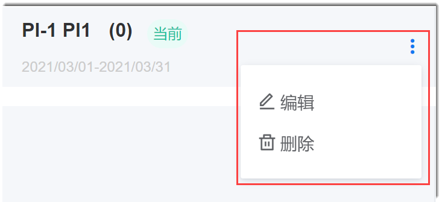
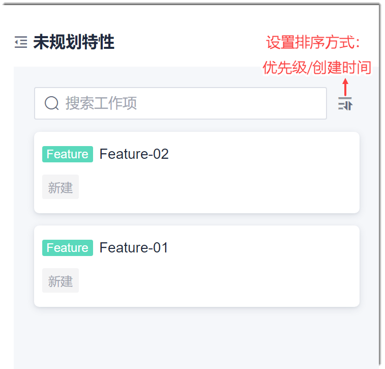
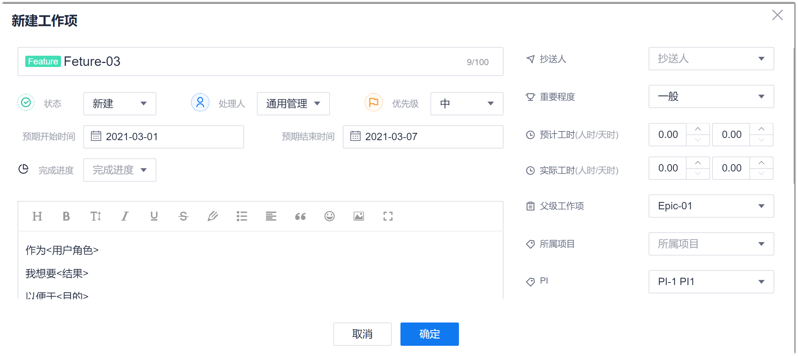

# 规划PI

在SAFe中，PI确定了ART级的增量开发节奏，一个PI一般包含多个团队的多个迭代。在项目群创建成功后，需要规划PI，以确定项目群级的开发节奏。

### 前提条件
* 已使用具有项目群“PI增量”相应权限的账号登录系统。

### 操作步骤
1. 在项目群顶部菜单栏中，单击“PI路线图”。              
     下方显示PI列表。系统根据PI周期的时间先后顺序从左到右依次显示PI增量。               
1. 在项目群总览页面中，单击项目群。
2. 任选一种方式进入规划子项目入口：
  * **通过项目群概览进入**：
    1. 在项目群顶部菜单栏中，单击“项目群概览”。                       
      显示项目群的基本信息和当前增量（PI）、子项目情况。                         
                                  
    2. 在“当前增量”区域右侧，单击“增加规划”。                                   
           下方显示PI列表。系统根据PI周期的时间先后顺序从左到右依次显示PI增量。                           
  * **通过PI路线图进入**：
    1. 在项目群顶部菜单栏中，单击“PI路线图”。                                  
          下方显示PI列表。系统根据PI周期的时间先后顺序从左到右依次显示PI增量。
            
3. 创建PI增量。
  1. 在界面左上方，单击“新建增量”。
  2. 在“新建增量”对话框中，输入增量名称、PI周期、增量描述，单击“确定”。                                
                                          
   PI创建成功后，按照PI计划时间的先后从左到右显示。默认显示界面最左边为当前PI。您可以单击左右箭头，显示其它PI。                             
                           
   当PI废弃后，并且PI中没有工作项时，您可以单击PI标题右侧的“ > 删除”，删除PI。                     
   您也可以单击PI标题右侧的“ > 编辑”，修改PI的名称、周期和描述。                           
    
    
3. 规划PI特性。
  * **将未规划PI的Feature工作项纳入PI中**。
    1. 在PI列表界面中，单击右侧的“未规划特性”。                               
      显示项目群中未规划PI的特性列表。                       
                          
    2. 拖拽特性卡片到对应的PI中。
       
       规划完成后，可以再次单击“未规划特性”，将界面收起。
> [!NOTE]
> 您可以在“未规划特性”的搜索框中输入工作项名称关键字搜索。也可以单击搜索框右侧的，选择对应的排序方式，重新排序未规划的特性。
 
  * **创建特性**。
    1. 在PI最下方，单击“ 创建特性”。
    2. 在“新建工作项”界面中，填写工作项相关参数，单击“确定”。
      
      
      

