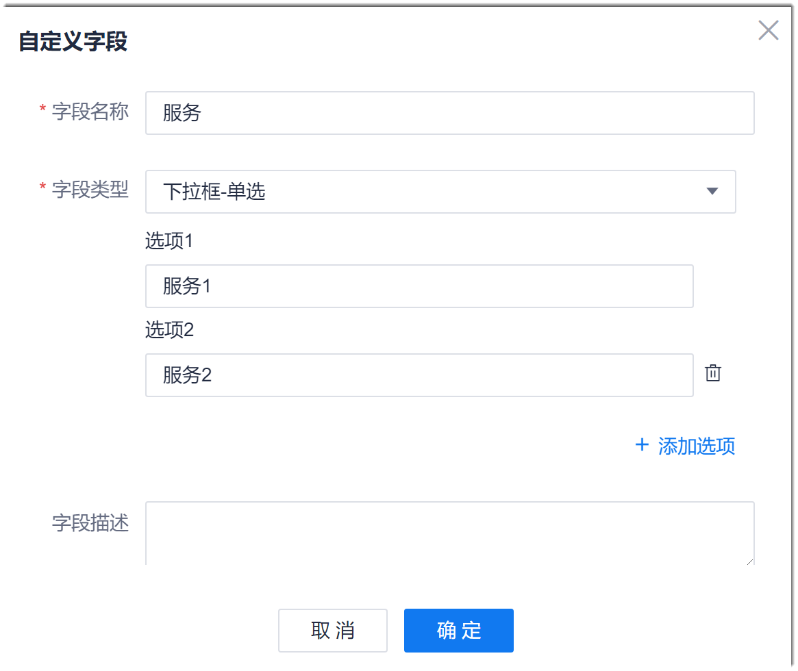

# 自定义工作项的字段与模板

对于通过项目群和子项目管理的研发项目：
* 在项目群内，您可以自定义Epic和Feature类型工作项的字段和描述信息的模板。
* 在子项目内，您可以自定义Story、Task、Bug类型工作项的字段和描述信息模板，以便于灵活适应各种项目的不同需求。

### 前提条件
* 已使用具有项目群“工作流设置”权限的账号登录系统。

### 背景信息
在通用字段中，系统默认的字段不能被删除和修改，只能删除和修改自定义字段。在工作项字段中，系统默认的字段不能被删除，只能删除自定义的字段。

### 设置通用字段
通用字段即Epic和Feature工作项类型均可使用的字段。设置通用字段后，可在设置工作项类型的字段时引用。
1. 在项目群顶部菜单栏中，单击“项目群设置”。
2. 在左侧导航栏中，单击“工作项设置”。
     
     右侧界面显示Epic和Feature工作项的字段和模板设置，以及通用字段设置。
     
     
     
3. 在右侧界面中，单击“通用字段配置”页签。
     
     下方显示通用字段列表。
     
     

4. 新增通用字段。
     
  1. 在列表右上方，单击“自定义字段”。
  2. 在“自定义字段”对话框中，设置“字段名称”、“字段类型”和“字段描述”，单击“确定”。
    
    
    
    其中，字段类型的说明如下表所示。
    
|字段类型|说明|
|:--------- |:-------- |
|单行文本|最多输入50个字符。|
|多行文本|最多输入200个字符。|
|下拉框-单选|需配置选项，每个选项不超过10个字符。|
|日期(年月日)|以yy-mm-dd格式显示日期。|
|数字|精确到小数点后2位。|
|下拉框-多选|需配置选项，每个选项不超过10个字符。|
|日期(年月日时分秒)|以yy-mm-dd h:m:s格式显示时间。|

新添加成功的字段显示在字段列表最后。

### 设置工作项类型的字段与模板
1. 在工作项设置界面中，单击需要定义字段和模板的工作项类型，例如“Epic设置”。
2. 在界面右上方，单击“编辑”。
    
    
> [!NOTE]
> 固定字段不能被调整顺序，系统自填充字段的值为系统填充，不能配置。

3. 在“描述信息”中，修改工作项描述的模板。
4. 添加字段。
  1. 添加通用字段。
         
         在界面右上方，单击“通用字段”。然后在弹出的“通用字段”对话框中，选择字段，单击“确定”。
         
  2. 添加自定义字段。
         
         在界面右上方，单击“自定义字段”。然后在弹出的“自定义字段”对话框中，设置“字段名称”、“字段类型”和“字段描述”，单击“确定”。

5. 设置“是否必填”和“默认值”。
     
6. 调整字段的显示顺序。
     
     在可调整字段区域中，拖拽带图标的字段到需要的位置。
     
7. 设置完成后，单击界面右上方的“保存”。

模板和字段设置成功后，已有的工作项和新建的工作项均会根据新模板和字段定义同步更新。

其它类型的工作项的字段模板，请参照上述步骤定义。