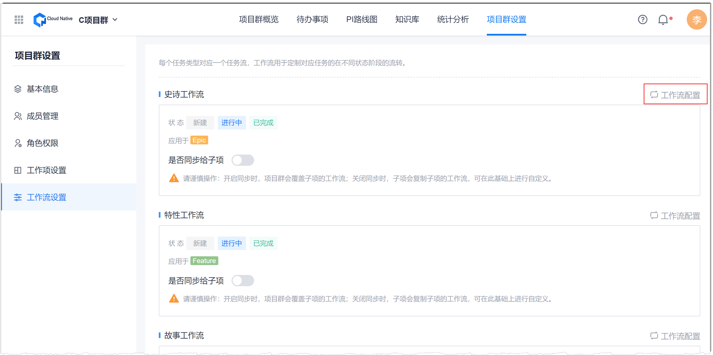
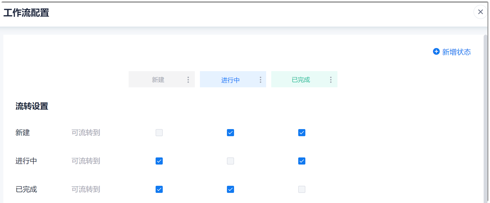
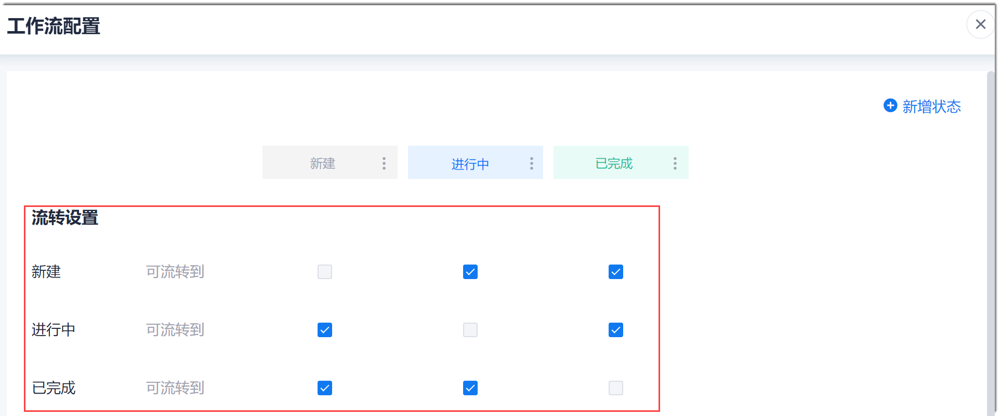

# 自定义工作项的可用状态及流转方向

可用状态是指工作项“状态”字段的取值，一般表示工作项所处的阶段，例如：新建、进行中。流转方向是指处于某个状态的工作项可以切换到哪个状态。

### 前提条件
* 已使用具有项目群“项目群信息编辑”权限的账号登录系统。

### 背景信息
项目群只能设置Epic和Feature类型的可用状态和流转方向，其它类型可以在项目中设置，请参见[自定义工作状态和流转方向](7.2.2 自定义工作项状态和流转方向.html)。Epic和Feature类型工作项的默认状态如下表所示。

|工作项类型|默认状态|
|:--------- |:-------- |
|Epic|新建、进行中、已完成|
|Feature|新建、进行中、已完成|

其中“新建”为开始态，或“已完成”为结束态，其余为进行态。您可以根据实际情况配置进行态的状态。

Cloud Native支持最多100个状态（包含子状态）。一个父状态下最多支持30个子状态。

开始态和结束态有且只能有一个，且分别固定为“新建”和“已完成”。

### 操作步骤
**操作入口：**
1. 在项目群顶部菜单栏中，单击“项目群设置”。
2. 在左侧导航栏中，单击“工作流设置”。    
    右侧界面显示各类工作项的状态。      
    

3. 单击右侧的“工作流配置”，可配置该类工作项的状态和流转方向。
单击需要设置状态和流转的工作项类型后面的“工作流配置”。
  
  

弹出“工作流配置”界面：
 
  
**设置状态及流转方向：**

在“工作流配置”界面中，按需执行相关操作。设置完成后，单击右上角的。

* 创建新状态
  采用以下任一方式创建：
  * 单击状态后面的“ > 在此后添加状态”。然后输入状态名称，单击“确定”。
    
    新建的状态显示在该状态后面。
    
  * 在右上角单击“新建”，然后输入状态名称，单击“确定”
    
    新建的状态显示在结束态前面。
    
  状态名称支持最多10个字符。    
* 创建子状态       
    当您需要在某个状态下细分状态时，可以创建子状态。只能在进行态的状态下创建子状态。当创建父状态下的第一个子状态时，第一个子状态会继承父状态下的工作项。                       
    单击状态后面的“ > 创建子状态”。然后在弹出的对话框中输入子状态名称，单击“确定”。  
* 修改状态名称
  
  不能修改结束态的状态名称。
  
  单击状态后面的“ > 修改状态列名称”。然后输入新的名称，单击“确定”。
      
  状态名称支持最多10个字符。

* 调整进行态状态的顺序。
     
   在状态行中，拖拽进行态的状态到合适的位置。
   
   调整后，工作项详情界面的“状态”字段取值的显示顺序会按照新顺序显示。      
     
* 删除状态      
    只能删除进行态的状态，不能删除开始态和结束态的状态。      
    当前系统支持2层状态：第一层为父状态，第二层为子状态。      
  * 删除父状态       
    当父状态下无工作项且无子状态时，可以删除；当父状态下有工作项或子状态时，不能删除。
  * 删除子状态      
     当子状态下无工作项时，可以删除；当子状态下有工作项时，可以删除，其下工作项的状态变化如下：           
     * 删除唯一子状态：工作项状态变为父状态。       
     * 删除非唯一非第一个子状态：工作项状态变为前一个子状态。      
     * 删除非唯一第一个子状态：工作项状态变为后一个子状态。                
   单击状态后面的“ > 删除状态”。然后在弹出的确认框中，单击“确定”。
      
* 配置工作项的流转方向。
  
  在流转设置区域中，勾选每个状态可流转的状态。
  
  
