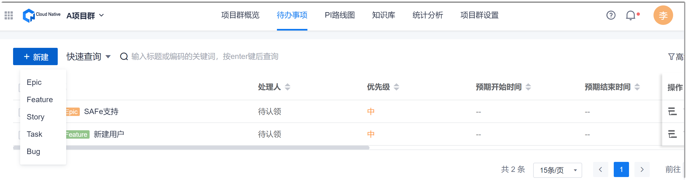
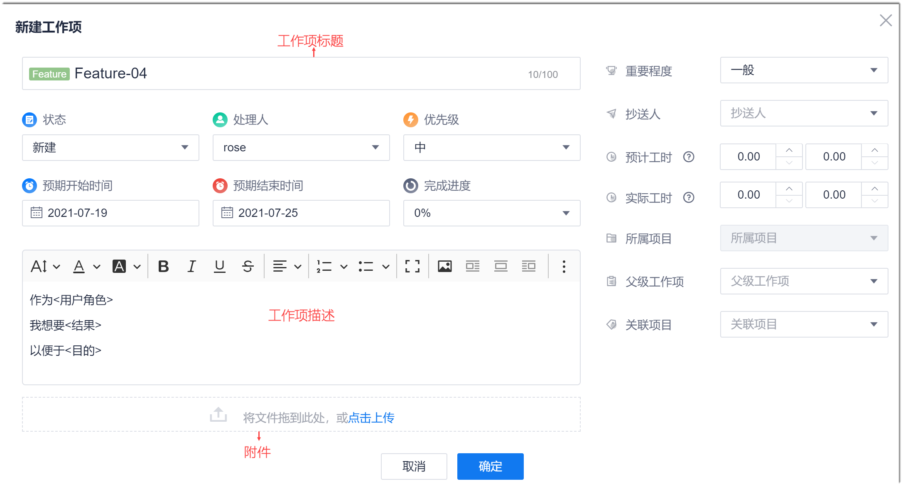
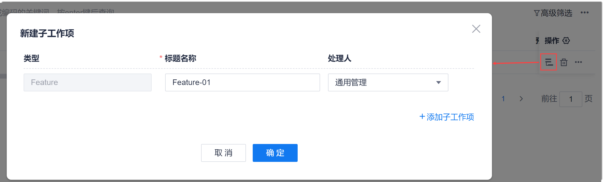

# 规划和分解需求

在项目群中，通过“待办事项”功能入口规划和分解需求。“待办事项”以树状列表的方式显示项目群中的工作项。您可以通过“待办事项”增、删、改、查工作项。您可以将需求最多分解到Story层级。

在工作项列表中，不同类型的工作项前面会有类型标识，用于快速识别工作项类型。同时，系统也在工作项名称后面显示工作项逾期提示：
* 即将逾期：工作项的预期结束时间为当天时，黄色字体显示“今天到期”。
* 已逾期：工作项的预期结束时间在当前时间以前时，红色字体显示“已逾期XX天”。

### 前提条件
* 已使用具有项目群“工作项”相关权限的账号登录系统。

### 创建工作项
1. 在项目群顶部菜单栏中，单击“待办事项”。
2. 在界面左上角，单击“新建 > _工作项类型_”。
     
     
     
3. 在“新建工作项”界面中，参考下表的描述，填写工作项的相关信息，单击“确定”。
     
     
     
> [!NOTE]
> 下表的字段为默认字段，实际工作项的字段可能经过自定义，请以实际情况为准。

|参数名称或区域| 必填项 |参数说明
| :--------- | :-------- |:--------|
|工作项标题    |是| 工作项的名称。长度不超过100个任意字符。|
|状态|否 |工作项当前所处的状态，取值范围为系统预置的状态。系统预置的状态如下：<ul><li>Epic/Feature：新建、进行中、已完成。</li><li>User Story：新建、进行中、测试中、待发布、已发布。</li><li>Task/Bug：新建 > 开发中 > 测试中 > 已完成。</li></ul>创建工作项时，默认取值为开始状态（新建）。|
|处理人|是|工作项处理的负责人。取值范围为该项目的创建者和成员。创建工作项时，默认取值为工作项创建者。|
|优先级|否  |工作项处理的优先级，从高到低依次为：高、中、低。|
|预期开始时间|否  |计划开始处理工作项的时间。|
|预期结束时间|否 |计划工作项处理结束的时间。|
|完成进度| 否  |工作项的完成进度，以百分数表示。|
|工作项描述   |否 |根据实际情况，按照模板要求填写工作项描述。  |
|附件|否 |上传工作项所需的附件。既可以单击添加区域从本地文档上传，也可以将文档拖拽至添加区域上传。 |
|抄送人| 否  |设置工作项的抄送人后，抄送人可以收到工作项的动态消息。|
|重要程度|否 |工作项的重要程度，从高到低依次为：高、中、低。|
|预计工时|否   |估算的工作量，支持“小时”和“人天”两种单位。|
|实际工时| 否  |实际耗费的工作量，支持“小时”和“人天”两种单位。|
|父工作项| 否 |Epic类型的工作项不支持此参数。设置父级工作项。Feature只能选择Epic，Story只能选择Feature。|
|所属项目|否|工作项所属的项目群中的子项目。下拉菜单取值为已加入项目群的项目。|
|PI|否|工作项所属的PI。下拉菜单取值为已创建的PI。|

系统返回工作项列表页面，您可以在工作项列表中查看新创建的工作项。

### 导入工作项

1. 在工作项列表的右上方，单击“ > 导入”。
2. 在“导入工作项”界面中，单击“下载文件模板”。
    
    
    
3. 打开工作项导入模板，根据模板内容，填写工作项的信息。填写完成后，保存并关闭文件。
     
     模板的第二个页签为填写说明，第三个页签为填写样例。
     
     XXXXX
4. 返回AMP中，在“导入工作项”对话框中，单击“选择文件”，选择已填好信息的工作项模板，单击“导入”。

导入成功后，工作项列表显示新导入的工作项。

### 复制工作项
当要创建的工作项信息与已有的工作项信息比较接近时，您可以采用复制工作项的方式创建工作项，提升创建效率。

复制工作项时，除系统自维护字段，以及实际工时、附件、评论、关联、详细工时、操作记录外，其它字段取值均继承被复制工作项的取值。
1. 在工作项列表中，单击待复制工作项“操作”列的“ > 复制”。
2. 在“复制”对话框中，设置工作项的标题，并选择需要复制取值的字段，单击“复制”。

复制成功后，工作项列表显示复制的工作项。

### 快速创建工作项
快速创建工作项是指将工作项作为一个占位符，无需配置工作项的众多参数，只需配置工作项的名称和类型，达到快速创建的目的。

快速创建工作项只支持在工作项下面快速创建直接子工作项，例如，在Feature下面只能创建Story类型的直接子工作项。
1. 在工作项列表中，单击父工作项“操作”列的。
2. 在弹出的“快速新增”对话框中，设置工作项类型和名称，单击“确定”。
     
     
     
     工作项列表中，显示快速创建的工作项。后续可以等工作项信息明确后，单击工作项名称，补充相关信息。
