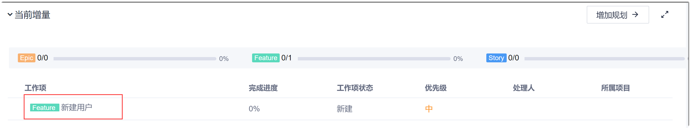
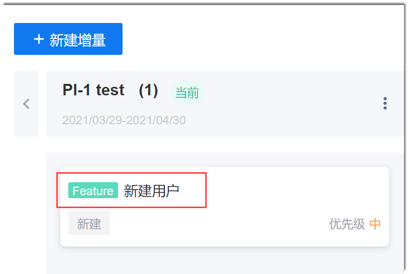
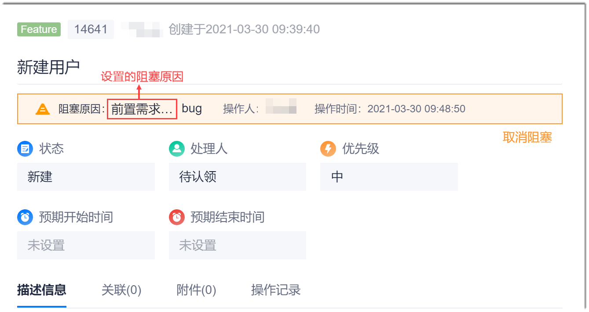
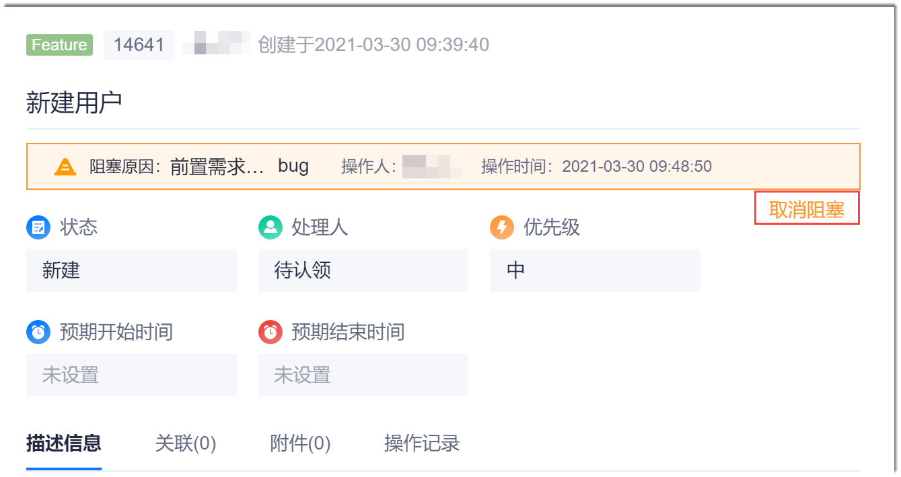

# 设置/解除工作项阻塞
为了使工作可视化，当工作项的实现有阻塞时，您可以设置阻塞；当工作项的阻塞解除时，您可以解除阻塞，使团队成员能了解当前工作情况，快速解决阻塞。

### 前提条件
* 已使用具备项目群“修改工作项”权限的账号登录系统。

### 背景信息
工作项被设置阻塞后，工作项的状态不能被修改。因此，对于Story工作项，在项目的迭代看板中，该工作项的卡片也不能被拖动。

### 操作入口
设置/解除工作项阻塞通过工作项详情界面操作，可以通过如下几个入口打开项目群的工作项详情：
* 项目群概览（仅限于当前PI的工作项）：在项目群顶部菜单栏中，单击“项目群概览”。在“当前增量”区域中，单击工作项名称。                           
                                
* 待办事项：在项目群顶部菜单栏中，单击“待办事项”。然后单击工作项名称。                      
                    
* PI路线图（仅限于Feature类型）：在项目群顶部菜单栏中，单击“PI路线图”。然后单击工作项名称。                   
     

### 设置阻塞
1. 在工作项详情页面的右上方，单击“ > 设置阻塞”。
2. 在“设置阻塞”对话框中，输入阻塞原因，单击“确定”。
设置成功后，在工作项详情页面上方，会显示如下信息：                         
    

### 取消阻塞
1. 在设置了阻塞的工作项详情页面上方，单击“取消阻塞”。                      
                      
2. 在“取消阻塞”对话框中，输入取消阻塞原因，单击“确定”。

设置成功后，工作项详情界面上方和工作项卡片的阻塞提示消失。工作项可以正常设置状态。
