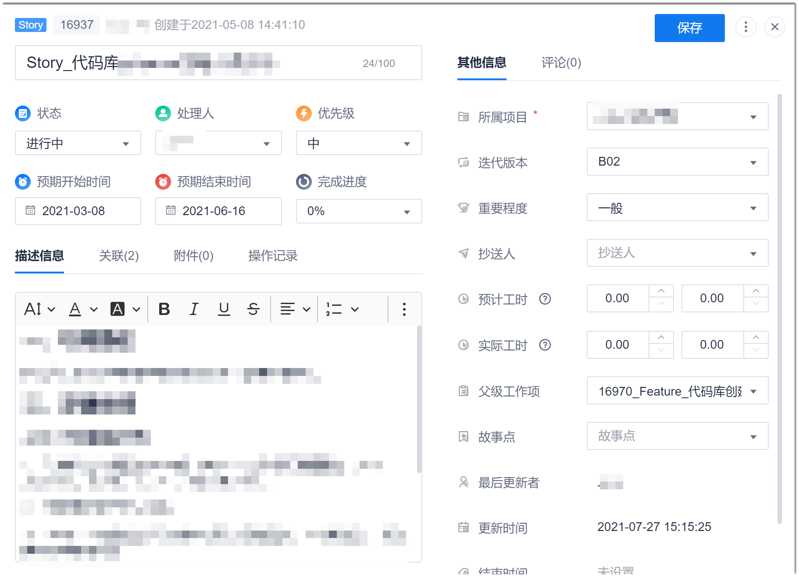
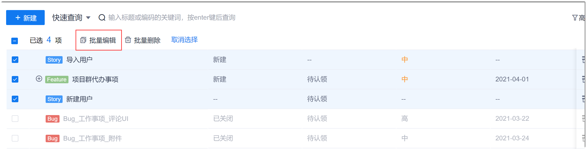
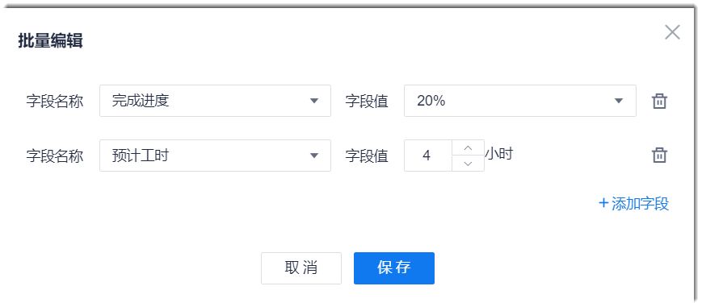

# 修改工作项信息

当工作项的信息变更，或者随着工作进展，工作项的状态、处理人、工时、完成度等信息改变时，您可以修改工作项信息。

### 前提条件
* 已使用具有项目群“修改工作项”权限的账号登录系统。

### 修改单个工作项信息
1. 在项目群顶部菜单栏中，单击“待办事项”。
2. 在工作项列表中，单击需要修改的工作项名称。
3. 在弹出的工作项详情界面中，单击右上角的。         
  
  
4. 参考本章下的“**规划和分解需求 > 创建工作项**”中对工作项参数的描述，修改对应参数值，单击右上方的“保存”。            
  当修改所属项目时：
  * 对于Story、Task、Bug类工作项，“迭代版本”会联动置为空，请一并修改所属的迭代。
  * 子工作项的所属项目保持不变。

### 批量修改工作项信息

1. 在工作项列表中，选中工作项，单击列表上方的“批量编辑”。                      
     如果工作项下面有子工作项，则默认会一起被选中。您也可以手动去选中子工作项。                     
     如果选中的不同类型的工作项，则只能修改公共字段的取值。              
               
3. 在弹出的对话框中，选择字段，并输入字段取值。如果需要修改多个字段，则单击“添加字段”。修改完成后，单击“保存”。                  
   
