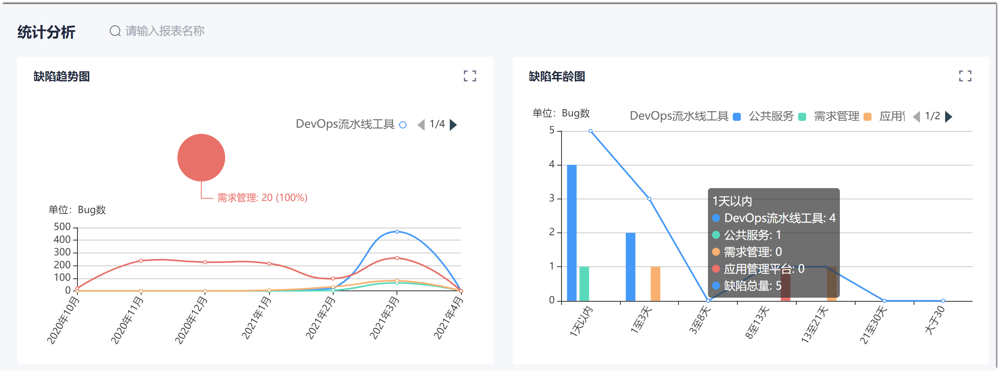
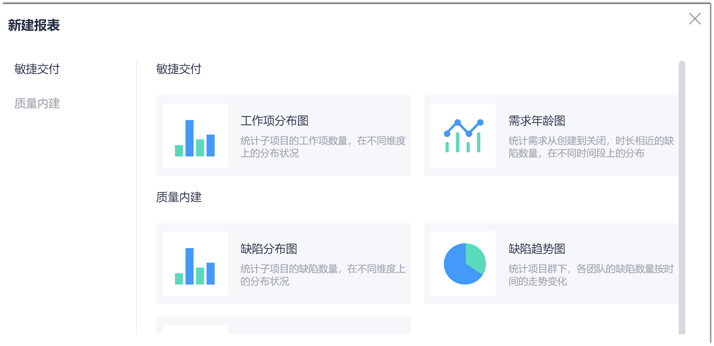
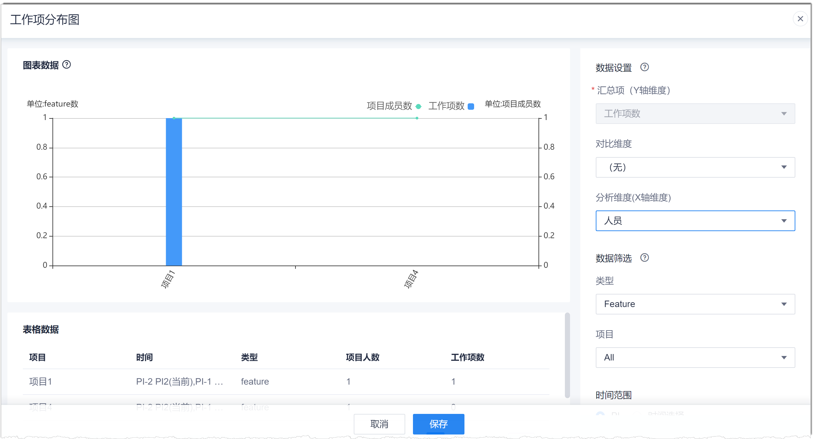

# 创建统计报表

当系统预置的报表不能满足统计需求时，您可以根据项目群的实际情况创建新的统计报表。系统支持最多创建500张报表。创建的报表对项目所有成员可见。

### 前提条件
* 已使用具有项目群“新建报表”权限的账号登录系统。

### 操作步骤
1. 在项目群顶部菜单栏中，单击“统计分析”。              
    显示系统预置的报表。                   
                          
2. 在右上角单击“新建报表”。
3. 在“新建报表”对话框中，单击要创建的报表类型。                    
                    
4. 在报表编辑页面，设置报表的展示内容。                   
   页面左侧分别为图、表格式的报表数据展示，右侧为报表的数据设置。
> [!TIP]
> 鼠标移动到左侧“图表数据”后面的图标上，可以查看此报表的图形解读。

  
  
  1. 在左上角，设置报表名称。                       
    报表名称为5~25个字符。                    
  2. 在页面右侧，设置报表数据和数据筛选条件。                 
    报表数据和筛选条件根据报表类型不同，可以设置的参数不同。常见的参数类型包括汇总项、对比维度、分析维度和数据筛选。汇总项、对比维度、分析维度三者的含义为：统计各个“分析维度”在各个“对比维度”的“汇总项”。数据筛选可从不同维度筛选统计的数据。            
  3. 设置完成后，单击“刷新报表”，可以预览报表。
  4. 确认报表后，单击“保存”。
       
   报表创建成功后，返回到统计分析主界面。在界面最后显示刚创建的报表。

