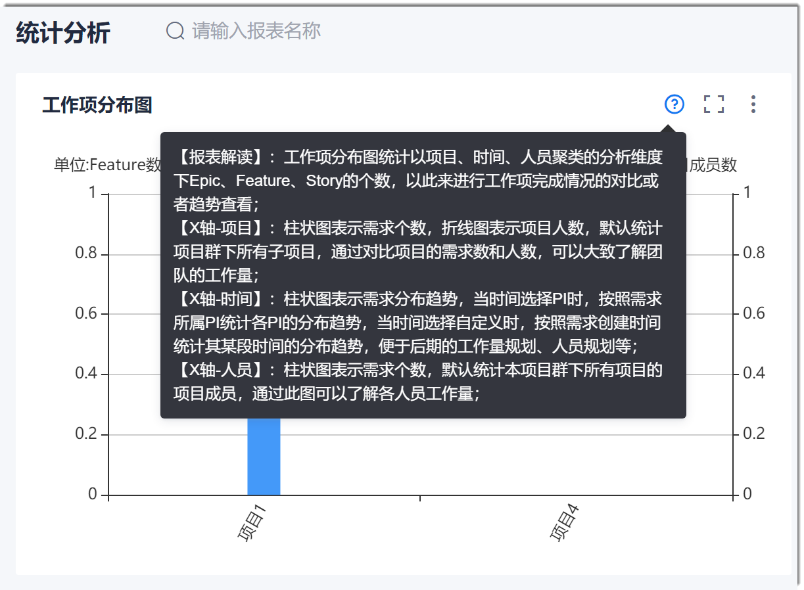
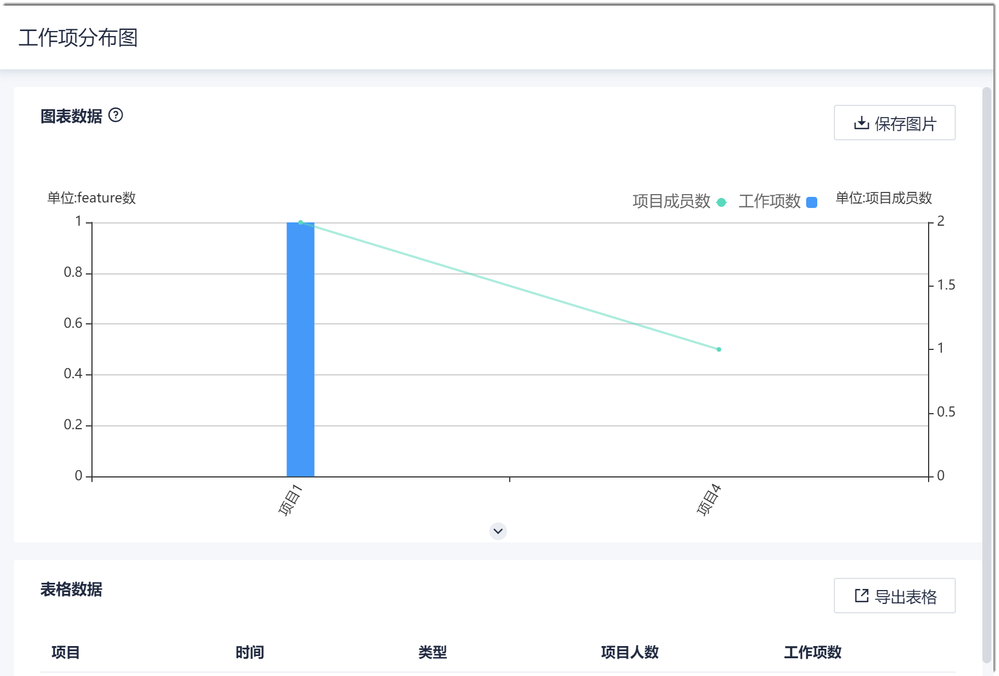
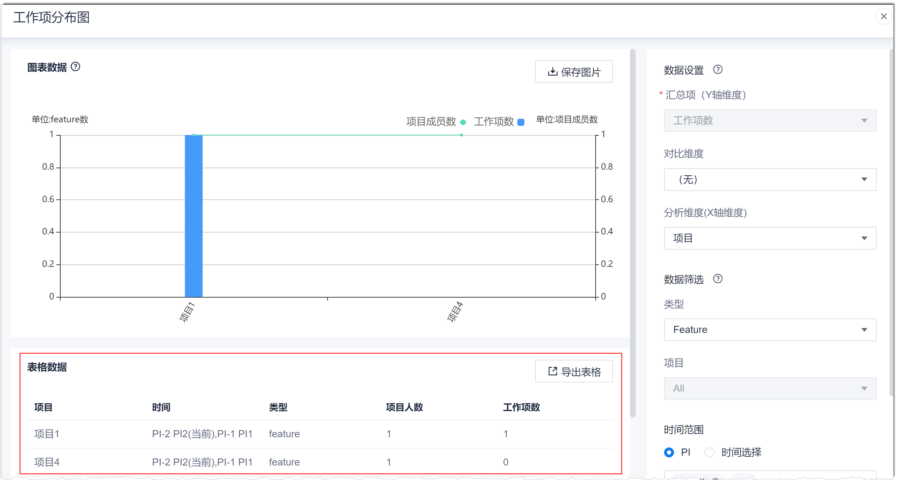
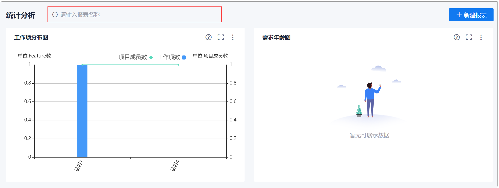

# 统计报表的相关操作

您还可以对统计报表执行：修改、删除、移动显示位置、放大/缩小图片、显示数据表、导出、搜索。            
对报表进行相关操作时，需要具备项目群的报表相关权限。

### 修改报表
1. 在报表展示页面中，单击报表右上方的，将报表最大化。
2. 修改报表的信息，包括报表标题、报表数据、报表筛选的参数，单击“刷新报表”。
3. 修改完成后，单击“保存”。

### 删除报表
报表被删除后，将无法恢复，请谨慎操作。
1. 在报表展示页面中，单击报表右上方的“ > 删除报表”。
2. 在弹出的确认框中，单击“确定”。

### 查看报表的图形解读
鼠标移动到报表左侧的图标上，可以查看此报表的图形解读。     

### 移动位置
报表默认按照创建时间倒序排列，您可以自定义报表的显示位置。
在报表展示界面中，鼠标放在报表边框位置，按住左键拖拽报表到希望的位置。

### 放大/缩小图片
* 滚动放大    
  在报表展示页面或者报表编辑页面中，鼠标放到报表中，滚动鼠标滚轮，可以放大或缩小报表。      
  当放大报表后，您可以按住鼠标左键拖动报表内容，查看由于放大后被隐藏的内容。
* 区域放大      
  在报表编辑页面中，单击图形下方的，放大图形区域，从而放大图片。      
         
  放大后，单击图形下方的，可将图片区域恢复到原始大小。

### 显示数据表           
在报表展示页面中，单击报表右上方的，将报表最大化。左下方显示报表的数据表格。              

### 导出报表           
您可以将报表的图片和报表数据导出到本地查看或者使用。
1. 在报表展示页面中，单击报表右上方的，将报表最大化。
2. 导出报表图片。                   
     在报表图形右上方，单击“保存图片”，将报表图形以“.png”格式下载到本地。                   
3. 导出报表数据表。                  
     在报表数据表格的右上方，单击“导出表格”，将报表的数据以“.CSV”格式下载到本地，可使用Excel软件打开。

### 搜索报表           
系统支持搜索报表名称，方便您快速找到需要的报表。    
在报表展示页面左上方的搜索框内，输入包含在报表名称中的关键字，单击。             
             
报表展示页面显示标题中包含关键字的报表。
