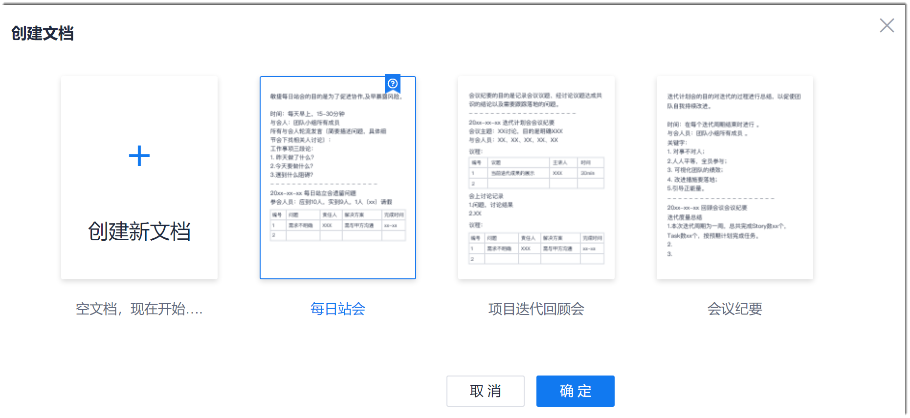
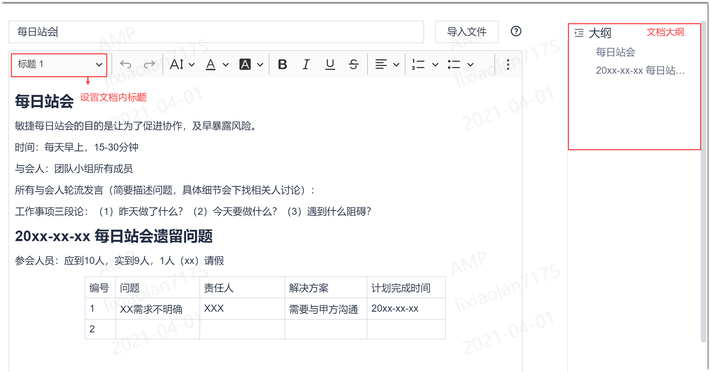
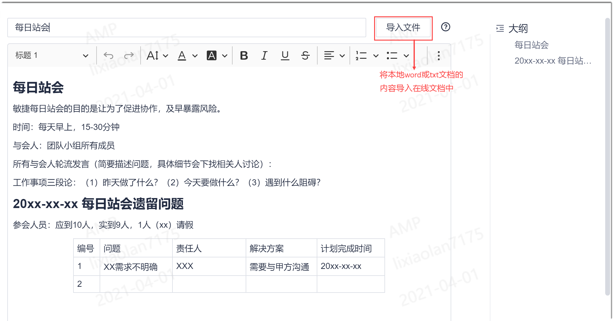
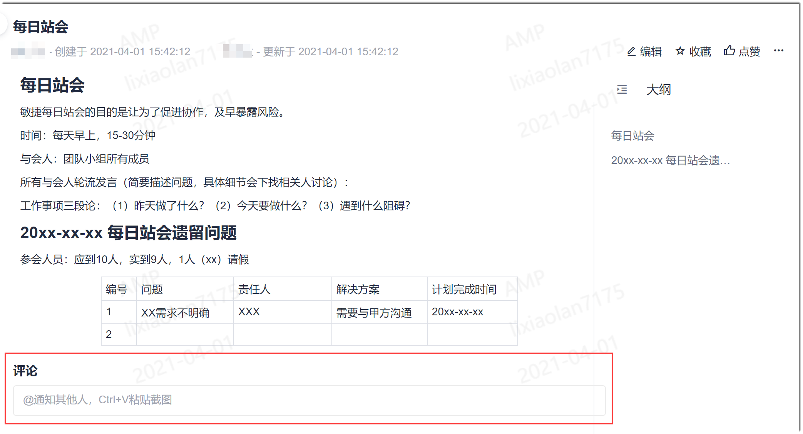
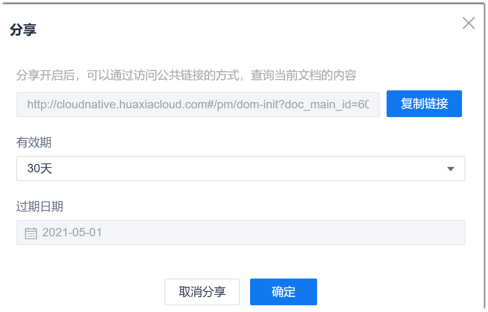
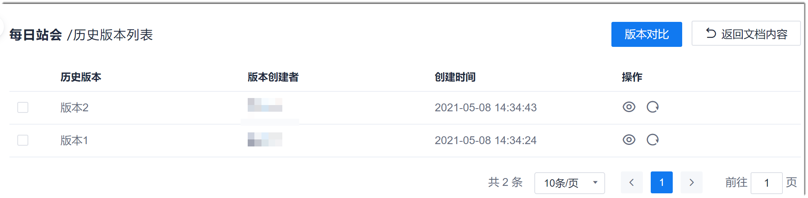
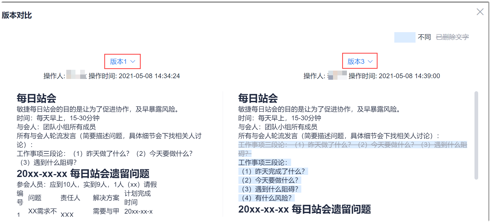

# 管理文档

系统支持在线创建、编辑、查看文档，将本地文档的内容导入在线文档中，导出文档，删除文档，移动文档位置，对文档进行评论，分享文档，文档版本间对比，评审文档等功能。

### 背景信息
系统根据敏捷管理经验，预置了每日站会、迭代回顾会议和通用会议纪要的模板，您可以根据实际情况，直接使用模板记录相关信息。

### 在线创建文档
1. 在知识库目录中，鼠标移动到所属文件夹，单击后面的“ > 创建文档”，或者单击所属文件夹，在右侧界面中单击“添加内容 > 创建文档”。
2. 选择文档模板，或者单击“创建新文档”，单击“确定”。        
                      
  进入文档编辑页面。                     
3. 输入文档的名称和正文。           
     文档的名称不能超过80个字符。          
     在编辑正文时，您可以使用多种样式。其中，您可以设置文档内的标题，最多可以设置6级标题。标题会以大纲的形式显示在文档右侧。          
                     
     文档的正文内容可以在线编辑，也可以通过导入本地的word文档或txt文档导入内容：单击右上方的“导入文件”。导入成功后，本地文件中的内容将添加到正文的最上方。           
                             
4. 如果文档有附件，还可以将附件文档拖拽到“附件”区域中，上传附件。
5. 编辑完成后，单击下方的“保存”。          
     显示此文档的查看界面。

### 在线查看文档               
在知识库目录中，单击文档。右侧界面显示文档详情及内容。  

### 编辑文档
1. 在知识库目录中，单击文档；或者单击所属文件夹，在右侧界面中单击文档。
2. 在右上方单击“编辑”。
3. 根据实际情况编辑文档的标题或正文，单击“保存”。

### 导出/下载文档
1. 通过以下任一方式下载文档：
  * 在知识库目录中，鼠标移动到文档上，单击文档后面的“ > 导出”。
  * 单击文档所属文件夹，再在右侧界面中，单击文档后面的“ > 导出”。
2. 在“导出文件类型”对话框中，选择导出格式（PDF和word），单击“确定”。

### 删除文档
文档删除后，放到“回收站”中保留30天。30天内您可以通过“回收站”查看或恢复文档。30天以后彻底删除。您可以采用以下任一方式删除文档：
* 在知识库目录中，单击文档后面的“ > 删除”。然后，在提示框中单击“确定”。
* 单击文档所属文件夹，再在右侧界面中，单击文档后面的。然后，在提示框中单击“确定”。

### 移动文档位置
您可以通过以下任一方式移动文档的位置：
* 选择移动
  1. 鼠标放到文件上，单击后面的“ > 移动”。
  2. 在弹出的“选择移动位置”对话框中，选择其父文件夹，单击“确定”。
* 拖拽移动        
  拖拽文件到想要的位置。

### 对文档进行评论
您可以在文档详情页面中，对文档进行评论。评论会默认在系统通知中通知文档创建人。项目团队成员均可查看文档的评论。
1. 在知识库目录中，单击文档；或者单击所属文件夹，在右侧界面中单击文档。          
     右侧界面显示文档详情及内容。          
2. 在“评论”框中，输入评论，最多支持500个字符，单击“添加”。            
     如果需要通知某成员，可以在评论中使用“@成员名称”的方式，触发系统发送系统通知给成员。被通知人可以通过系统通知直接打开文档详情。
评论添加后，您也可以对评论进行修改和删除。        
  

### 收藏文档             
收藏后的文档除了可以在目录中查看外，还可以在左侧导航栏中“我的收藏”中查看。      
打开文档，在页面右上方，单击“收藏”。

### 点赞文档              
如果您觉得某个文档很好，您可以点赞表达您的喜欢。如果文档创建者设置了点赞文档通知，则点赞后，文档创建者会收到您的点赞通知。      
打开文档，在界面右上方，单击“点赞”。     

### 分享文档
分享开启后，可以通过访问公共链接的方式，查询当前文档的内容。      
1. 打开文档，在界面右上方，单击“ > 分享”。
2. 在“分享”对话框中，复制文档地址，设置分享有效期，单击“确定”。        
         
在文档分享到期前，如果您希望提前结束分享，则打开“分享”对话框，单击“取消分享”。

### 查看文档的修改历史               
您可以查看文档的历史版本，也可以将文档恢复到历史版本。     
1. 采用任一方式进入文档历史版本列表界面：
  * 在知识库目录中，鼠标移动到文档上，单击文档后面的“ > 历史”。     
  * 在知识库目录中单击所属文件夹，然后在右侧的列表中，单击文档后面的“ > 历史”。    
  * 打开文档，在文档右上方，单击“ > 历史”。         
    显示该文档的历史版本列表，按照修改时间倒序排列。         
                        
2. 根据实际需要执行操作：
  * 查看历史文档。           
       单击历史版本后面的。            
  * 恢复历史文档。             
       单击历史版本后面的，将文档恢复到选择的历史版本。
  * 对比文档。     
    在历史版本列表中，选择2个版本，单击右上方的“版本对比”。弹出“版本对比”对话框，显示2个版本间的差异。           
    您可以单击界面中的版本，切换对比的版本。            
    

