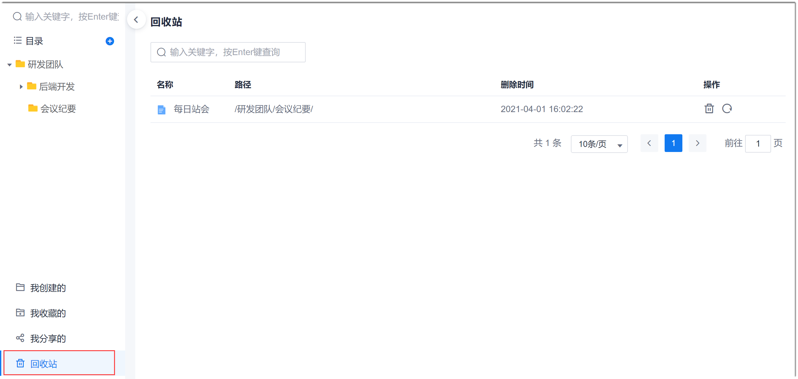

# 管理知识回收站

当您误删除了知识库中的文档或者文件夹的30天内，您可以通过回收站查看或者恢复文档和文件夹。

### 操作入口
1. 在项目顶部菜单栏中，单击“知识库”。
2. 在左侧导航栏最下方，单击“回收站”。                     
     右侧页面显示回收站。                 
      
      
### 恢复文档/文件夹                  
恢复文件夹时，会一并恢复其包含的文档和子文件夹。               
1. 在回收站页面中，单击操作列的。
2. 在弹出的提示框中，单击“确定”。

文档或文件夹恢复到原来的位置。如果所属的原文件夹不存在（已删除），则恢复到与原目录同级的位置。

### 删除文档/文件夹                
在回收站中删除文档/文件夹，是指在系统中彻底删除。删除后不可恢复。删除文件夹时，会一并删除其包含的文档和子文件夹。              
1. 在回收站页面中，单击操作列的。
2. 在弹出的提示框中，单击“确定”。
