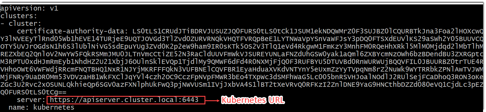
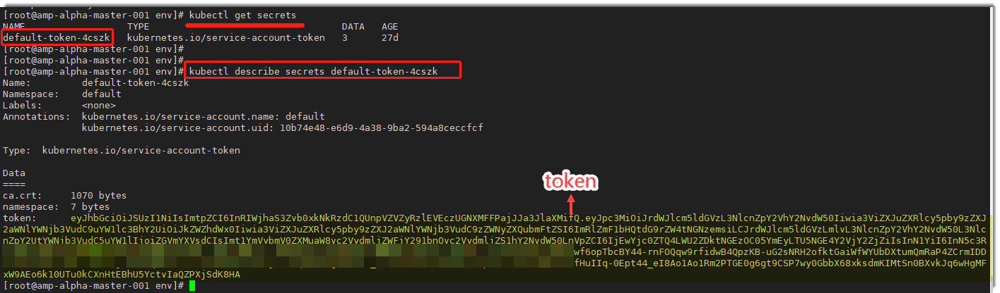

# 管理K8s接入点

### 前提条件
* 已使用具备“K8s集群管理”权限的账号登录系统。
* 已完成K8s集群部署。

### 添加K8s集群
1. 获取K8s集群的“masterURL”参数。     
     打开K8s集群的配置文件。在K8s集群部署成功后，配置文件一般保存在“~/etc/kubernetes”目录下。 配置文件中存储了Cloud Native与K8s集群建立连接的“masterURL”参数。     
    
   
2. 获取K8s集群的“oauthToken”参数。        
     在master节点执行**kubectl get secrets**命令，获取token名称。然后再执行**kubectl describe secrets _token名称_**命令，获取token。        
     举例如下图所示。       
     
     
3. 在项目顶部菜单栏中，单击“K8s管理”。
4. 在左侧导航栏中，单击“集群管理”。          
     右侧显示已添加的K8s集群列表。
     
5. 在右上方，单击“添加集群”。
6. 在“添加集群”对话框中，根据下表填写相关参数，单击“确定”。     
         
|参数名称|说明|
|:--------- |:-------- |
|集群名称|支持1~20个字母、数字、“-”、“_”字符。|
|masterURL|配置文件中的“server”取值。|
|oauthToken|获取的token值。|

K8s集群添加成功后，返回K8s集群列表界面，显示新添加的集群。
### 相关操作
* **修改集群信息**        
    在K8s集群列表中，单击要修改的集群后面的。
* **删除集群**              
    在K8s集群列表中，单击要修改的集群后面的。
