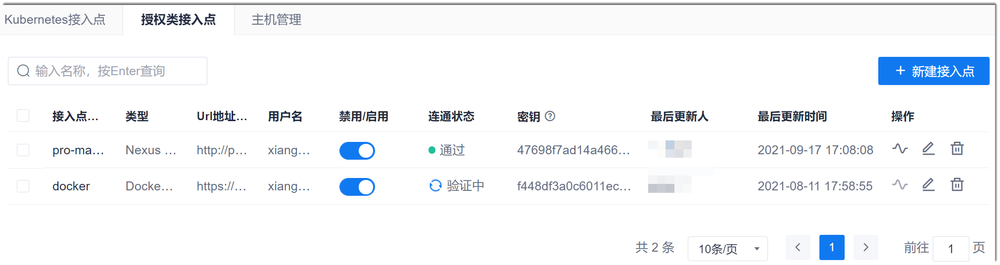
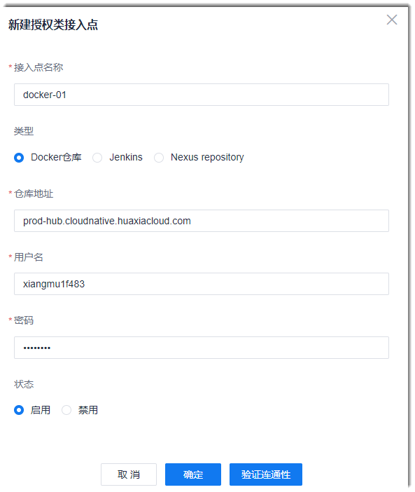

# 添加授权接入点

### 前提条件
* 已获取接入点的URL和用户名密码。

### 操作步骤
1. 在流水线列表界面中，单击右上角的“项目设置 > 接入点设置”。       
2. 在右侧界面中，单击“授权类接入点”页签。            
  进入授权类接入点列表界面。              
          
3. 在右上角单击“新建接入点”。         
4. 在弹出的“新增授权类接入点”对话框中，根据下表的描述，填写对应对应仓库信息，单击“验证连通性”。          
  
  
  <table>
<tr>
    <th>参数</th>
    <th>说明</th>
</tr>
<tr>
    <td>接入点名称 </td>
    <td>自定义接入点名称，仅支持中文、字母、数字、“_”、“-”字符，最多支持64个字符。</td>
</tr>
<tr>
    <td>类型 </td>
    <td>选择本接入点的类型。</td>
</tr>
<tr>
    <td>仓库地址/Server URL</td>
    <td>设置Docker仓库或Nexus repository的仓库地址，或者Jenkins的Server URL地址。地址可以包含http/https前缀，也可以不包含。</td>
</tr>
<tr>
    <td>用户名</td>
    <td>访问“仓库地址/Server URL”的用户名。</td>
</tr>
<tr>
    <td>密码</td>
    <td>“用户名”的密码。</td>
</tr>
<tr>
    <td>状态</td>
    <td>启用：该接入点可以在流水线的对应步骤中被发现。
禁用：该接入点不能在流水线的对应步骤中被发现。
</td>
</tr>
</table>

5. （可选）如果连通性验证失败，请检查并修改接入点信息，确保接入点可与系统互联互通。
6. 接入点信息配置完成后，单击“确定”。         
  界面返回主机列表，可以查看刚刚添加的授权类接入点。
