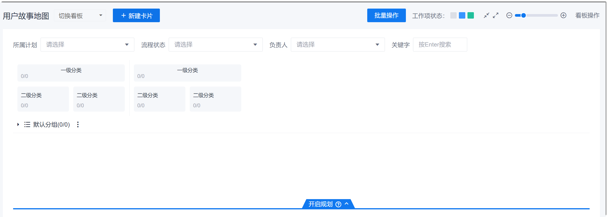
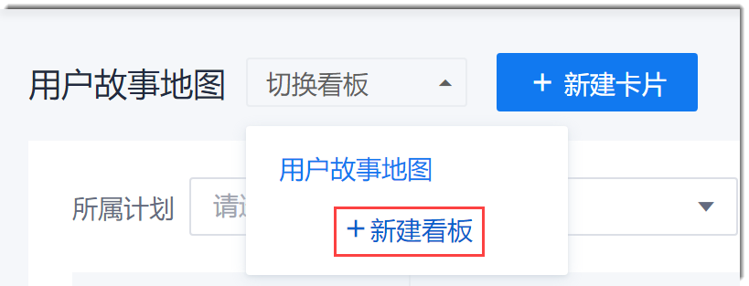
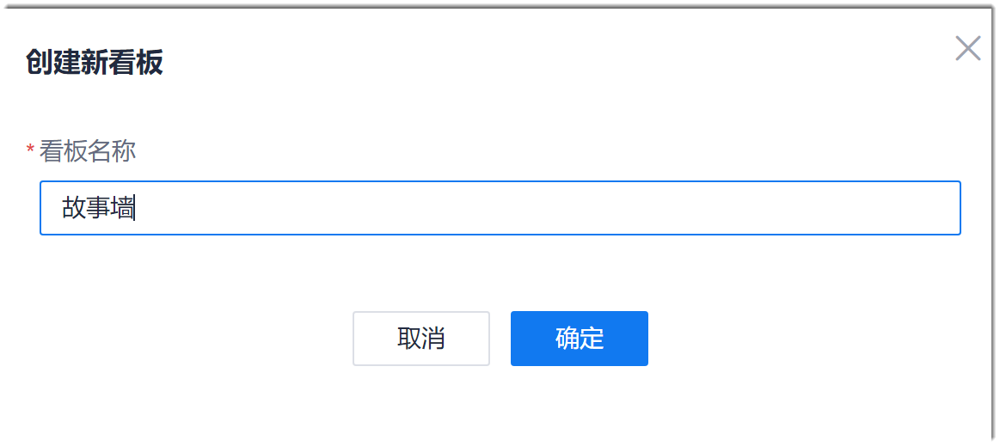
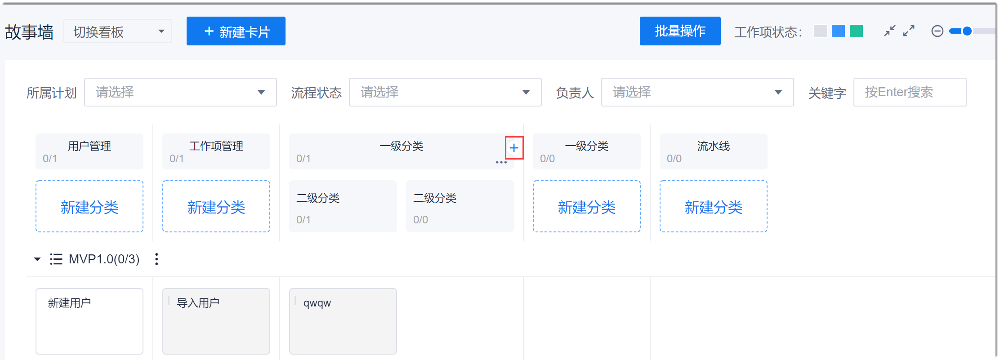
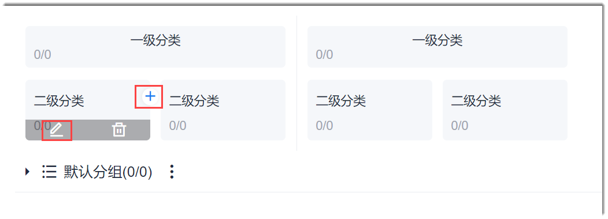
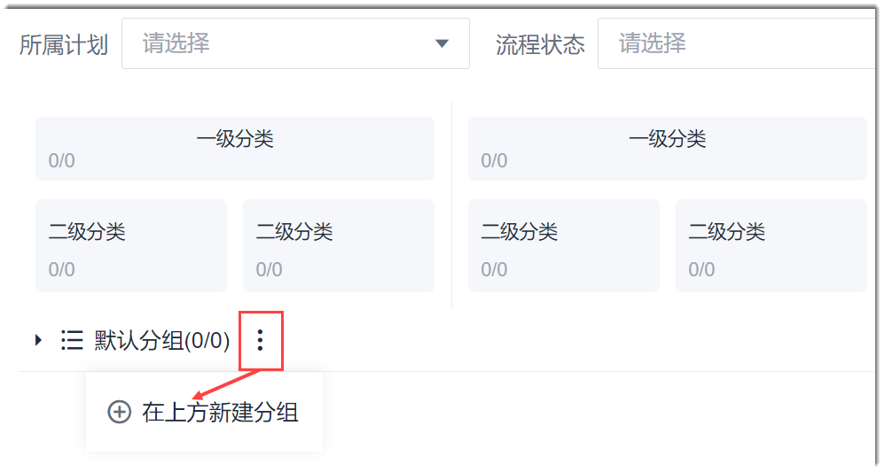
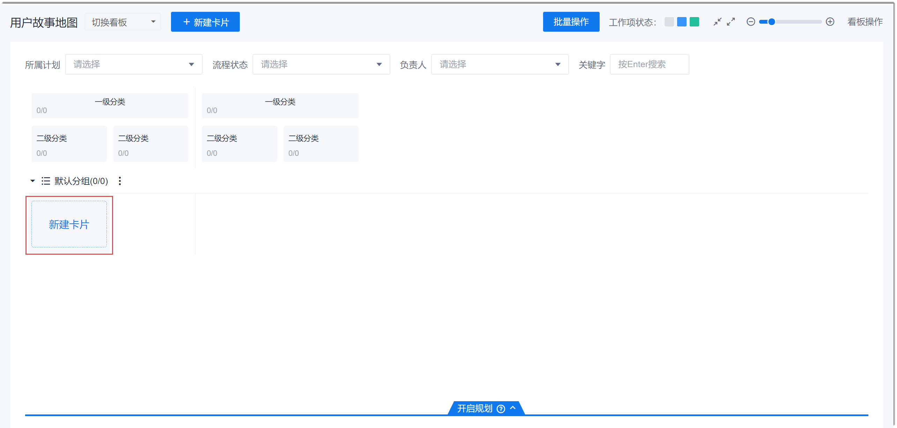
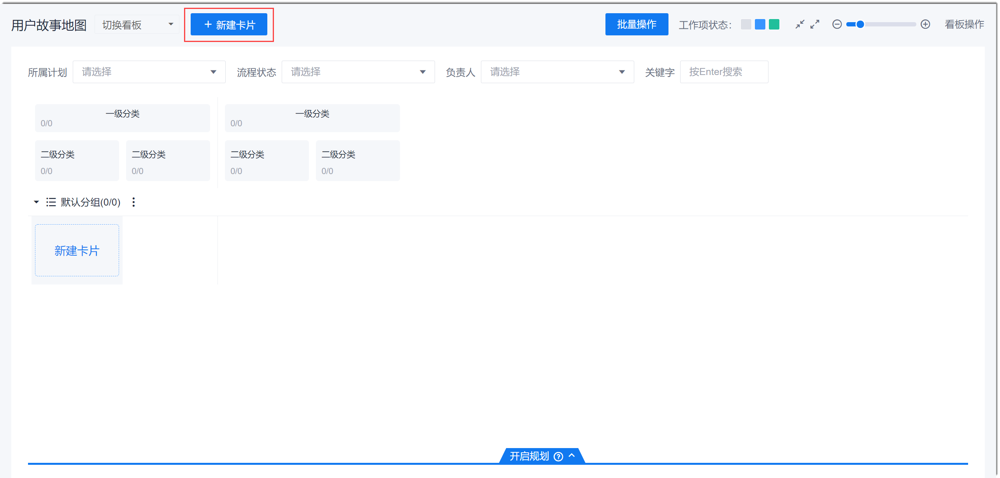
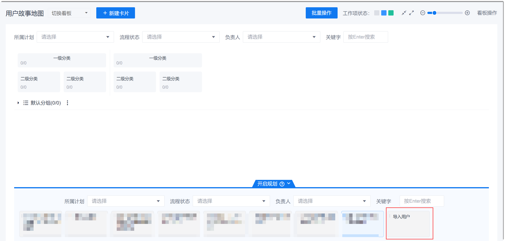
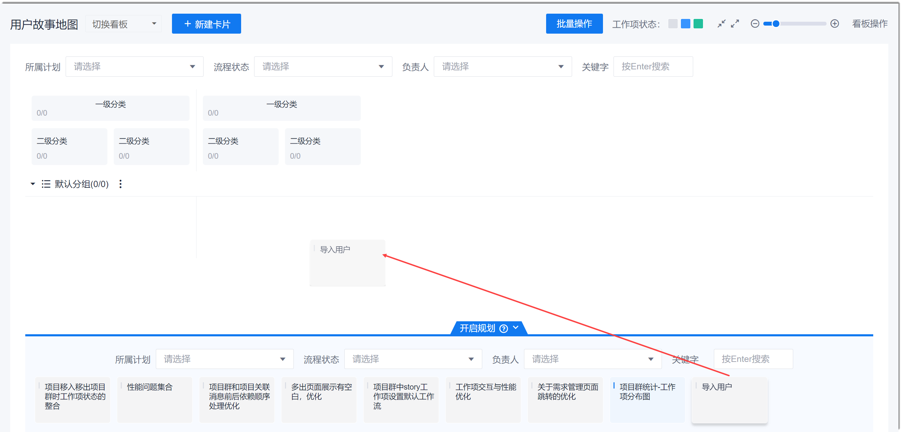

# 规划需求

介绍通过“故事地图”规划需求，即完整创建一个用户故事地图看板的操作。

### 前提条件             
* 已使用具有项目“新增工作项”、“修改工作项”、“删除工作项”权限的账号登录系统。

### 背景信息                      
用户故事地图只能管理Story类型的工作项。因此，如果Story有父级Feature类型的工作项，建议通过项目群或者“工作事项”完成父级工作项的创建后，再通过用户故事地图创建或者管理。                
在用户故事地图中，默认有一个名为“用户故事地图”的看板。您也可以创建多个新的看板，以适应不同场景的要求。

### 操作步骤
1. 在项目顶部菜单栏中，单击“故事地图”。                  
    显示默认的看板。
    
2. （可选）新建看板。
  1. 在左上方单击“切换看板”下拉列表，单击“新建看板”。                      
                     
  2. 在“创建新看板”对话框中，输入看板名称，单击“确定”。                 
                         
   新看板创建成功后，故事地图切换到新建的看板。
   
3. 设置一级分类标签。                            
    设置看板后，系统默认创建2个一级分类标签：
  * **修改标签名称**：将鼠标移动到标签上，单击“ > 编辑”。
  * **新建标签**：将鼠标移动到标签上，单击。
    
     
     
4. （可选）设置二级分类标签。         
    二级分类标签为可选标签。创建看板后，系统默认在每个一级分类标签下创建2个二级分类标签。如果您不需要二级分类标签，可以将鼠标移动到标签上，单击；如果您需要二级分类标签，可以执行以下操作设置：
  * **修改标签名称**：将鼠标移动到标签上，单击。
  * **新建标签**：将鼠标移动到标签上，单击。           
     
     
5. （可选）设置泳道分组。                   
    泳道可以根据自定义分组划分，也可以根据迭代计划划分。系统默认按照自定义分组划分。看板创建成功后，会自动创建一个“默认分组”。如果您希望通过自定义分组划分泳道，您可以设置分组：
    
    单击分组名称（例如“默认分组”）后面的，选择“在上面新建分组”或“在下面新建分组”。然后输入分组名称，回车。        
> [!NOTE]
> “默认分组”不能被修改、删除，也只能放在最后。
> 自定义的分组可以被修改、删除；您也可以在自定义分组前后创建分组：单击分组名称后面的。           
  
  
    
6. 规划用户故事。           
    您可以通过两种方式规划用户故事：
  * **新建空白用户故事**          
    通过此种方式创建的Story，相当于一个占位符（无具体内容），直接放到对应的分类和泳道中。          
    鼠标移动到分类和泳道的交叉单元格，单击显示的“新建卡片”。然后在单元格中，输入Story的名称，按下“Enter”键。         
         
> [!NOTE]
> * 如果需要修改空白Story的详细信息，双击故事卡片。
> * 如果需要批量修改多个Story的父工作项和迭代，按住Ctrl键，然后选择多个故事卡片，单击界面上方的“批量修改”。     
  * **新建用户故事，放入未规划故事中**         
    通过此种方式创建的Story，可以填写Story详细信息。         
    在界面左上方，单击“新建卡片”。然后在弹出的“新建工作项”对话框中，配置Story的详细信息，单击“保存”。   
                              
    创建成功后，放到故事地图的“开启规划”区域中。           
           
       
  * **将已有用户故事纳入故事地图规划**          
    对于未规划到故事地图中的Story，可以通过拖拽的方式纳入故事地图规划。          
    单击下方的“开启规划”，展开未规划到故事地图的Story，然后拖拽Story卡片到需要的位置中。         
    

