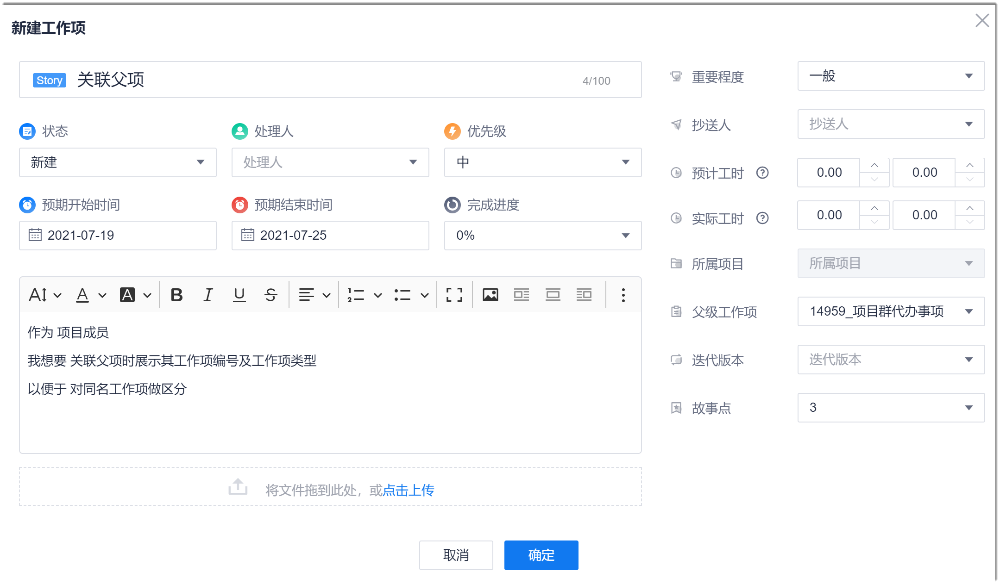

# 在线创建工作项

您可以在系统中直接在线创建工作项。

### 前提条件
* 已使用具有项目“新增工作项”权限的账号登录系统。

### 操作步骤
1. 在项目顶部菜单栏中，单击“工作事项”。
2. 在界面左上角，单击“新建 > _工作项类型_”。
3. 在“新建工作项”界面中，参考下表的描述，填写工作项的相关信息，单击“确定”。
> [!NOTE]
> 工作项的字段支持自定义，因此工作项的界面根据工作项类型不同。以下以默认的“Story”工作项为例。

  

  

|参数名称或区域| 必填项 |参数说明
| :--------- | :-------- |:--------|
|工作项标题    |是| 工作项的名称。长度不超过100个任意字符。|
|状态|否 |工作项当前所处的状态，取值范围为系统预置的状态。系统预置的状态如下：<ul><li>Epic/Feature：新建、进行中、已完成。</li><li>User StoryTask/Bug：新建、进行中、已解决、测试中、已拒绝、已关闭。</li></ul>创建工作项时，默认取值为开始状态（新建）。|
|处理人|否|工作项处理的负责人。取值范围为该项目的创建者和成员。创建工作项时，默认取值为工作项创建者。|
|优先级|否  |工作项处理的优先级，从高到低依次为：高、中、低。|
|预计开始时间|否  |计划开始处理工作项的时间。|
|预计结束时间|否 |计划工作项处理结束的时间。|
|工作项描述   |否 |根据实际情况，按照模板要求填写工作项描述。  |
|附件|否 |上传工作项所需的附件。既可以单击添加区域从本地文档上传，也可以将文档拖拽至添加区域上传。 |
|重要程度|否 |工作项的重要程度，从高到低依次为：高、中、低。|
|抄送人| 否  |设置工作项的抄送人后，抄送人可以收到工作项的动态消息。|
|预计工时|否   |估算的工作量，支持“小时”和“人天”两种单位。|
|实际工时| 否  |实际耗费的工作量，支持“小时”和“人天”两种单位。|
|完成进度| 否  |工作项的完成进度，以百分数表示。当工作项下面有子工作项时，本参数不可设置，由子工作项的完成进度汇总平均取整得来。|
|父级工作项| 否 |Epic类型的工作项不支持此参数。设置父级工作项。Feature只能选择Epic，Story只能选择Feature，Task和Bug只能选择Story。|
|关联项目|否|作为项目群的子项目时，Epic、Feature类型的工作项支持此参数。表示Epic、Feature工作项需要哪些项目共同完成。取值为除“所属项目”外的项目群子项目，支持多选。
当父工作项已设置“关联项目”时，子工作项会继承取值。

在关联项目中，此工作项为只读。但可以通过<a href="7.3.2.4-quick-create-backlog.md">快速创建工作项</a>创建子项目。
|
|PI|否|作为项目群的子项目时，Epic、Feature类型的工作项支持此参数。表示工作项所属的PI，取值来源于所属项目群的PI增量。|
|迭代版本|否|Story、Task、Bug类工作项支持此参数。设置本工作项规划的迭代。取值范围为配置的迭代。|
|故事点|否|Story类工作项支持此参数。以故事点为单位的工作量估算。取值范围为100以内的斐波那契数列。|
|最后更新者|否|工作项创建后显示此参数。系统自维护字段。表示到目前为止，最后一次更新的操作者。|
|最后更新时间|否|工作项创建后显示此参数。系统自维护字段。表示到目前位置，最后一次更新的时间。|
|结束时间|否|工作项创建后显示此参数。系统自维护字段。表示将工作项设置为结束态的时间。|

系统返回工作项列表页面，您可以在工作项列表中查看新创建的工作项。新创建的工作项默认显示在最上面。
