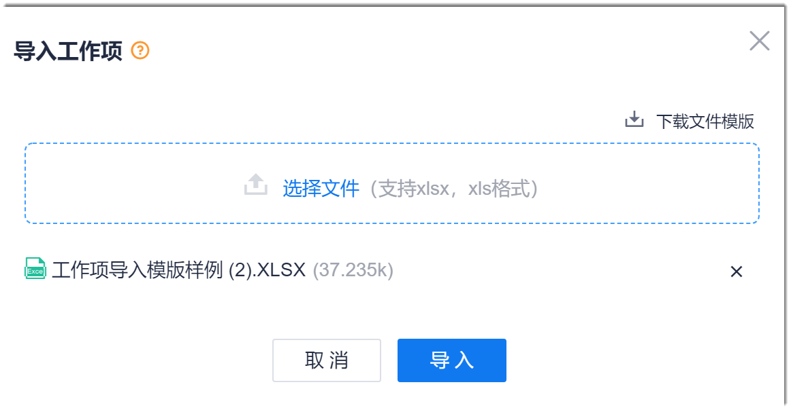

# 导入工作项

您也可以在系统中下载工作项模板，在本地编辑后，导入到系统中。

### 前提条件
* 已使用具有项目“工作项导入”权限的账号登录系统。

### 操作步骤
1. 在工作项列表的右上方，单击“ > 导入”。
2. 在“导入工作项”界面中，单击“下载文件模板”。           
             
3. 在本地打开工作项导入模板。根据模板第1行的填写规则，从第3行开始填写工作项的信息数据。第2行为字段标题。填写完成后，保存并关闭文件。         
  模板显示的字段为系统的默认字段。如果需要填写自定义字段或者自定义字段已设为必填字段，则需要在默认字段后，手动添加自定义字段的名称，并填写相关内容。红色字体的字段为必填字段，其它字段为非必填字段。             
> [!NOTE]
> 建立工作项的父子关系时，“原系统父级工作项编码”为导入文件中的父工作项的编码，“父级工作项编码”为当前系统中已有工作项的编码。请区分填写。           
> 在填写工作项信息时，除必填参数外，建议将父级工作项和迭代版本填写完整，便于形成整洁的工作项层级关系，以及将对应的工作项纳入所属的迭代版本计划中。            

   
4. 返回系统的“导入工作项”界面，单击“选择文件”，然后选择已填写好的工作项文档，单击“导入”。          
        
> [!NOTE]
> 如果工作项文档中有填写不规范的地方，在导入时，系统会提示。     
