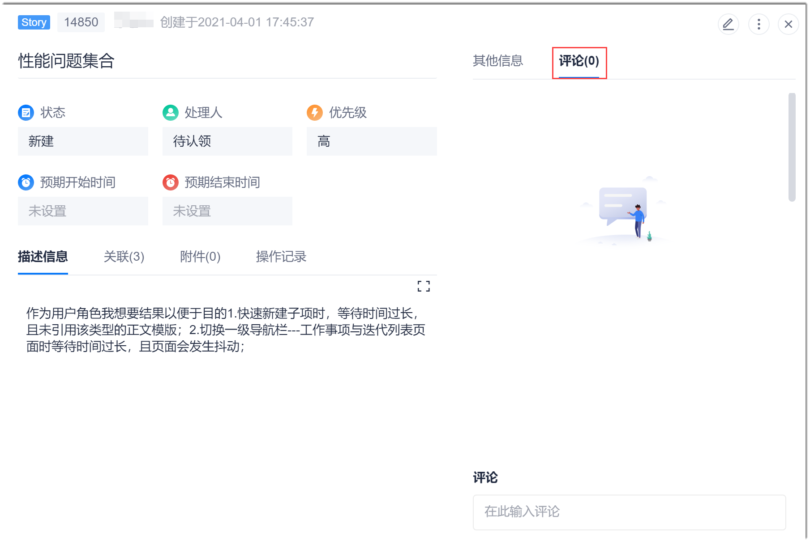
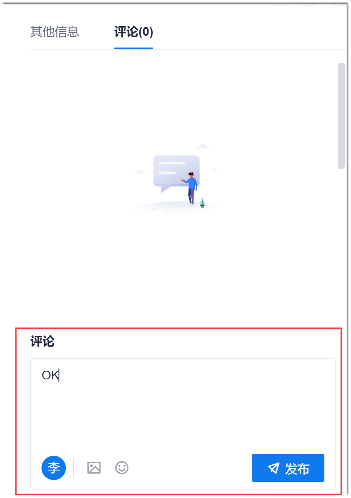
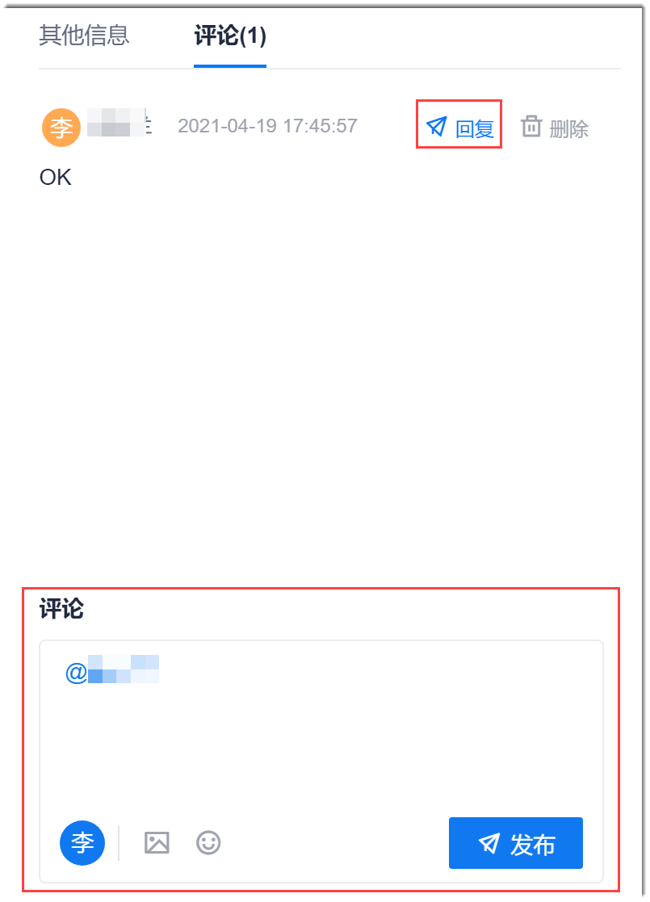

# 评论工作项

您可以对工作项进行评论，反馈您的建议、意见和看法。

### 前提条件
* 已使用具有项目“新增评论”、“删除评论”权限的账号登录系统。

### 操作入口
* 在“故事地图”中，双击Story卡片，进入Story详情界面。
* 在“工作事项”中，单击工作项标题，进入工作项详情界面。
### 新增工作项评论
1. 在工作项详情界面中，单击“评论”页签。     
  
2. 在下方评论框中，输入图文评论，并且可以插入表情符号，单击“发布”。     
           
发表成功的评论显示在评论界面中。

### 回复评论
1. 在工作项评论界面中，鼠标移动到评论上，单击“回复”。    
2. 在下面的评论框中，保留自动添加的@信息，输入回复内容，单击“发布”。     
     

回复作为评论显示在评论界面中。

### 删除评论
1. 在工作项评论界面中，鼠标移动到评论上，单击“删除”。  
2. 在弹出的确认对话框中，单击“确定”。
