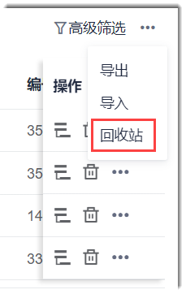
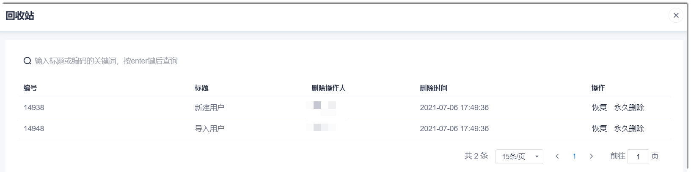
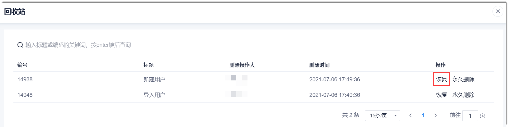
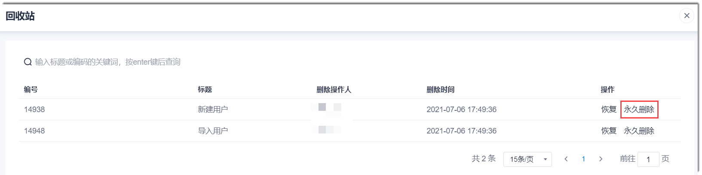

# 管理回收站中的工作项

工作项被删除后，被放入回收站中。回收站中的工作项保存30天。

### 前提条件
* 已使用具有项目“删除工作项”权限的账号登录系统。

### 查看回收站中的工作项
1. 在项目顶部菜单栏中，单击“待办事项”。
2. 在工作项列表界面右上方，单击“ > 回收站”。         
         
进入回收站，显示30天内已被删除的工作项。      
         

### 恢复被删除的工作项
在工作项回收站中，单击工作项操作列的“恢复”。然后在弹出的确认对话框中，单击“确定”。                   
         
该工作项恢复为正常工作项。

### 永久删除工作项
在工作项回收站中，单击工作项操作列的“永久删除”。然后在弹出的确认对话框中，单击“确定”。                   
         
该工作项被永久删除，无法恢复。

