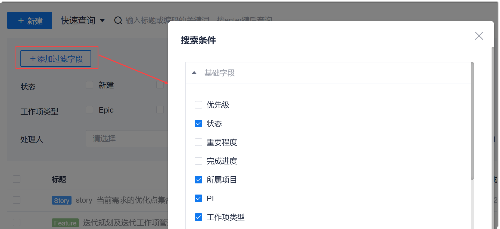
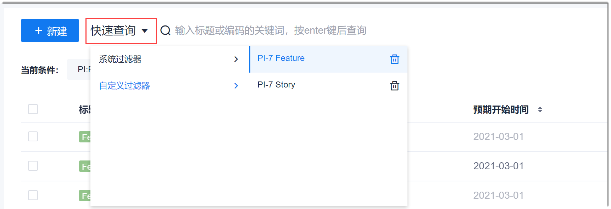
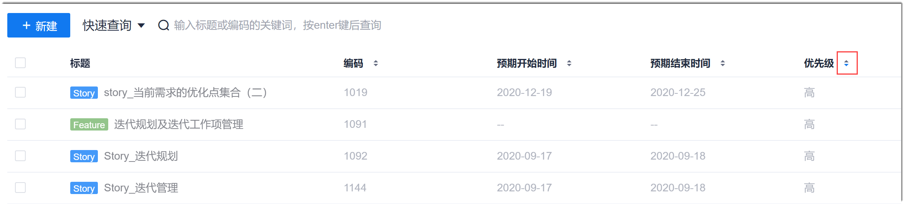
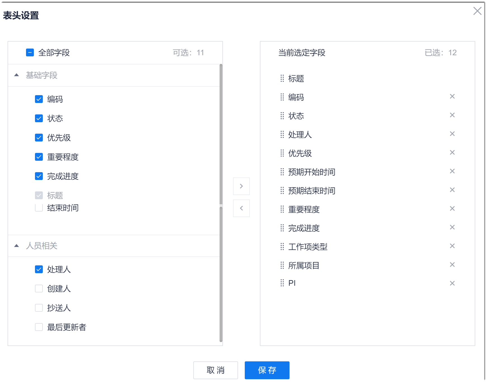
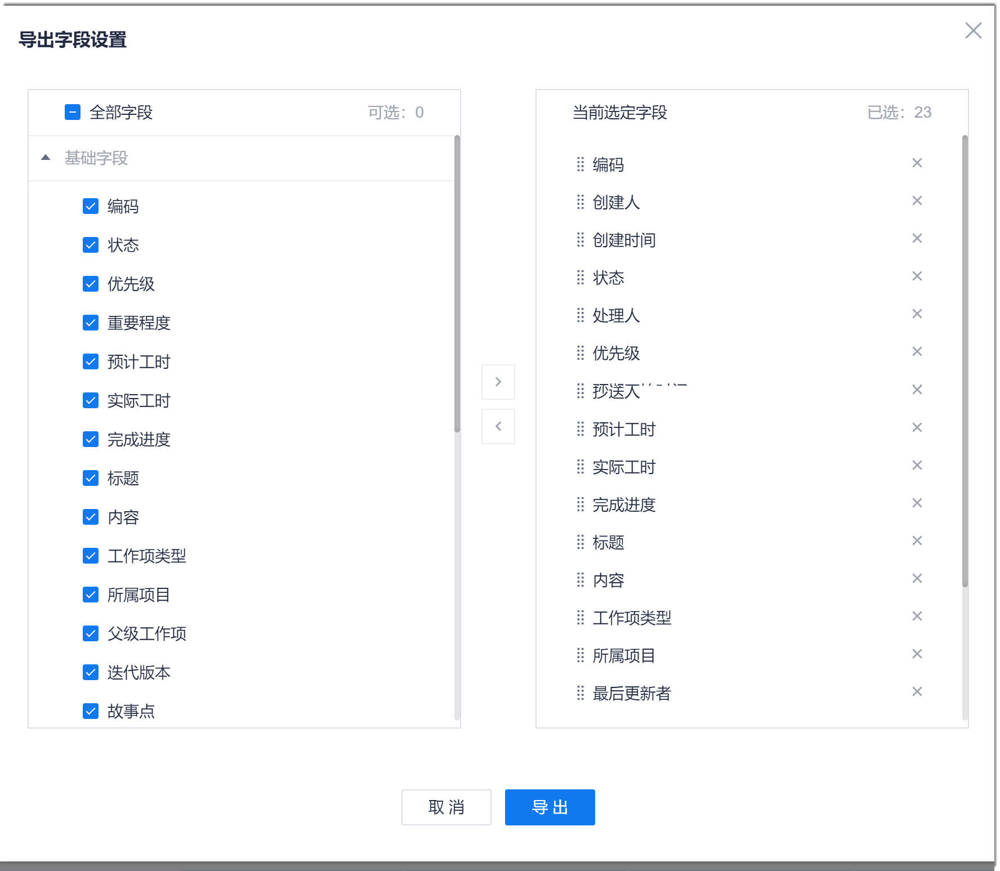

# 查看项目工作项

在查看工作项过程中，您可以筛选、查询工作项，对列表进行排序，自定义工作项列表显示的字段，导出工作项到本地查看，查看工作项的操作历史。
###  前提条件
* 已使用具有项目“工作项”相关权限的账号登录系统。

### 背景信息
项目预置如下过滤器。

| 过滤器名称      | 过滤结果   |
| :--------- | :-------- |
| 所有工作项    | 不过滤，显示所有工作项。|
| 我的工作项     | 显示当前处理人为本人的工作项。|
| 未关闭的工作项|显示非结束态的工作项。|
| 已关闭的工作项 |显示结束态的工作项 |
|我创建的工作项|显示创建人为本人的工作项。|
|我处理的工作项|显示历史处理人为本人的工作项。|
|抄送给我的工作项|显示抄送人包含本人的工作项。|

每个用户可以自定义自己的过滤器。自定义的过滤器只对自己可见。一个用户可以自定义最多20个过滤器。自定义的过滤器对于工作项列表和迭代工作项列表均有效。

### 筛选工作项

支持默认按照“工作项状态”、“工作项类型”、“处理人”筛选。如果默认的筛选字段不能满足要求，您也可以自定义筛选字段。并且支持将筛选条件保存为快速过滤器。

1. 在工作项列表右上方，单击“高级筛选”。
2. （可选）根据实际情况确定是否添加筛选条件。
  1. 在左上方，单击“添加过滤字段”。
  2. 在“搜索条件”对话框中，勾选需要过滤的字段，单击“保存”。                      
                    
3. 筛选工作项。                    
     设置筛选条件，在右上方单击“过滤”。下方的工作项列表将按照筛选条件显示。                 
                  
4. 将筛选条件保存为过滤器。
  1. 设置筛选条件后，在右上方单击“保存为过滤器”。
  2. 在弹出的对话框中，设置过滤器名称，单击“确定”。                          
  保存为过滤器后，您可以通过界面左上方的“快速查询 > 自定义过滤器 > _过滤器名称_”，快速筛选工作项。 
      

### 查询工作项
您可以搜索工作项名称的关键字，从而快速找到想要的工作项。                          
在工作项列表上方的搜索框中，输入工作项名称的关键，按下Enter键。
            
下方列表显示符合条件的工作项。

### 排序工作项              
在工作项列表中，单击标题中的向上或向下按钮，使工作项针对该字段进行升序或降序排序显示。       

### 自定义工作项列表的显示字段                  
工作项列表默认显示“标题”、“工作项状态”、“处理人”、“预计开始时间”、“预计结束时间”、“优先级”、“工作项类型”、“操作”字段，您也可以根据实际情况自定义显示的字段。
1. 在工作项列表中，单击工作项最后一列“操作”后面的。                    
     显示“表头设置”对话框。左侧界面为可选的表头字段，右侧界面为已选中的表头字段。                     
  
       
2. 在“表头设置”对话框的左侧界面中，选中需要显示的字段，去选中不需要显示的字段。
3. 调整字段的显示顺序：在右侧界面中，拖拽字段到合适的位置。
4. 配置完成后，单击“保存”。

设置完成后，工作项列表按照定义的规则显示。

### 导出工作项                  
系统支持导出符合当前条件的全部工作项。即导出工作项时，您可以查询、筛选工作项后再导出，则导出的工作项为符合查询、筛选条件的工作项。                  
1. 在工作项列表中，根据需要导出的工作项执行以下操作：    
  * 导出指定工作项：选中需要导出的工作项
  * 导出全部工作项：不选中任何工作项。
2. 在工作项列表界面右上角，单击“ > 导出”。
3. 在弹出的“导出字段设置”对话框中，设置需要导出的字段：左侧区域为可选择的字段，右侧区域为已选择的字段。单击“导出”。       
  

系统将工作项以压缩包的形式下载到本地。压缩包中，包含工作项列表的Excel文档。

### 查看工作项的变更历史                
系统记录除系统自维护字段（例如“编码”、“更新时间”）以外所有字段的变更。从而使工作项的变更可追溯。              
在工作项详情页面的“描述信息”字段后面，单击“操作记录”。                     
页面显示工作项的变更记录。
                                 
其中，对于“描述信息”字段的修改，可以单击“变更详情”。系统以对比变更的形式，清晰地显示各版本之间的差异。                  
 

> [!NOTE]
> 如果只是格式的修改，系统将不会记录。

