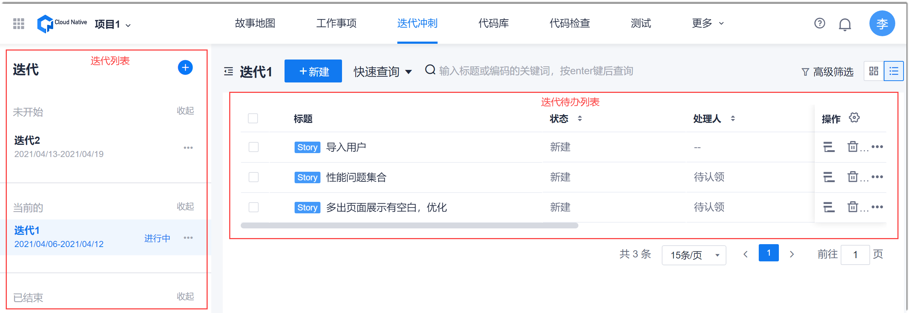
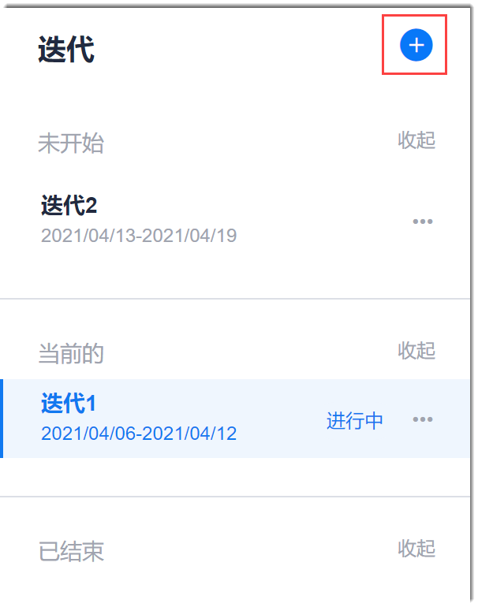
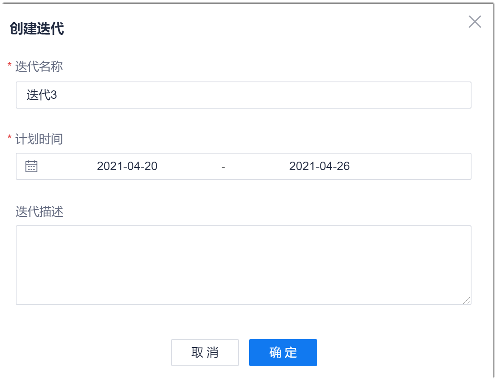

# 创建迭代

在迭代开始，需要规划迭代的开始、结束时间，迭代的目标。

### 前提条件
* 已使用具有项目“新增迭代”权限的账号登录系统。

### 操作步骤
1. 在项目顶部导航栏中，单击“迭代冲刺”。
         
     左侧界面显示迭代（分为“未开始”、“当前的”和“已结束”三种迭代类型分类显示），右侧显示迭代待办列表。也可以单击左右侧分界附近的按钮，将左侧界面收起。            
         
      
2.  在左侧迭代列表右上角中，单击。                   
      
   
3. 在弹出的“创建迭代”对话框中，设置“迭代名称”、“计划时间”、“迭代描述”，单击“确定”。           
    如果项目属于项目群的子项目，您还需要设置所属的PI。您可以将迭代目标放到迭代描述中。            
> [!NOTE]
> 对于项目在创建迭代之后再关联到项目群的情况：
> * 如果不编辑迭代，则“所属PI”为空不会影响系统正常运行。当编辑迭代时，会要求填写“所属PI”。
> * 为了确保版本计划和迭代计划的关联性，并且方便统计相关数据，建议在关联到项目群后，编辑迭代，设置迭代所属的PI。

     
  
迭代创建成功后，右侧界面显示新建迭代的待办事项。但刚刚新建的迭代右侧显示空白，可单击相应按钮规划迭代内容或者在迭代中创建工作项（Story、Task、Bug），详见下一节：“规划迭代内容”。

> [!TIP]
> 需要展开或收起迭代类型下面的迭代时，请单击迭代类型后面的“查看” 或“收起”。

