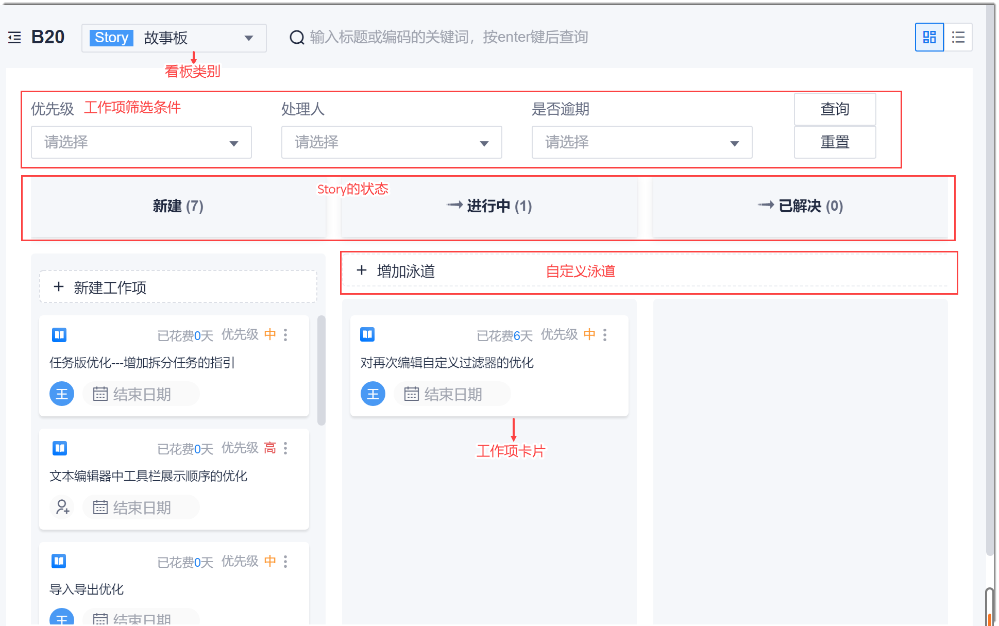
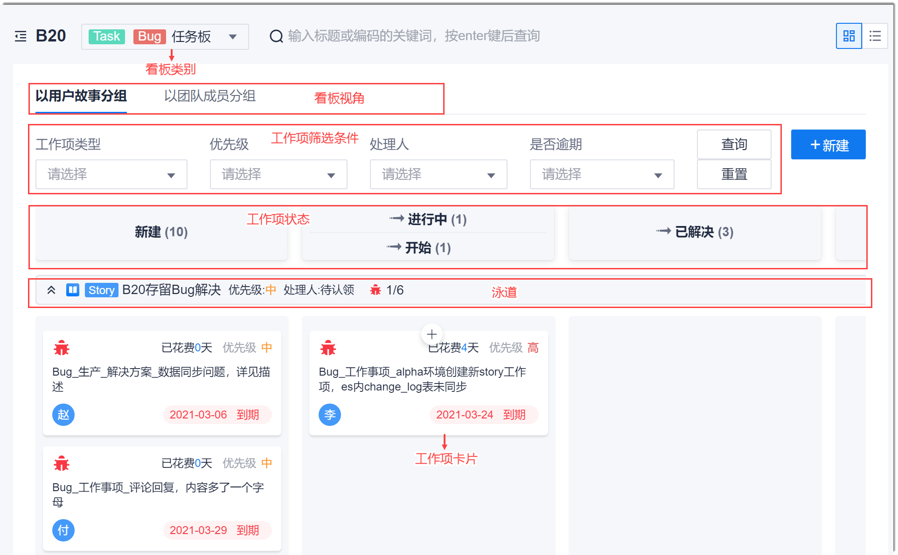

# 迭代看板介绍

迭代内的工作项除了可以通过列表视图查看和操作外，也可以通过看板视图查看和操作，使迭代进展更直观。
迭代看板分为故事板和任务板：
* **故事板**：显示迭代内的所有Story工作项。               
    在故事板中，您可以设置工作项状态及其流转方向，新建Story、Task、Bug类工作项，自定义泳道，设置/解除工作项阻塞，查看Story工作项详情，快速设置责任人，快速设置工作项结束日期。                
    故事板页面如下图所示。

* **任务板**：显示迭代内的所有Task和Bug工作项。                      
    任务板分为用户故事视图和团队成员视图。当查看用户故事视图时，默认按照所属的Story分为不同的泳道。当查看团队成员视图时，默认按照责任人分为不同的泳道。                      
    在任务板中，您可以设置工作项状态及流转方向，新建Task、Bug类工作项，查看工作项详情。                  
  任务板页面如下图所示。

