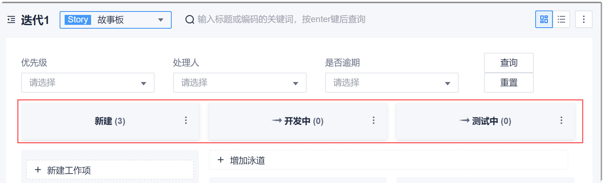
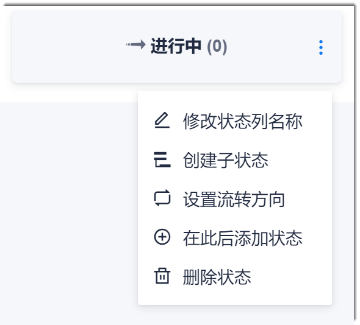
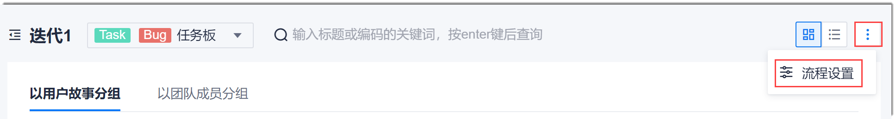
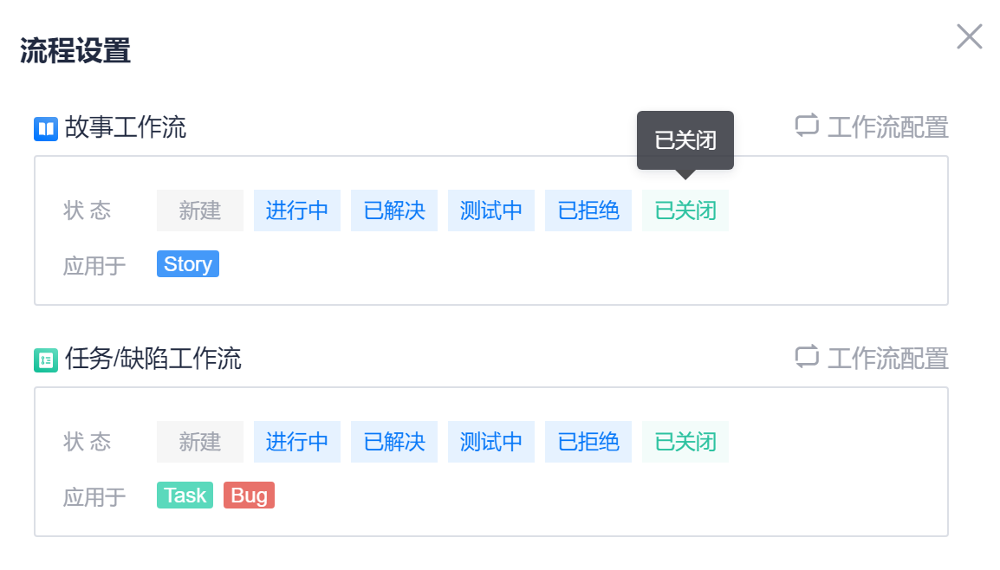
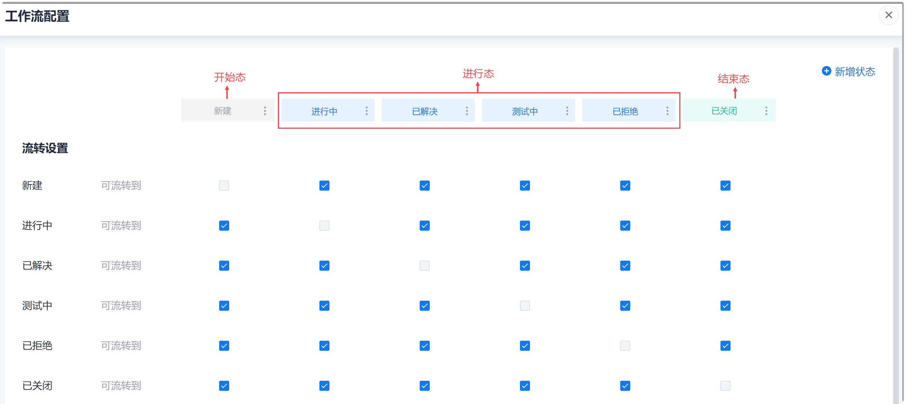
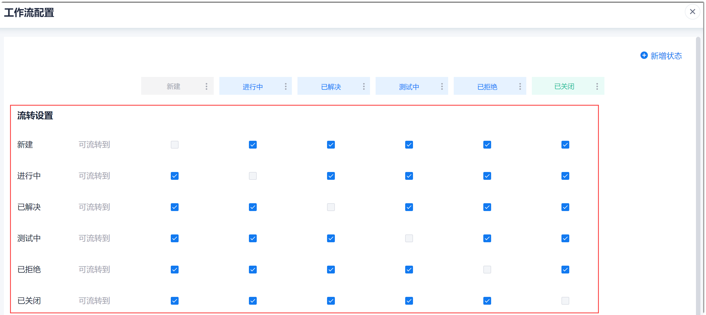

# 自定义工作流

工作流是指工作项的可用状态以及状态的流转方向。

如果项目为独立项目，或者项目作为项目群的子项目但未[同步项目群的工作流](5.7.1.3 同步基础信息到子项目.html)，则通过迭代看板可以配置所有工作项类型的工作流；如果项为项目群的子项目，且[同步了项目群的工作流](5.7.1.3 同步基础信息到子项目.html)，则子项目的工作流继承项目群的工作流，不能通过迭代看板自定义工作流。

### 前提条件
* 已使用具有项目“工作流设置”权限的账号登录系统。

### 背景信息
各类工作项的默认状态如下表所示。          

|工作项类型|默认状态|
|:--------- |:-------- |
|Epic|新建、进行中、已完成|
|Feature|新建、进行中、已完成|
|Story|新建、进行中、已解决、测试中、已拒绝、已关闭|
|Task|新建、进行中、已解决、测试中、已拒绝、已关闭|
|Bug|新建、进行中、已解决、测试中、已拒绝、已关闭|

其中“新建”为开始态，“已关闭”或“已完成”为结束态，其余为进行态。您可以根据实际情况配置进行态的状态。         
系统支持最多100个状态（包含子状态）。一个父状态下最多支持30个子状态。          
开始态和结束态有且只能有一个，且分别固定为“新建”和“已关闭”。

### 操作入口
1. 在项目顶部菜单栏中，单击“迭代冲刺”。
2. 在界面右上角，单击按钮，将迭代工作项切换为看板视图。

 您可以通过两个界面配置工作项的可用状态和流转方向：    
* 通过迭代看板界面：包括故事板和任务板。
* 通过流程设置界面：在迭代看板界面右上角，单击“ > 流程设置”。

### 通过迭代看板的状态栏设置                
迭代看板的状态栏位置：

* 配置工作项的可用状态。
  * 修改状态名称          
      单击状态后面的“ > 修改状态列名称”。然后输入新的名称，单击“确定”。                
      状态名称支持最多10个字符。                 
     
         
  * 创建新状态              
    单击状态后面的“ > 在此后添加状态”。然后输入状态名称，单击“确定”。                  
       状态名称支持最多10个字符。
       
 * 创建子状态                             
       当您需要在某个状态下细分状态时，可以创建子状态。当创建父状态下的第一个子状态时，第一个子状态会继承父状态下的工作项。               
       单击状态后面的“ > 创建子状态”。然后输入状态名称，单击“确定”。
              
* 删除状态                        
   只能删除进行态的状态，不能删除开始态和结束态的状态。      
    当前系统支持2层状态：第一层为父状态，第二层为子状态。      
    
  * 删除父状态       
    当父状态下无工作项且无子状态时，可以删除；当父状态下有工作项或子状态时，不能删除。      
    
  * 删除子状态      
     当子状态下无工作项时，可以删除；当子状态下有工作项时，可以删除，其下工作项的状态变化如下：               
     * 删除唯一子状态：工作项状态变为父状态。       
     * 删除非唯一非第一个子状态：工作项状态变为前一个子状态。      
     * 删除非唯一第一个子状态：工作项状态变为后一个子状态。                
   单击状态后面的“ > 删除状态”。然后在弹出的确认框中，单击“确定”。   
   
* 配置工作项的流转方向。
   1. 单击状态后面的“ > 设置流转方向”。
   2. 在弹出的“为该状态设置流转方向”对话框中，勾选当前状态可以流转到的状态，单击“保存”。
   
   
     
### 通过流程设置界面设置

**进入流程设置界面：**        

1. 在迭代看板界面中，单击右上角的“ > 流程设置”。         
  
  
2. 单击需要设置状态和流转的工作项类型后面的“工作流配置”。           
  

弹出“工作流配置”界面：        
 
  
**设置状态及流转方向：**            

在“工作流配置”界面中，按需执行相关操作。设置完成后，单击右上角的。

* 创建新状态
  采用以下任一方式创建：
  * 单击状态后面的“ > 在此后添加状态”。然后输入状态名称，单击“确定”。          
    新建的状态显示在该状态后面。
    
  * 在右上角单击“新建”，然后输入状态名称，单击“确定”          
    新建的状态显示在结束态前面。     
    
  状态名称支持最多10个字符。
  
* 修改状态名称        
  不能修改结束态的状态名称。         
  单击状态后面的“ > 修改状态列名称”。然后输入新的名称，单击“确定”。             
  状态名称支持最多10个字符。

* 调整进行态状态的顺序。           
   在状态行中，拖拽进行态的状态到合适的位置。          
   调整后，工作项详情界面的“状态”字段取值的显示顺序会按照新顺序显示。               
   
* 删除状态           
   只有当状态下无工作项时，才能删除状态。不能删除开始态和结束态。           
   单击状态后面的“ > 删除状态”。然后在弹出的确认框中，单击“确定”。
   
* 创建子状态            
    当您需要在某个状态下细分状态时，可以创建子状态。只能在进行态的状态下创建子状态。           
    单击状态后面的“ > 创建子状态”。然后在弹出的对话框中输入子状态名称，单击“确定”。    
    
* 配置工作项的流转方向。        
  在流转设置区域中，勾选每个状态可流转的状态。         
  

