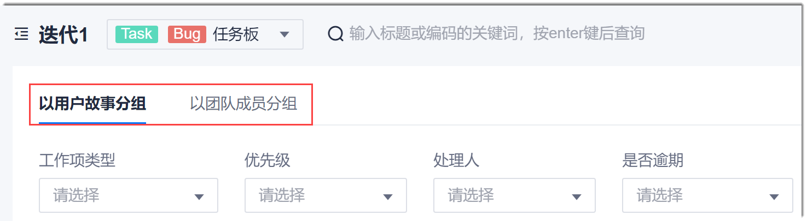
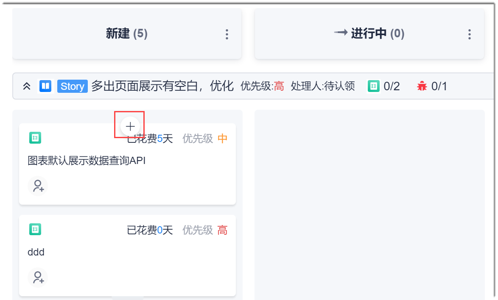

# 通过任务板管理工作项

您可以在任务板创建Task、Bug类型的工作项，快速设置处理人和结束日期，流转工作项。

### 前提条件
 * 已使用具有项目“迭代与规划”、“工作项”相关权限的账号登录系统。

### 背景信息
任务板支持用户故事和团队成员2个视角：
* 用户故事视角以Story为泳道，展示其下的Task和Bug工作项卡片。
* 团队成员视角以当前处理人为泳道，展示其下的Task和Bug工作项卡片。

您可以在任务板中，单击如下图所示的页签，切换视角。

### 管理工作项
#### 创建工作项                 
在任务板中，您可以创建Task、Bug类型的工作项。                    
在用户故事视角下创建工作项，其父工作项默认为泳道Story。在团队成员视角下创建工作项，其处理人默认为泳道人员。

在某个状态下创建工作项，其状态默认为该状态。

1. 将鼠标移动到泳道和状态对应的坐标下，单击显示的。
  
  
  
2. 输入工作项标题和工作项类型。如果需要填写详细信息，单击“更多录入”，再填写详细信息。然后单击“确定”。

工作项创建成功后，在泳道和状态对应的坐标格下显示新建的工作项。

#### 修改/删除工作项信息
1. 在任务板中，单击工作项卡片中的工作项名称，进入工作项详情界面。
2. 执行相关操作：
  * 单击右上角的 ：修改工作项。
  * 单击右上角的“ > 删除”：删除工作项。
> [!NOTE]
> 在工作项详情中可以执行的操作，还包括：复制、设置阻塞、解除阻塞、关联内容。

#### 快捷设置处理人
在任务板中，单击卡片中的（未设置责任人）或处理人图标（已设置责任人），然后选择新的责任人。

### 流转工作项

工作项卡片可以在设置了流转的状态之间相互移动。如何设置状态流转请参见本章下面的“自定义工作流”。

在任务板中，拖动未工作项卡片到需要的状态下，即可将工作项流转到该状态。该工作项详情的“状态”字段取值会随之改变。

